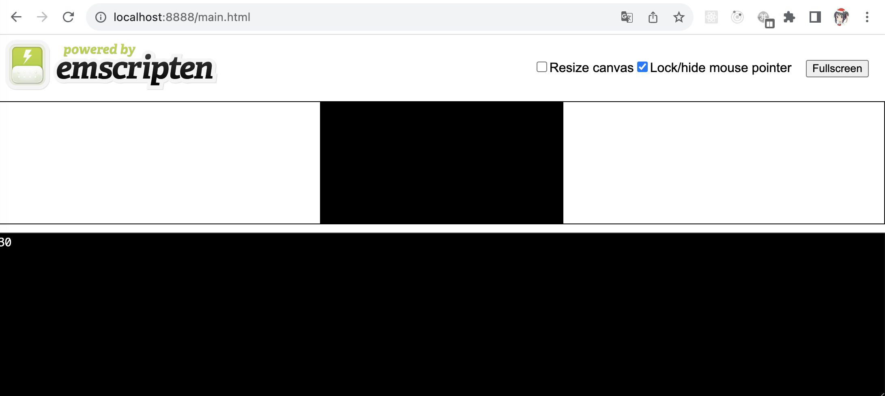
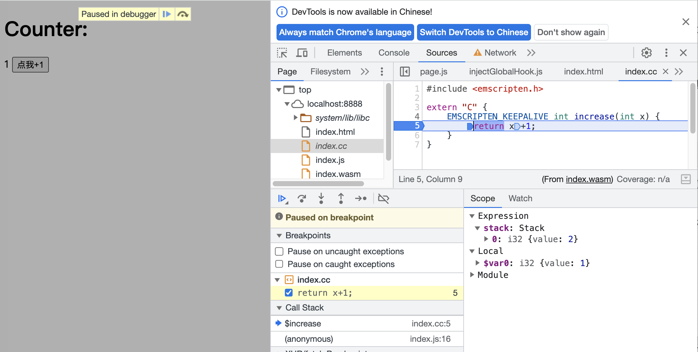

## 编译wasm Web应用

刚学完WebAssembly的入门课，来卖弄一点入门知识。

首先我们知道wasm是目标语言，是一种新的V-ISA标准，所以编写wasm应用，正常来说不会直接使用WAT可读文本格式，更不会用wasm字节码；而是使用其他高级语言编写源代码，经过编译后得到wasm应用。课程中使用了C++来编写源代码，所以这里我也用C++来编写demo。

wasm的运行环境主要分为两类，一类是Web浏览器，另一类就是out-of-web环境，运行于Web浏览器的wasm应用主要使用Emscripten来编译得到，因为它会在编译过程中，为所编译代码在Web平台的功能适配性进行一定的调整。

### 针对Web平台的编译

对于功能适配性的调整，可以从下面这个例子中得到体现。
#### 编码

首先我们编写一段功能简单的C++源代码：
```cpp
#include <iostream>  
​  
extern "C" {  
  // 防止Name Mangling  
  int add(int x, int y) {  
    return x + y;  
  }  
}  
​  
int main(int argc, char **argv) {  
  std::cout << add(10, 20) << std::endl;  
  return 0;  
}
```
这段代码里，声明了一个函数“add”，它的定义被放置在“`extern "C" {}`”结构中，以防止函数名被C++的Name Mangling机制更改，从而确保在宿主环境中调用该函数时，可以用与C++源码中保持一致的函数名，来直接调用这个函数。

这段代码中还定义了主函数main，其内部调用了add函数，并且通过`std::cout` 来将该函数的调用结果输出到`stdout`。
#### 编译

现在我们可以用Emscripten这个工具集中最为重要的编译器组件emcc，来编译这段源代码。命令如下所示：
```shell
emcc main.cc -s WASM=1 -O3 -o main.html
```
通过“-s”参数，为emcc指定了编译时选项“WASM=1”，这样emcc就会将输入的源代码编译为wasm格式目标代码，“-o”参数则指定了产出文件的格式为“.html”，这样Emscripten就会生成一个可以直接在浏览器中使用的Web应用。

这个自动生成的应用中，包含了wasm模块代码、JavaScript代码以及HTML代码。
#### 运行

现在我们可以尝试在本地运行这个简单的Web应用。首先自行准备一个简单的Web服务器：

```javascript
const http = require('http');  
const url = require('url');  
const fs = require('fs');  
const path = require('path');  
​  
const PORT = 8888;  
const mime = {  
  "html": "text/html;charset=UTF-8",  
  "wasm": "application/wasm" // 遇到".wasm"格式文件的请求时，返回特定的MIME  
}  
​  
http.createServer((req, res) => {  
  let realPath = path.join(__dirname, `.${url.parse(req.url).pathname}`);  
  // 检查所访问文件是否存在并且可读  
  fs.access(realPath, fs.constants.R_OK, err => {  
    if (err) {  
      res.writeHead(404, { 'Content-Type': 'text/plain' });  
      res.end();  
    } else {  
      fs.readFile(realPath, "binary", (err, file) => {  
        if (err) {  
          // 文件读取失败时返回500  
          res.writeHead(500, { 'Content-Type': 'text/plain' });  
          end();  
        } else {  
          // 根据请求的文件返回相应的文件内容  
          let ext = path.extname(realPath);  
          ext = ext ? ext.slice(1) : 'unknow';  
          let contentType = mime[ext] || 'text/plain';  
          res.writeHead(200, { 'Content-Type', contentType });  
          res.write(file, "binary");  
          res.end();  
        }  
      });  
    }  
  });  
}).listen(PORT);  
console.log("Server is running at port: " + PORT + ".");
```
这段代码中最为重要的一个地方，就是对wasm格式文件请求的处理。

通过返回特殊的MIME类型“application/wasm”，我们明确告诉浏览器，这是一个wasm格式的文件，这样浏览器就可以允许应用使用针对wasm文件的“流式编译”方式，来加载和解析该文件。

现在我们通过8888端口来访问刚刚编译生成的main.html文件。



可以看到，Emscripten将C++源码中使用`std::cout`将数据输出到`stdout`，模拟为输出到页面上指定的textarea区域。这就是Emscripten针对Web平台的功能适配性调整。

再继续看，Emscripten自动生成的完整wasm Web应用，不管是js文件还是html文件，体积都偏大，这是因为Emscripten自动生成的“胶水代码”中，包含有通过JavaScript模拟出的POSIX运行时环境的完整代码，而大多数情况下，我们不需要这些。

### 仅生成wasm模块

那怎样可以使得Emscripten仅生成wasm模块，而js胶水代码和Web API这两部分的代码由我们自己编写呢？

答案就是调整编译时的命令行参数。那么我们要如何去编写JS来调用wasm模块导出的函数呢？

课程里有个图像处理的例子，这里就来整个小例子。

首先编写我们的HTML页面：

```html
<!-- index.html -->  
<!DOCTYPE html>  
<html>  
    <head>  
        <meta charset="UTF-8">  
        <meta name="viewport" content="width=device-width, initial-scale=1.0">  
        <title>DEMO</title>  
    </head>  
    <body>  
        <div>  
            <h1>Counter: </h1>  
            <span>0</span>  
            <button id="increaseButton">点我+1</button>  
        </div>  
        <script src="index.js"></script>  
    </body>  
</html>
```
这里想要实现一个功能，点击按钮后，span内的数字加1，当然这个功能JavaScript也能做，但现在作为练习，我们要通过调用wasm函数来实现。

然后就是重要的JavaScript代码，如下：

```javascript
// index.js  
document.addEventListener('DOMContentLoaded',  async () => {  
    let response = await fetch('./index.wasm');  
    let bytes = await response.arrayBuffer();  
    let {instance} = await WebAssembly.instantiate(bytes);  
    let {  
        increase  
    } = instance.exports;  
​  
    const span = document.querySelector('span');  
    const button = document.querySelector('#increaseButton');  
    let count = 0;  
    button.addEventListener('click', () => {  
        count = increase(count);  
        span.innerText = count;  
    });  
});
```
首先，通过fetch获取wasm模块，并获取fetch方法返回的Response对象；

然后，调用response对象上的arrayBuffer()方法，将内容解析为ArrayBuffer的形式，这个ArrayBuffer将作为WebAssembly.instantiate方法的实际调用参数；这是一个用于实例化wasm模块的方法。

接着，WebAssembly.instantiate将实例化对应的wasm模块，我们就可以获得模块的实例对象，在instance变量中，可以获得从wasm模块导出的所有方法。

此时，我们就可以调用wasm模块的方法了，假设instance上有个increase方法，就可以这样调用。

现在，我们编写对应的C++代码并进行编译。

```cpp
// index.cc  
#include <emscripten.h>  
​  
extern "C" {  
    EMSCRIPTEN_KEEPALIVE int increase(int x) {  
        return x+1;  
    }  
}
```
此处我们需要引入`<emscripten.h>`，因为需要使用其中定义的宏`EMSCRIPTEN_KEEPALIVE`，因为这个文件中我们不声明主函数main，也不在文件内部调用这个increase函数，为了防止在编译过程中被DCE（Dead Code Elimination）处理掉，需要使用这个宏来标记函数。

现在我们来编译这个文件。

```shell
$ emcc index.cc -s WASM=1 -O3 --no-entry -o index.wasm
```
仅生成wasm模块文件的编译方式，通常称为”standalone模式”。

“-o”参数为我们指定了输出的文件格式为“.wasm”，这就是告诉Emscripten以“standalone”的方式来编译C++源码。

“--no-entry”参数则告诉编译器，这个wasm模块没有声明“main”函数。

上述命令执行完毕后，就会得到一个名为“index.wasm”的二进制模块文件。

此时我们就可以尝试去运行这个Web应用，可以看到和期待的效果一致。


当然这个demo很简单，目前要发挥wasm的优势，更适合将其应用在计算密集的功能。

### 调试应用

当我们编写完应用时，少不了要调试。那么如何针对wasm应用进行调试呢，Emscripten也提供了一些方式。
#### 编译阶段

首先是针对编译阶段，当使用emcc编译项目时，可以通过为命令添加“EMCC_DEBUG”环境变量的方式，来让emcc以“调试模式”来编译项目。
```shell
$ EMCC_DEBUG=1 emcc index.cc \  
> -s WASM=1 \  
> -O3 \  
> --no-entry -o index.wasm
```
可以看到编译时输出了很多的信息，这是因为我们将EMCC_DEBUG这个环境变量的值设置为1，EMCC_DEBUG的值可以设置为3个值，分别是0、1、2。

0表示关闭调试模式，这和不加这个环境变量是一样的效果；1表示输出编译时的调试性信息，同时生成包含有编译器各个阶段运行信息的中间文件；可用于编译流程的调试。

可以通过`ls`命令查看生成了哪些文件；调试性信息中包含了各个编译阶段所实际调用的命令行信息，通过对这些信息分析，能够辅助开发者查找编译失败的原因。

当EMCC_DEBUG的值设置为2时，可以得到更多的调试性信息。
#### 运行阶段

当我们成功地编译了wasm应用，但在实际运行时发生了错误，就需要在运行时进行调试。Emscripten也提供了一定的支持，我们可以在编译时设定参数“-g“以保留与调试相关的信息。

当设置为”-gsource-map“时，emcc会生成可用于在Web浏览器中进行“源码级”调试的特殊DWARF信息；通过这些特殊格式的信息，使我们可以直接在浏览器中对wasm模块编译之前的源代码进行诸如“设置断点”、“单步跟踪”等调试手段。

这里我们尝试调试之前编写的index.cc。
```shell
$ emcc index.cc -gsource-map -s WASM=1 -O3 --no-entry -o index.wasm
```
此时重新加载Web应用并打开“开发者面板”的“sources”Tab，就可以通过“操作”C++源代码的方式，来为应用所使用的wasm模块设置断点。（wasm模块的加载方式需要改为“流式编译”）。


通过这种方式，开发者就可以方便地在wasm Web应用的运行过程中，调试发生在wasm模块内部的“源码级”错误。

WebAssembly作为一种相对较新的技术，可以先保持一点了解。