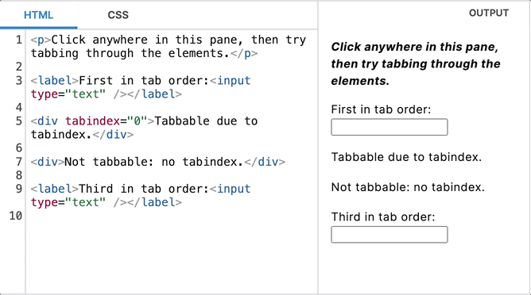

## display: none与visibility: hidden的区别

引言：

在前端面试中，一般比较侧重JavaScript方面的考察，CSS布局方面考察的内容会相对少一些，其中display: none与visibility: hidden的区别是较常见的考点，这两个css配置都可以从视觉上隐藏DOM元素，那这两者的使用上有什么区别呢？

### display: none

首先我们来看W3C中对[display: none](https://www.w3.org/TR/css-display/#valdef-display-none)的描述：

> 'none'
>
> ​    The [element](https://www.w3.org/TR/css-display/#elements) and its descendants generate no [boxes](https://www.w3.org/TR/css-display/#box) or [text sequences](https://www.w3.org/TR/css-display/#css-text-sequence).
>
> ​    Similarly, if a [text node](https://www.w3.org/TR/css-display/#text-nodes) is defined to behave as [display: none](https://www.w3.org/TR/css-display/#propdef-display), it generates no [text sequences](https://www.w3.org/TR/css-display/#css-text-sequence).
>
> Elements with either of these values do not have [inner](https://www.w3.org/TR/css-display/#inner-display-type) or [outer display types](https://www.w3.org/TR/css-display/#outer-display-type), because they don’t generate any boxes at all.
>
> NOTE: As these values cause affected elements to not generate a box, anonymous box generation rules will ignore the elided elements entirely, as if they did not exist in the box tree.

简单翻译一下：

> ​    **元素及其后代不生成盒子或文本序列。**
>
> ​    **同样，如果文本节点被定义为display: none，它就不会生成文本序列。**
>
> **具有上述任一值（指none和contents，W3C的文档中这两者放在同一小节）的元素都没有内部或外部显示类型，因为它们根本不会生成任何盒子。**
>
> **注意：由于这些值会导致受影响的元素不生成盒子，因此匿名盒子生成规则会完全忽略被省略的元素，就好像它们不存在于盒子树中一样。**

根据上面这段描述可以看出，给元素设置`display: none`后，该元素及其后代都不会生成盒子和文本序列，也就是在渲染树上不会有这个元素对应的节点。

### visibility: hidden

首先我们看[visibility](https://www.w3.org/TR/css-display/#propdef-visibility)属性本身的描述：

> The visibility property specifies whether the box is rendered. Invisible boxes still affect layout. 

意思是：

> **可见性属性指定是否渲染盒子。不可见的盒子仍会影响布局。**

接着继续看[visibility: hidden](https://www.w3.org/TR/css-display/#valdef-visibility-hidden)的描述：

> hidden
>
> Any boxes generated by the element are [invisible](https://www.w3.org/TR/css-display/#invisible). Descendants of the element can, however, be visible if they have [visibility: visible](https://www.w3.org/TR/css-display/#propdef-visibility).

意思是：

> **该元素生成的任何盒子都是不可见的。然而，该元素的后代如果设置为`visibility: visible`，则就是可见的。**

根据上面这段描述，可以看出，给元素设置为`visibility: hidden`后，该元素也会生成盒子，所以仍会影响布局，只是不可见（没有被绘制），并且后代元素可以控制自己是否可见；也就是说后代是可能被显示到页面上的，因此渲染树上会有其对应的节点，只是这个元素本身是不可见的，类似透明。

我们可以看到W3C中还有下面一段描述：

> Invisible boxes are not rendered (as if they were fully transparent), cannot be interacted with (and behave as if they had [pointer-events: none](https://drafts.csswg.org/css-ui-4/#propdef-pointer-events)), are removed from navigation (similar to [display: none](https://www.w3.org/TR/css-display/#propdef-display)), and are also not rendered to speech (except when [speak](https://www.w3.org/TR/CSS21/aural.html#propdef-speak) is [always](https://www.w3.org/TR/css-speech-1/#valdef-speak-always) [[CSS-SPEECH-1](https://www.w3.org/TR/css-display/#biblio-css-speech-1)]). However, as with display: contents, their semantic role as a container is not affected, to ensure that any [visible](https://www.w3.org/TR/css-display/#valdef-visibility-visible) descendants are properly interpreted.

翻译一下意思是：

> **隐形盒子不会被呈现（就像完全透明一样）、无法与之交互（行为类似于设置了`pointer-events: none`）、被从导航中移除（类似于`display: none`），也不会呈现为语音（除非speak被设置为[always](https://www.w3.org/TR/css-speech-1/#valdef-speak-always)  [[CSS-SPEECH-1](https://www.w3.org/TR/css-display/#biblio-css-speech-1)]）。不过，与display: contents一样，它们作为容器的语义作用不会受到影响，以确保任何可见后代都能得到正确的解释。**

我看了一下，大概意思差不多理解，但是其中“被从导航中移除”这个不太理解，原本以为是设置锚点不能跳转，但是尝试了一下，发现是可以的，所以又查阅了一下MDN的说法：[MDN-visibility](https://developer.mozilla.org/en-US/docs/Web/CSS/visibility)

> `hidden`
>
> The element box is invisible (not drawn), but still affects layout as normal. Descendants of the element will be visible if they have `visibility` set to `visible`. The element cannot receive focus (such as when navigating through [tab indexes](https://developer.mozilla.org/en-US/docs/Web/HTML/Global_attributes/tabindex)).

大致意思就是：

不能被聚焦（比如通过tabindex这个属性）。

tabindex这个属性可以使HTML元素获得焦点，比如：

我们可以通过tab键使设置了tabindex的元素获得焦点，也可以直接点击这个元素使它获得焦点；那么也就是说如果元素设置了visibility: hidden，即使设置了tabindex属性，也无法获取焦点。

另外后面这段内容，我觉得也可以帮助理解，

> Using a `visibility` value of `hidden` on an element will remove it from the [accessibility tree](https://developer.mozilla.org/en-US/docs/Learn/Accessibility/What_is_accessibility#accessibility_apis). This will cause the element and all its descendant elements to no longer be announced by screen reading technology.

它的意思是，设置了hidden的元素将从**可访问树上**被移除，其中的内容无法被无障碍阅读设备读取，总体来说，就是将这个被设置了`visibility: hidden`的元素当做完全不存在，直接跳过，在页面审查元素的时候，也无法在页面上选中这个元素。

### 两者对比

从上述的定义中，可以看出，两者在渲染时，主要有两个区别：

* 第一，是对后代元素是否可见的可控性，`visibility: hidden`无法完全控制后代的可见性
* 第二，是是否参与布局计算，从定义中完全可以看出，元素即使设置了`visibility: hidden`，依旧会生成盒子，会参与布局的计算

那么在使用上要怎么选择呢？

**首先**我们可以考虑，是否由元素完全控制其后代的可见性，如果答案是否，那么`display: none`就可以直接排除了。

**其次**我们还要考虑一件事，就是通常来说，如果某个元素页面上不需要展示，我们直接可以不写，但既然我们写了，那么这个隐藏元素就可能出现在页面上，也就是说显示/隐藏的状态会发生切换。

这个时候我们就要考虑回流重排的问题，因为元素在设置`display: none`时不参与布局的计算，在状态切换为显示时，又会参与布局，这就会使**渲染树**的节点发生改变，导致触发浏览器回流并重新生成渲染树；频繁的切换状态就会导致频繁地触发回流重排，影响页面渲染性能，所以在有状态切换的场景，尤其是频繁切换，更推荐优先使用`visibility: hidden`。

并且使用`visibility: hidden`还可以设置一些过渡的显示效果（transition）。

但**还要注意一个问题**，就是元素设置`visibility: hidden`后，就无法与之交互，如果遇到一些特殊的业务需求，比如需要与不可见元素发生交互，或者能够被无障碍阅读设备读取，这个时候就不能这样用了，这个时候可以考虑使用`opacity: 0`，将元素的透明度设置为0，这样除了变成完全透明，其他方面与普通元素没什么不同。

**那`display: none`这么多缺点，是不是就要抛弃不用呢？** 那倒也不是这么绝对，比如有种情况，在页面加载的时候，根据某些值来判断是否显示某个元素，并且后续基本很少切换状态，那简单使用`display: none`也是没有问题的。

v-if false：直接不生成dom节点 => 不在dom树上

v-show false：=display:none    => 在dom树上，不在渲染树上

​                             visibility:hidden => 在渲染树上，不在可访问树上（注意后缀，-ability代表一种能力）

​                             opacity:0 => 在渲染树上，在可访问树上

​                              width:0 => 在渲染树上，在可访问树上，不占空间

可以用以下比喻来帮助理解：

opacity: 0是玻璃（固态，有形），虽然看不见，但是摸得着（可以获得焦点）

width: 0是水（液态），但摸得着（可以获得焦点），触碰它可以直接穿透，相当于没有宽度

visibility: hidden是空气（气态，无形），虽然看不见也摸不着（无法获得焦点），但是是真实存在的气态物质

以上三种都是存在的物质，固体和液体可以触摸（获得焦点），但是气体摸不着（无法获得焦点）；所以在渲染树上都会存在。

而display: none可以理解成没有肉身，只有能量态，比如一个按钮被设为`display: none`，它仍旧可以被触发点击事件，它这个能量（功能）还存在。

可能这些比喻算不上特别恰当，反正就是用来帮助理解一下。