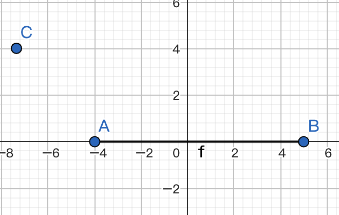

## 利用向量计算点到线段的距离并展示

### 引言

最近我在学可视化的东西，借此来巩固一下学习的内容，向量运算是计算机图形学的基础，这个例子就是向量的一种应用，是利用向量来计算点到线段的距离，这个例子中可视化的展示采用Canvas2D来实现。

说起向量，当时一看到这个词，我是一种很模糊的记忆；这些是中学学的东西，感觉好像都还给老师了。然后又说起了向量的乘法，当看到点积、叉积这两个词，我才猛然想起点乘和叉乘；但整体上还是模模糊糊的，不太记得两者具体的定义了；就找资料快速过了一遍吧。

因为本文中不涉及向量的基础知识；如果有跟我一样遗忘的小伙伴，可以找点视频回忆一下，或者是找点资料看下。


### 题面

首先本次的例子中要获取两个值，一个是点到线段的距离，另一个是点到线段所在直线的距离。

假设存在一个线段AB，以及一个点C；则他们之前的位置可能有三种情况：

* 点C在线段AB左侧

  

* 点C在线段AB的上方或下方

  

* 点C在线段AB的右侧

  

在第一种和第三种情况下，点C到线段AB的距离为点C到点A或点B的距离，即向量AC或向量BC的长度。

在第二种情况下，点C到线段AB和到线段AB所在直线的距离是一样的，这个时候，我们就可以利用向量的乘法来解决这个距离的计算。

这个例子给的思路是利用向量的乘法，因为向量叉乘的几何意义就是平行四边形的面积，已知底边长度，也就是线段AB的长度，然后就可以得出点C到直线的距离；但因为要在页面上展示出来，所以我们需要求得点D的坐标。


### 思路

一开始我想的有点复杂，想要去求AB所在直线的函数方程，从而计算出点C是在直线的上方还是下方，虽然向量的叉乘我记得不太多了，但我依旧还记得，如果向量AB旋转到向量CD为顺时针，则向量AB叉乘向量CD的值就为正，如果是逆时针，就为负。

接着再利用叉乘和点乘，去计算点D的x坐标和y坐标；这其实有点把事情搞复杂了，另外还需要去特殊处理CD和X轴平行以及Y轴平行的特殊情况。

然后我看了别人的提示才反应过来，我们只要充分地利用向量的乘法就可以了，而不需要去求什么直线的函数方程，当然这也就不用考虑什么特殊情况。


由上图可知AD是AC在AB上的投影，然后我们知道投影可以通过点乘来求得，要求两个向量的点乘，有两种计算方式，一种是通过坐标来计算，另一种是通过向量的模和夹角来计算；分别对应以下两个公式：

* AC · AB = AC.x * AB.x + AC.y * AB.y
* AC · AB = |AC| * |AB| * cosθ

因为已知点A、点B和点C的坐标，所以我们可以利用以上两个公式计算点D的坐标。


### 具体实现

现在我们就来通过Canvas来实现以上效果。

#### HTML

首先我们在HTML中先放一个Canvas标签。

```html
<canvas width="512" height="512"></canvas>
```

#### CSS

然后写一点简单的CSS样式。

```css
canvas {
  margin: 0;
	width: 512px;
	height: 512px;
	border: 1px solid #eee;
}
```

#### JavaScript

最后我们来编写最重要的JavaScript代码。

这里预先定义了一个Vector2D的类用于表示二维向量。

```javascript
class Vector2D extends Array {
	constructor(x = 1, y = 0) {
		super(x, y);
	}
	get x() {
		return this[0];
	}
	set x(value) {
		this[0] = value;
	}
	get y() {
		return this[1];
	}
	set y(value) {
		this[1] = value;
	}
	get len() {
		// x、y的平方和的平方根
		return Math.hypot(this.x, this.y);
	}
	get dir() {
		// 向量与X轴的夹角
		return Math.atans(this.y, this.x);
	}
	copy() {
		return new Vector2D(this.x, this.y);
	}
	add(v) {
		this.x += v.x;
		this.y += v.y;
		return this;
	}
	rotate(rad) {
		const c = Math.cos(rad),
			s = Math.sin(rad);
		const [x, y] = this;

		this.x = x * c - y * s;
		this.y = x * s + y * c;

		return this;
	}
	scale(length) {
		this.x *= length;
		this.y *= length;

		return this;
	}
	dot(v) { // 点乘
		return this.x * v.x + this.y * v.y;
	}
	cross(v) { // 叉乘
		return this.x * v.y - v.x * this.y;
	}
  reverse() {
    return this.copy().scale(-1);
  }
  minus(v) {
    return this.copy().add(v.reverse());
  }
  normalize() {
    return this.copy().scale(1 / this.len);
  }
}
```

x和y分别是向量的坐标，len获取的是向量的长度、利用了Math对象上的方法，dot和cross方法分别对应的就是向量的点乘和叉乘。

接着就来编写功能代码。

* 首先是获取canvas2d的上下文，并完成坐标的转换

  ```javascript
  let canvas = document.querySelector('canvas'),
  	ctx = canvas.getContext('2d');
  
  ctx.translate(canvas.width / 2, canvas.height / 2);
  ctx.scale(1, -1);
  ```

  因为画布原始的坐标系是以左上角为原点，X轴向左，Y轴向下，这不符合我们在数学中常用的配置。

  这里我们先通过translate方法把坐标挪到画布中心，再通过scale方法将坐标系绕X轴翻转；通过这样的转换，就可以按照我们在数学中常见的坐标系来操作了。

* 然后我们来初始化三个点，也就是之前说的点A、点B和点C。

  坐标可以随便写，只要范围在-256到256之间就可以。

  我这里就简单定义三个在X轴上的点，并维护在一个Map中，方便后续在canvas上显示三个点的标识；后面会加一个事件监听来更新点C的坐标。

  ```javascript
  let map = new Map();
  let	v0 = new Vector2D(0, 0),
  	v1 = new Vector2D(100, 0),
    v2 = new Vector2D(-100, 0);
  map.set('C', v0);
  map.set('A', v1);
  map.set('B', v2);
  ```

* 然后就可以开始绘制

  这里我们定义一个draw函数，然后调用它。

  ```javascript
  draw();
  
  function draw() {}
  ```

  * 首先，为了看上去更清晰，我们可以把坐标系绘制出来。

    因为接下去绘制的直线比较多，这里我简单封装一个绘制直线的方法。

    ```javascript
    function drawLine(start, end, color) {
      ctx.beginPath();
      ctx.save();
      ctx.lineWidth = '4px';
      ctx.strokeStyle = color;
      ctx.moveTo(...start);
      ctx.lineTo(...end);
      ctx.stroke();
      ctx.restore();
      ctx.closePath();
    }
    ```

    然后我们来绘制坐标系。

    ```javascript
    drawAxis();
    
    function drawAxis() {
      drawLine([-canvas.width / 2, 0], [canvas.width / 2, 0], "#333");
      drawLine([0, canvas.height / 2], [0, -canvas.height / 2], "#333");
    }
    ```

  * 接着我们把点绘制到画布上

    ```javascript
    for(const p of map) {
      drawPoint(p[1], p[0]);
    }
    
    function drawPoint(v, name, color='#333') {
      ctx.beginPath();
      ctx.save();
    	ctx.fillStyle = color;
    	ctx.arc(v.x, v.y, 2, 0, Math.PI * 2);
      ctx.scale(1, -1);
      ctx.fillText(`${name}`, v.x, 16 - v.y);
      ctx.restore();
    	ctx.fill();
    }
    ```

    这里我们想把点的标识通过fillText也绘制到画布上，但由于之前坐标被绕X轴翻转过一次，所以直接绘制表示会导致文本是倒过来的，所以我们这里临时把坐标系翻转回来，完成文本绘制后，再通过restore恢复回去。

  * 现在我们把线段AB也绘制出来

    ```javascript
    drawBaseline();
    
    function drawBaseline() {
      drawLine(map.get('A'), map.get('B'), "blue");
    }
    ```

  * 最后就是最关键的一步，把点C到线段AB和直线的距离求出来并展示在canvas画布上

    d为点C到线段AB的距离，dLine为点C到直线的距离；

    result存储的是AC和AB的点乘结果；crossProduct存储的是AC和AB的叉乘结果。

    根据叉乘结果，我们就可以计算出dLine的值，也就是点C到直线的距离。

    ```javascript
    drawLines();
    
    function drawLines() {
      let AC = map.get('C').minus(map.get('A'));
      let AB = map.get('B').minus(map.get('A'));
      let BC = map.get('C').minus(map.get('B'));
      let result = AC.dot(AB);
      let d, dLine; // distance
      
      let crossProduct = AC.cross(AB);
      dLine = Math.abs(crossProduct) / AB.len; 
      let pd = getD();
      map.set('D', pd);
      if (result < 0) {
        // 角CAB为钝角
        drawLine(map.get('A'), map.get('C'), 'red');
        drawLine(map.get('C'), pd, 'green');
        d = AC.len;
      } else if (result > Math.pow(AB.len, 2)) {
        // 角CBA为钝角
        drawLine(map.get('B'), map.get('C'), 'red');
        drawLine(map.get('C'), pd, 'green');
        d = BC.len;
      } else {
        d = dLine;
        drawLine(map.get('C'), pd, 'red');
      }
      
      let text = `点C到线段AB的距离：${Math.floor(d)}, 点C到AB所在直线的距离为${Math.floor(dLine)}`;
      drawText(text);
    }
    
    function getD() {
      let AC = map.get('C').minus(map.get('A'));
      let AB = map.get('B').minus(map.get('A'));
      let A = map.get('A'); // 即：向量OA
      // 已知：AD为AC在AB上的投影
      // AD = (AB / |AB|) * (AC·AB / |AB|)
      //    = AB * (AC·AB / |AB|²) 
      // D.x - A.x = AD.x, D.y - A.y = AD.y
      let AD = AB.scale(AC.dot(AB) / AB.len**2);
      let D = new Vector2D(
        AD.x + A.x,
        AD.y + A.y
      );
      return D;
    }
    ```

    然后我们来计算点D的坐标：

    已知：AD是AC在AB上的投影。

    所以AD可以表示为这样：`(AB / |AB|) * (AC·AB / |AB|)`

    `向量AB除以AB的模`即代表和向量AB同一方向夹角的单位向量，单位向量可以简单理解为长度为1的向量；

    `AC和AB的点积除以AB的模`结果等于`AC的模乘以两个向量夹角的余弦值`。

    所以这两个值相乘，就等于是向量AD。

    通过调整上面的公式，我们可以得到AD = `AB * (AC·AB / |AB|²) `，因为A、B、C的坐标都已知，也就可以得到向量AD的坐标。

    然后我们又知道向量AD的坐标可以直接通过向量的减法得到，也就是：

    * AD.x = D.x - A.x
    * AD.y = D.y - A.y

    所以我们就可以得到点D的坐标，即`(AD.x + A.x, AD.y + A.y)`。

    接着我们根据AC和AB的点乘结果result，来绘制相应的直线。

    * 当result为负数时，说明AC和AB夹角的余弦值大于90度

      即∠CAB为钝角，说明点C到线段AB的距离就是点C到点A的距离。

    * 而当result大于AC长度的平方，也就是AC的模乘以余弦值大于AB的模，也就是说，AC在向量AB上的投影大于AB的长度

      那么此时∠CBA是钝角，点C到线段AB的距离就是点C到点B的距离。

    * 当result为0时，说明两个向量互相垂直

      此时，点C在线段AB的上方或下方，点C到线段AB的距离就是点C到直线的距离。也就是我们前面求到的dLine的值。

    最后我们将结果通过fillText方法绘制到屏幕上。

    ```javascript
    function drawText(distance) {
      ctx.beginPath();
      ctx.save();
      ctx.font = "16px serif";
      ctx.scale(1, -1);
      ctx.fillText(`${distance}`, -250, 240);
      ctx.restore();
    }
    ```

  * 最后我们加一个鼠标移动事件，动态地更新点C的坐标，以及点C到线段AB和直线的距离。

    ```javascript
    initEvents();
    
    function initEvents() {
    	canvas.addEventListener('mousemove', e => {
        const rect = canvas.getBoundingClientRect();
        ctx.clearRect(-canvas.width / 2, -canvas.height / 2, canvas.width, canvas.height);
        let x = e.pageX - rect.left - canvas.width / 2;
        let y = -(e.pageY - rect.top - canvas.height / 2);
        v0 = new Vector2D(x, y);
        map.set('C', v0);
        draw();
    	});
    }
    ```

  好啦，到这里为止一个简单的距离展示就完成了；我们可以通过移动鼠标来查看最后的效果。
