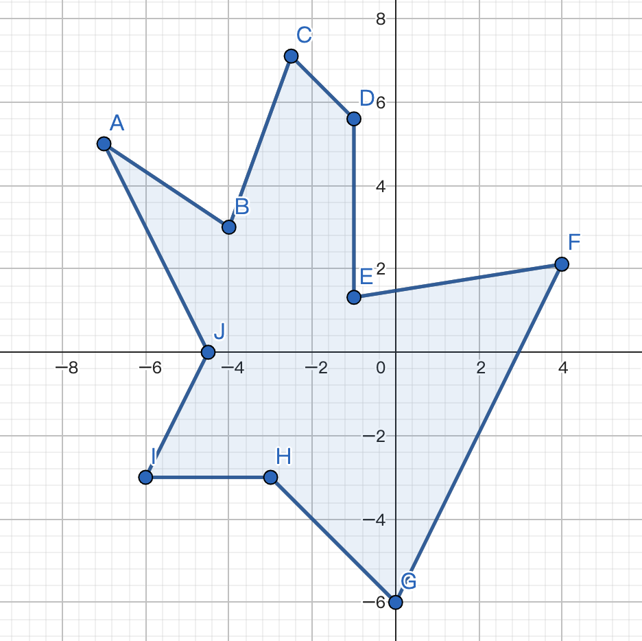
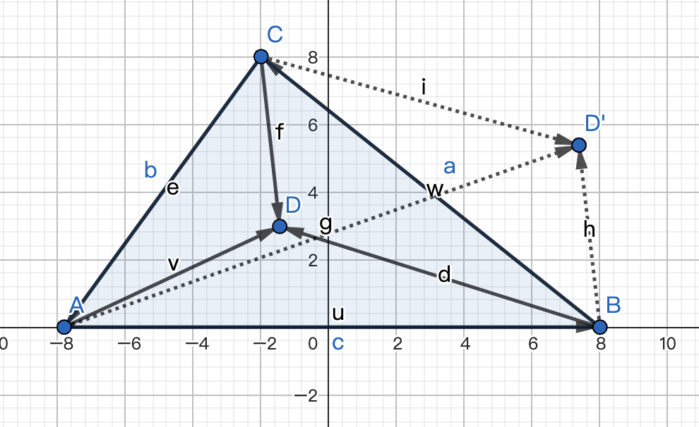

## 利用向量判断多边形边界

### 引言

继续巩固我的可视化学习，向量运算是计算机图形学的基础，本例依旧是向量的一种应用，利用向量判断多边形边界，但是多边形的边界判断稍微有点复杂，所以除了应用向量之外，还需要借助三角剖分的相关工具。这个例子中可视化的展示采用Canvas2D来实现。


### 问题

假设Canvas画布上存在一个如下多边形：



我们移动鼠标的时候，想要实现一个效果，就是当鼠标移动到多边形内部的时候，将多边形内部的填充颜色更新成其他颜色；所以此时我们需要判断鼠标是否在多边形内部，这就涉及到多边形边界的判断。


### 思路

首先我们先将这个多边形绘制到Canvas画布上。

```html
<canvas width="512" height="512"></canvas>
```

```css
canvas {
  width: 512px;
  height: 512px;
  border: 1px solid #eee;
}
```

```javascript
const canvas = document.querySelector('canvas');
const ctx = canvas.getContext('2d');

ctx.translate(canvas.width / 2, canvas.height / 2);
ctx.scale(1, -1);

const vertices = [
    [ -179.2, 128 ],
    [ -102.4, 76.8 ],
    [ -64, 181.76 ],
    [ -25.6, 143.36 ],
    [ -25.6, 33.28 ],
    [ 102.4, 53.76 ],
    [ 0, -153.6 ],
    [ -76.8, -76.8 ],
    [ -153.6, -76.8 ],
    [ -115.2, 0 ]
];

drawPolygon(vertices);

function drawPolygon(vertices, fillStyle = "red") {
  ctx.beginPath();
  ctx.moveTo(...vertices[0]);
  for (let i = 1; i < vertices.length; i ++) {
      ctx.lineTo(...vertices[i]);
  }
  ctx.closePath();
  ctx.fillStyle = fillStyle;
  ctx.fill();
}
```

#### 1. 调用API

对于Canvas2D而言，有一个API自带的方法，就是CanvasRenderingContext2D的isPointInPath方法。

这个方法使用起来非常简单，我们在这个时候直接增加一个鼠标移动事件的监听就可以。

```javascript
const {left, top} = canvas.getBoundingClientRect();
canvas.addEventListener('mousemove', e => {
  const {x: pageX, y: pageY} = e;
  // 坐标转化
  const offsetX = x - left;
  const offsetY = y - top;
  // 清除画布
  ctx.clearRect(-256, -256, 512, 512);
  if (ctx.isPointInPath(offsetX, offsetY)) {
    drawPolygon(vetices, "green");
  } else {
    drawPolygon(vetices);
  }
});
```

但是这个API的使用存在很大的局限性，就是它只能针对当前绘制的图形生效。

就比如说，如果在完成这个多边形的绘制之后，又绘制了一个小三角形。

```javascript
const triangle = [
  [100, 100], 
  [100, 200], 
  [150, 200]
];

drawPolygon(triangle, "blue");
```

为了保持这个小三角形，我们还需要修改鼠标监听事件，以达到更新画布时，三角形依旧被绘制。

```javascript
canvas.addEventListener('mousemove', e => {
  const {pageX: x, pageY: y} = e;
  // 坐标转化
  const offsetX = x - left;
  const offsetY = y - top;
  // 清除画布
  ctx.clearRect(-256, -256, 512, 512);
  if (ctx.isPointInPath(offsetX, offsetY)) {
    drawPolygon(vertices, "green");
    drawPolygon(triangle, "blue");
  } else {
    drawPolygon(vertices);
    drawPolygon(triangle, "blue");
  }
});
```

此时我们再移动鼠标，就会发现，在鼠标移动到多边形内部时，多边形的填充颜色并不会变，但是当鼠标移动到小三角形内部时，多边形的填充色发生了变化；这就是Canvas2D Context的isPointInPath方法所存在的局限性。

#### 2. 自定义isPointInPath

为了突破Canvas2D API中自带方法的局限性，最简单的方法就是，我们手动自定义一个自己的isPointInPath方法。

具体实现如下：

```javascript
function isPointInPath(x, y) {
  // 根据ctx重新clone一个新的Canvas对象
  const cloned =  ctx.canvas.cloneNode().getContext('2d');
  cloned.translate(canvas.width / 2, canvas.height / 2);
  cloned.scale(1, -1);
  let ret = false;
  // 绘制多边形，判断点是否在图形内部
  drawPolygon(cloned, vertices, "red");
  ret |= cloned.isPointInPath(x, y);
  if (!ret) {
    // 如果不在，继续绘制小三角形，判断点是否在图形内部
    drawPolygon(cloned, triangle, "blue");
    ret |= cloned.isPointInPath(x, y);
  }
  return ret;
}
```

* 首先，根据原画布的Context创建一个新的Canvas对象并获取它的上下文
* 然后绘制多边形，并判断鼠标是否在多边形内部
* 如果不在多边形内部，继续判断是否在三角形内部
* 最后将结果返回

可以看到，在这个自定义的方法内部，我们依然是调用了Canvas2D Context的isPointInPath方法。

接着我们还需要修改鼠标的监听事件，把判断方法改为我们自定义的isPointInPath。

此时移动鼠标，可以看到，当鼠标移动到多边形或者三角形内部，都可以使多边形的填充色发生变化；这就是因为我们在自定义的isPointInPath中做的两次判断。

但是我们也能发现，虽然这种方式解决了我们在第一种方式中所碰到的问题，却也存在其他问题，第一，是增加了很多无谓的Canvas绘图操作；第二，是通用性差，如果图形有修改，那么isPointInPath方法就要跟着修改，并且这个方法依赖于Canvas2D的API，如果哪天修改了绘图方式，比如改为使用WebGL，就不能使用了。

#### 3. 通用型isPointInPath

所以我们需要实现一个更具通用性的isPointInPath方法：直接通过点与几何图形的数学关系来判断点是否在图形内，也就是我们标题中所说的利用向量来判断。

但是直接判断点与几何图形的关系，还是比较困难的。这个时候，我们可以先对多边形进行三角剖分，三角剖分可以简单地理解为是把多边形表示成由多个三角形组合而成的形式；接着将点和对应的多个三角形的关系进行逐一判断；最后得出结果。

对于三角剖分，涉及的算法稍复杂，这里我们直接使用一个成熟的、使用起来比较简单的库——earcut；然后就剩下最关键的一步，就是点和三角形的位置判断。

判断点是否在三角形内部，就相对比较简单了：

假设三角形的三个点是A、B、C，把三角形的三条边分别使用向量表示，再将平面上一个点D连接三角形三个顶点得到三个向量，那么点D在三角形内部的充分必要条件就是：

AB x AD、BC x BD、CA x CD三组向量的叉乘结果符号相同。就如下图所示。



* 如果点在三角形内部，就如图上的点D，可以看出AB 到 AD、BC 到 BD、CA 到 CD的旋转方向都是逆时针，旋转方向相同，所以最后的叉乘结果符号都是相同的；
* 而如果点在三角形外部，就如图上的点D'，可以看出AB到AD'和CA到CD'的旋转方向是逆时针，但BC到BD'的旋转方向是顺时针，所以三组向量叉乘的结果符号并不相同

因此根据上述条件，就可以定义一个简单的判定函数：

```javascript
function inTriangle(p1, p2, p3, point) {
    const a = p2.copy().minus(p1);
    const b = p3.copy().minus(p2);
    const c = p1.copy().minus(p3);

    const u1 = point.copy().minus(p1);
    const u2 = point.copy().minus(p2);
    const u3 = point.copy().minus(p3);

    const s1 = Math.sign(a.cross(u1));
    const s2 = Math.sign(b.cross(u2));
    const s3 = Math.sign(c.cross(u3));

    return s1 === s2 && s2 === s3;
}
```

这个函数的前三个参数是三角形的三个顶点，最后一个参数是待判断的点；这样就能判断点是否在三角形内部了。

但是这个函数中还缺少一种特殊情况的判断，就是点恰好在三角形某条边上的情况。

如果一个点在三角形的一条边上，那它需要满足以下2个条件：

* 第一，它和所在边某个顶点形成的向量与这个顶点所在边的向量，这两个向量的叉乘结果为0，即这两个向量的夹角为180度或0度。比如点D在边AB上，则AB x AD为0

* 第二，它和这个顶点形成的向量与这个顶点所在边的向量，这两个向量的点乘结果除以边长的平方，结果大于等于0且小于等于1。比如点D在边AB上，则0<= AB·AD/AB² <=1

  这个值也就是AD在AB上的投影的长度，与AB长度的比值，大于零，说明两个向量的夹角是0度，为同一方向，小于等于1，也就说明点D在线段AB上。

根据这两个条件，我们可以对上面的判定函数进行优化：

```javascript
function inTriangle(p1, p2, p3, point) {
    const a = p2.copy().minus(p1);
    const b = p3.copy().minus(p2);
    const c = p1.copy().minus(p3);

    const u1 = point.copy().minus(p1);
    const u2 = point.copy().minus(p2);
    const u3 = point.copy().minus(p3);

    const s1 = Math.sign(a.cross(u1));
    let p = a.dot(u1) / a.length ** 2;
    if (s1 === 0 && p >= 0 && p <= 1) return true;
    const s2 = Math.sign(b.cross(u2));
    p = b.dot(u2) / b.length ** 2;
    if (s2 === 0 && p >= 0 && p <= 1) return true;
    const s3 = Math.sign(c.cross(u3));
    p = c.dot(u3) / c.length ** 2;
    if(s3 === 0 && p >= 0 && p <= 1) return true;

    return s1 === s2 && s2 === s3;
}
```

这样我们就可以使用inTriangle函数对某个点是否在三角形内部进行判断了。

现在我们来继续完成对点在多边形内部的判断：

1. 首先使用earcut库对多边形进行三角剖分处理

   1. 引入earcut库

      ```html
      <script src="https://unpkg.com/earcut@2.2.4/dist/earcut.dev.js"></script>
      ```

   2. 因为earcut库只接受扁平化的顶点数据，我们需要先用数组的flat方法将顶点扁平化

      ```javascript
      const points = vertices.flat();
      ```

   3. 然后我们就可以把扁平化后的数据传给earcut进行处理了

      ```javascript
      const triangles = earcut(points);
      console.log(triangles);
      ```

      根据打印结果，可以看到earcut的处理结果是一个数组，这个triangles数组的元素是顶点数据在vertices数组中的下标；在这个数组中，每三个元素所对应的顶点就构成一个三角形。

   这样我们就完成了多边形的三角剖分。

2. 接着逐个判断点是否在每个三角形内部。

   ```javascript
   // 判断点是否在多边形内部
   // 将多边形进行三角剖分，然后判断点是否在其中某个三角形内部
   function isPointInPolygon({vertices, cells}, point) {
       let ret = false;
       for(let i = 0; i < cells.length; i += 3) {
           const p1 = new Vector2D(...vertices[cells[i]]);
           const p2 = new Vector2D(...vertices[cells[i + 1]]);
           const p3 = new Vector2D(...vertices[cells[i + 2]]);
           if (inTriangle(p1, p2, p3, point)) {
               ret = true;
               break;
           }
       }
       return ret;
   }
   ```

   根据返回的布尔值就可以知道点是否在多边形内部。

3. 最后就是修改鼠标监听事件的处理程序。

   ```javascript
   const {left, top} = canvas.getBoundingClientRect();
   canvas.addEventListener('mousemove', e => {
     const {pageX: x, pageY: y} = e;
     // 坐标转化
     const offsetX = x - left;
     const offsetY = y - top;
     ctx.clearRect(-256, -256, 512, 512);
     
     const point = new Vector2D((offsetX - canvas.width / 2), (canvas.height / 2 - offsetY)); // 因为Canvas经过坐标转换，所以这里需要把页面上点的坐标也转换一遍，才能正常判断
     if (isPointInPolygon({
           vertices: positions,
           cells: triangles
         }, point)
     ) {
       drawPolygon(vertices, "green");
       drawPolygon(triangle, "blue");
     } else {
       drawPolygon(vertices);
       drawPolygon(triangle, "blue");
     }
   });
   ```

   这里需要注意，Canvas2D自带的API在进行判断时，应该是自动对鼠标对应的点的坐标进行了转换，所以我们使用自定义的方法时，不能直接使用offsetX和offsetY，需要自己去将点的坐标根据坐标系的转换计算出对应在画布上的坐标。

此时，我们再去移动鼠标，就可以看到，当鼠标移动到多边形内部或者多边形的边时，多边形的填充色发生了改变，也就说明我们的判断生效了；这就成功应用了向量来判断多边形边界。

