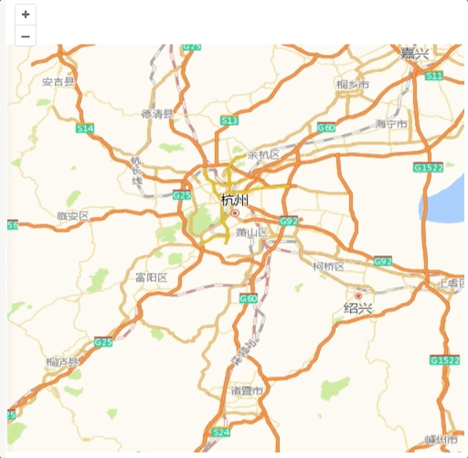

## 开源地图库OpenLayers的简单使用

### 引言

最近在学习可视化的东西，这让我想起了一些以前用过的图表库，其实我在日常做的大多是普通的需求，可视化方面应用的并不多，只是偶尔会因为个别特殊的需求，去借助一些图表库来实现图表的展示，这些普通的图表库，在使用上都大差不差，并没有什么太大的区别，但是某些特殊的图表库，比如地图库，在使用上和一些普通的图表，还是存在一些不同，现在想一想还是需要做一些记录，因为我没有在当时使用的时候及时记录，导致我现在对OpenLayers的使用也有一点模糊了，只能借助代码来回忆，所以我现在把它的简单使用做一次整理。

其实一开始我选择使用的是比较普遍的高德地图，但是需求做到后面，我才意识到当时做的项目是要部署在内网的，当时就有点傻眼了，因为我对WebGIS也并不熟悉，所以就上网匆匆的搜索有什么容易上手使用的开源地图库，然后锁定了OpenLayers这个库。

OpenLayers使用起来不像高德地图那么方便，因为部署的是内网环境，需要自己准备瓦片服务，还记得当时下载地图瓦片也下载了很久，因为要准备不同比例的地图瓦片，不过幸好当时只需要下载杭州一个城市的瓦片。


### 准备工作

虽然之前我是在React的项目中使用OpenLayers的，但OpenLayers的使用与项目的具体框架并没有太大的关系，所以我们只需要使用script标签引入OpenLayers，就可以在项目中使用这个开源地图库了。

因此我们的准备工作，只需要一个引入OpenLayers的页面，然后在页面上准备一个div，来作为地图的容器就可以了，另外在这个例子中我使用了systemjs来进行浏览器端的包管理，不用也是可以的；当然，地图瓦片也是需要提前准备的。

```html
<!doctype html>
<html lang="en">
<head>
    <meta charset="UTF-8">
    <meta name="viewport"
          content="width=device-width, user-scalable=no, initial-scale=1.0, maximum-scale=1.0, minimum-scale=1.0">
    <meta http-equiv="X-UA-Compatible" content="ie=edge">
    <title>OpenLayers demo</title>
    <script type="systemjs-importmap">
        {
            "imports": {
                "ol": "https://cdn.jsdelivr.net/npm/ol@v8.2.0/dist/ol.js"
            }
        }
    </script>
    <link rel="stylesheet" href="https://cdn.jsdelivr.net/npm/ol@v8.2.0/ol.css">
    <script src="https://cdn.jsdelivr.net/npm/systemjs@6.8.3/dist/system.js"></script>
    <script src="https://cdn.jsdelivr.net/npm/systemjs@6.8.3/dist/extras/use-default.js"></script>
</head>
<body>
<div id="map" style="width: 500px; height: 500px;"></div>
</body>
</html>
```

#### 地图瓦片

地图瓦片是什么呢？简单来说，它是地图视图的组成单元，也就是说，地图的视图是由一张张的瓦片拼凑而成。但是地图的使用一般而言不是静态的，通常在使用中我们需要对地图进行缩放交互，来进行更细致的观察。所以我们一般需要准备多个比例下的地图瓦片，具体的可以根据需求来确定。

虽然当时我查到可以由后端部署服务来提供瓦片，但因为当时比较匆忙，我没来得及仔细研究，又觉得说本来这块工作量之前也并不了解，前端这边如果能直接处理就处理了，所以就用地图瓦片下载器自己去下载了瓦片，然后部署到一个静态服务下面；现在对于demo的编写倒也是一个好处，可以方便前端的独立展示。


### 实现效果

因为是简单的使用，所以这里我们主要实现地图的展示、放大缩小等简单的功能，以及一些简单的交互处理。


### 具体实现

总体来说，Openlayers的使用并不复杂，普通的使用通过查阅API文档完全可以应对。

-  首先我们提前把下载好的地图瓦片放到服务目录下。 

-  然后是最基本的，使用`System.import`方法引入ol依赖 

  ```javascript
  const ol = await System.import('ol');
  ```

-  然后我们关注三个主要的类，分别是Map、View和TileLayer，这是我们用于构筑地图的主要部分 

  ```javascript
  const OlMap = ol.Map,
      	View = ol.View,
      	TileLayer = ol.layer.Tile;
  ```

-  现在我们就可以通过new Map来创建新的地图对象 

  ```javascript
  const map = new OlMap({
    target: 'map',
    view: new View({
      center: [120.212, 30.208],
      projection: 'EPSG:4326',
      zoom: 9,
      maxZoom: 17,
      minZoom: 7
    }),
  });
  ```

  其中target用于指定盛装地图的容器；

  在创建地图对象的时候，会使用到View这个类，代表地图的二维视图。我们可以在视图中通过经纬度数组指定视图的中心，View默认使用EPSG3857坐标系设置，我们也可以通过projection选项来修改坐标系，之前我使用的时候比较匆忙，没有注意到这一块，还很曲折的通过`fromEPSG4326`方法来把4326的经纬度转换为3857坐标系；zoom选项用于定义视图初始分辨率的缩放级别，这里我当时是用了9这个级别，我感觉比较合适，当然具体的设置要看项目需求；然后我们可以通过maxZoom和minZoom这两个选项限制最大和最小的缩放级别。

  现在我们就可以看到，页面上其实已经生成地图容器了，已经能看到放大缩小的操作按钮了，只是说还没有贴上瓦片，所以这时候的地图还比较抽象。 

-  接下来我们就需要用到之前准备的瓦片了，用于给map对象设置layers图层
  layers选项接收的是一个数组，也就是说可以给地图配置多个图层；这里我们使用刚刚引入的TileLayer这个类来创建一个图层；另外我们还需要使用一个XYZ的类，来指定瓦片服务的地址。 

  ```javascript
  // ...
  const XYZ = ol.source.XYZ;
  const map = new OlMap({
    target: 'map',
    view: new View({
      center: [120.212, 30.208],
      projection: 'EPSG:4326',
      zoom: 9,
      maxZoom: 17,
      minZoom: 7
    }),
    layers: [
      new TileLayer({
        source: new XYZ({
          url: './maps/{z}/{x}/{y}.png'
        })
      })
    ]
  });
  ```

 至此我们就可以在页面上看到地图的展示了，打开控制台我们也可以看到对地图瓦片的请求，请求的是`maps/9`目录下的瓦片，我们也能注意到，有一些404的请求，这是因为view图层中的部分地图瓦片我们没有准备，通过在页面上检查元素，也可以看到map容器中确实存在一部分没有贴上瓦片，这通常来说没什么关系，可以不用管；可以看到当使用鼠标滚动缩放地图的时候，也会去请求相应缩放比例的地图瓦片。

-  添加简单的交互事件
  最后来添加一些简单的交互。
  之前我做的需求中需要根据接口返回的数据批量标注地图上的点，但是因为现在没有数据，这里就实现一些简单的交互吧。 

  ```javascript
  const olExtent = ol.extent;
  map.on('moveend', e => {
    console.log('zoom', map.frameState_.viewState.zoom);
    const extent = map.frameState_.extent;
    console.log('extent', extent);
    console.log('TopLeft', olExtent.getTopLeft(extent));
    console.log('BottomRight', olExtent.getBottomRight(extent));
  });
  ```

  我们可以通过zoom获取视图的缩放级别，通过extent获取视图的经纬度范围，还可以进一步通过extent的getTopLeft和getBottomRight分别获取左上角的经纬度和右下角的经纬度；这样我们就可以在缩放视图和移动图层时根据视图的经纬度范围来加载相应的数据。 

  

  ```javascript
  const Feature = ol.Feature;
  const Point = ol.geom.Point;
  const Style = ol.style.Style,
    CircleStyle = ol.style.Circle,
    Fill = ol.style.Fill,
    Stroke = ol.style.Stroke;
  const VectorSource = ol.source.Vector,
    VectorLayer = ol.layer.Vector;
  let count = 0;
  map.on('click', e => {
    const features = [];
    console.log(e.coordinate); // 获取坐标
  
    const iconFeature = new Feature({
       geometry: new Point(e.coordinate),
       name: count ++,
       location: e.coordinate
    });
    const style = new Style({
      image: new CircleStyle({
        radius: 10,
        fill: new Fill({
          color: '#f49d41'
        }),
        stroke: new Stroke({
          color: '#836365',
          width: 1
        })
      })
    });
    iconFeature.setStyle(style);
    features.push(iconFeature);
    const vectorSource = new VectorSource({
      features
    });
    const vectorLayer = new VectorLayer({
      source: vectorSource,
      opacity: 0.8
    });
    map.addLayer(vectorLayer);
  });
  ```

  我们还可以在处理地图的鼠标点击事件时，获取鼠标点对应的经纬度，通过Feature类给地图添加标注，再通过Style类给标注设置样式；也可以在添加新标注前移除旧的标注。 

  ```javascript
  const layers = map.getLayers();
  layers.forEach(item => {
    if(item instanceof VectorLayer) map.removeLayer(item);
  });
  ```

到这里我们就完成了OpenLayers的简单使用，如果有感兴趣的小伙伴，可以去OpenLayers的GitHub和官方文档再去进一步的了解。

以下是运行效果：



整体代码参考[这里](https://github.com/yeying0827/learnFE/tree/master/mini_test/demo8)