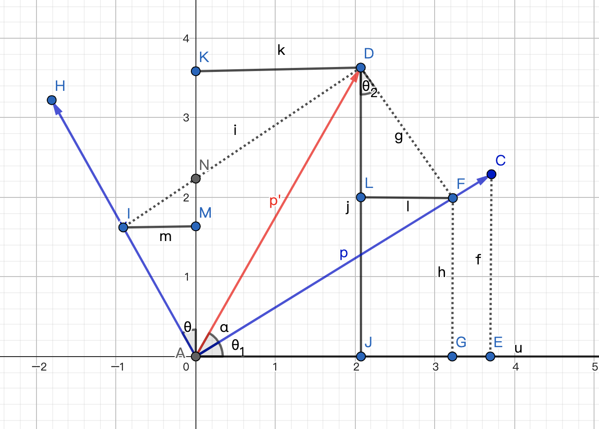

## CSS transform与仿射变换

### 引言

在几年前，我就在一些博客中看到关于CSS中transform的分析，讲到它与线性代数中矩阵的关系，但当时由于使用transform比较少，再加上我毕竟是个数学学渣，对数学有点畏难心理，就有点看不下去，所以只是随便扫了两眼，就没有再继续了解了。现在在学习可视化，又遇到了这个点，又说到这是可视化的基础知识，既然这样，那看来还是逃不过去，那就再多了解一点吧。


### transform的作用

使用过transform的前端小伙伴一定不陌生，通过对CSS中transform属性的设置，我们可以对DOM元素进行缩放、旋转、平移，以及扭曲，从而改变元素的位置、形状、大小和角度。


### 仿射变换

CSS中的transform对应到图形学中的概念就是仿射变换。

仿射变换简单来说就是“线性变换 + 平移”。

在CSS中对某个DOM元素应用仿射变换，可以简单理解成是把这个元素原本的整个坐标系进行了变换，并且这个坐标系的原点在最初始时位于DOM元素的中心，X轴朝右、Y轴朝上、Z轴朝外，也就是朝向屏幕。

所以就是说，对某个DOM元素进行仿射变换，就相当于对它所对应的几何图形的每个顶点向量进行仿射变换。

关于图形的仿射变换，有两个性质：

第一，仿射变换不改变直线段的形状，也就是说，应用仿射变换后，直线段依旧是直线段；

第二，应用相同的仿射变换后，两条直线段的长度比例保持不变。

#### 平移

接下来我们先说平移，平移变换是最简单的仿射变换。

假设存在一个向量`P(x0, y0)`，我们想要把它沿着另一个向量`Q(x1, y1)`的方向移动对应距离，那只要将两个向量相加，我们就可以得到这个新的向量它的坐标。

```
x = x0 + x1
y = y0 + y1
```

这就是平移变换的公式。

#### 线性变换

根据公式可以看出，应用平移变换后，原始坐标系的原点会发生变化。

但是应用线性变换后，原点却并不会变化；下面来讲解两个常用的线性变换：旋转和缩放。

* 旋转

  首先我们先来看旋转变换。

  

  假设存在一个向量`P(x0, y0)`，长度为r，与X轴夹角为θ，现在将它逆时针旋转α角，那么此时新的向量P'的坐标x和y分别是多少呢？

  首先我们根据圆的参数方程，可以得到如下公式：

  ```
  x0 = r * cosθ
  y0 = r * sinθ
  
  x = r * cos(α+θ)
  y = r * sin(α+θ)
  ```

  但这样并看不出新旧坐标之间的关联，所以需要进行推导。

  在上图中，我们假设旋转θ角后得到了一个新的坐标系（蓝色），此时我们可以求得向量P'在新坐标系的坐标，此时P'在新坐标系的坐标可以表示为：

  ```
  x' = r * cosα -> AF
  y' = r * sinα -> AI
  ```

  分别相当于是线段AF和AI的长度。

  此时依旧看不出新旧坐标之间的关联，我们还需要继续推导，求出向量P'在原坐标系的值，在上图中相当于我们要求出线段AJ和AK的长度。

  * 先来求AJ的长度

    首先我们从图中可以看出`AJ = AG - JG`， 并且 `AG = AF * cosθ`；

    同时JG 和LF的长度相同，DF与AI的长度相同，且角FDJ的度数也是θ，所以可以得到`JG = AI * sinθ`。

    最终我们可以得到如下公式：

    ```
    AJ = AF * cosθ - AI * sinθ 
       = r * cosα * cosθ - r * sinα * sinθ
    ```

    又因为：

    ```
    x0 = r * cosθ
    y0 = r * sinθ
    ```

    就可以得到AJ的长度，也就是新向量的x坐标

    ```
    x = x0 * cosα - y0 * sinα
    ```

  * 接着来求AK的长度

    从图中我们也可以看出`AK = AM + MK`，并且`AM = AI * cosθ`

    MK又可以分为MN和NK两段，相当于`MK = AF * sinθ`。

    最终我们可以得到：

    ```
    AK = AI * cosθ + AF * sinθ
       = r * sinα * cosθ + r * cosα * sinθ
    ```

    再加上原坐标和角度及半径的关系，就可以得到AK的长度，也就是新向量的y坐标：

    ```
    y = x0 * sinα + y0 * cosα
    ```

  至此我们就得到了新坐标和原坐标以及旋转角度之间的关系，也就是旋转变换的公式：

  ```
  x = x0 * cosα - y0 * sinα
  y = x0 * sinα + y0 * cosα
  ```

  根据线性代数的知识，我们可以使用矩阵的形式来表示以上公式：
  $$
  \begin{bmatrix}
   x \\
   y 
  \end{bmatrix} =
  \begin{bmatrix}
   cosα & -sinα\\
   sinα & cosα\\
  \end{bmatrix} \times 
  \begin{bmatrix}
   x0\\
   y0
  \end{bmatrix}
  $$

* 缩放

  接着我们继续看缩放变换。缩放变换相当于是让向量与标量相乘。

  比如我们使X轴缩放比例为sx，使Y轴缩放比例为sy，就可以得到新向量的坐标为：

  ```
  x = sx * x0
  y = sy * y0
  ```

  缩放比旋转简单一些，可以直接写出矩阵形式的公式：
  $$
  \begin{bmatrix}
   x \\
   y 
  \end{bmatrix} =
  \begin{bmatrix}
   s_x & 0\\
   0 & s_y\\
  \end{bmatrix} \times 
  \begin{bmatrix}
   x0\\
   y0
  \end{bmatrix}
  $$

至此，我们就基本了解了仿射变换的公式，并且可以看出线性变换的公式可以用矩阵相乘的形式进行表示。

除了不改变原点，线性变换还有另外一个性质，就是可以进行叠加；多个线性变换的叠加结果就是将线性变换的矩阵依次相乘，最后再与原始向量相乘。

根据以上内容，我们可以得到仿射变换的一般表达式：

```
P = M x P0 + P1
```

M为多个线性变换的叠加结果，也就是变换矩阵的相乘结果，P0为原始向量坐标，P1为平移。

#### 公式优化

为了便于计算，我们还可以对以上的仿射变换表达式进行优化，通过增加维度来使用矩阵进行表示：
$$
\begin{bmatrix}
 P \\
 1 
\end{bmatrix} =
\begin{bmatrix}
 M & P1\\
 0 & 1\\
\end{bmatrix} \times 
\begin{bmatrix}
 P0\\
 1
\end{bmatrix}
$$
这实际上就是给线性空间增加了一个维度，用高维度的线性变换表示了低维度的仿射变换。

这种n+1维坐标被称为**齐次坐标**，对应的矩阵被称为**齐次矩阵**。

我们需要注意，由于平移变换会改变坐标原点，不同的变换顺序很可能会导致不同的变换结果，所以要注意矩阵相乘的顺序。


### 公式应用

接下来我们就来应用一下线性变换的公式。

假设现在在页面上有一个div。

```html
<div class="block separate">我使用分开写</div>
```

```less
.block {
  width: 100px;
  height: 100px;
  color: #fff;
  background: orange;

  &.separate {
    transform: rotate(30deg) translate(100px, 50px) scale(1.5);
  }
}
```

通过简单的旋转和平移，我们改变了元素的角度、位置和大小。

此时我们对于transform的变换是分开写的，但在CSS的transform中，可以使用一个matrix函数，让我们对这些变换进行合并编写。

首先我们引入一个ogl库，使用其中定义的矩阵类Mat3（也可以借助其他数学库，比如mathjs）：

```javascript
import { Mat3 } from 'ogl';
```

然后针对上面的3个变换，分别定义三个变换矩阵，分别是旋转矩阵、平移矩阵和缩放矩阵：

```javascript
const rad = Math.PI / 6;

let a = new Mat3(
    // 旋转矩阵
    Math.cos(rad), -Math.sin(rad), 0,
    Math.sin(rad), Math.cos(rad), 0,
    0, 0, 1
);
let b = new Mat3(
    // 平移矩阵
    1, 0, 100,
    0, 1, 50,
    0, 0, 1
);
let c = new Mat3(
    // 缩放矩阵
    1.5, 0, 0,
    0, 1.5, 0,
    0, 0, 1
);

// -------------
// 使用math.js
const a = math.matrix(
  [
    [Math.cos(rad), -Math.sin(rad), 0], 
    [Math.sin(rad), Math.cos(rad), 0],
    [0, 0, 1]
  ]
);
const b = math.matrix(
  [
    [1, 0, 100], 
    [0, 1, 50],
    [0, 0, 1]
  ]
);
const c = math.matrix(
  [
    [1.5, 0, 0], 
    [0, 1.5, 0],
    [0, 0, 1]
  ]
);
```

接着对三个矩阵进行相乘，得到axbxc的结果：

```javascript
const res = [a, b, c].reduce((prev, current) => {
  return current.multiply(prev); // prev x current 结果保存到current
});

// -------------
// 使用math.js
let res = math.multiply(a, b);
res = math.multiply(res, c);
```

最后我们利用CSS变量将JS的计算结果应用到样式上：

```less
.block {
  // ...

  &.combine {
    --trans: none;
    transform: var(--trans);
  }
}
```

由于CSS的matrix是一个简写的齐次矩阵，它省略了三阶齐次矩阵第三行的0,0,1，所以只有6个值。

```javascript
const combine = document.querySelector('.combine');
const s = res.slice(0, 6);
```

matrix貌似是列主序，所以在设置的时候，需要按如下顺序赋值：

```javascript
const combine = document.querySelector('.combined');

combine.style.setProperty('--trans', `matrix(
${s[0]},${s[3]},
${s[1]},${s[4]},
${s[2]},${s[5]},
)`);


// -------------
// 使用math.js
const s = Array.from(res).map(item => item.value);
combine.style.setProperty('--trans', `matrix(
  ${s[0]},${s[3]},
  ${s[1]},${s[4]},
  ${s[2]},${s[5]}
)`);
```

可以明显看出，这样使用的效果，和rotate、translate和scale分开写的效果是一样的。


### 总结

利用仿射变换，我们可以快速绘制出形态、位置、大小各异的众多几何图形，比如实现粒子动画。

也许在普通的前端开发中，用不到太多，也并不太需要说去利用matrix去减少CSS的代码体积，但如果要去做可视化方面的开发，仿射变换还是可以多去了解一下。


[整体代码](https://github.com/yeying0827/visualization-demos/blob/main/src/pages/Transform/CSS.vue)
[效果](https://yeying0827.github.io/visualization-demos/#/transform/css)
