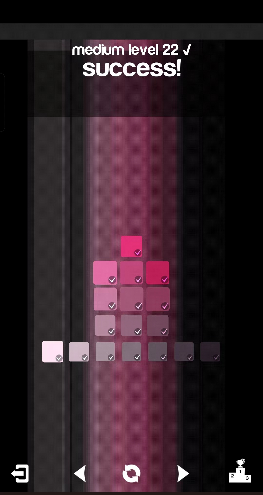
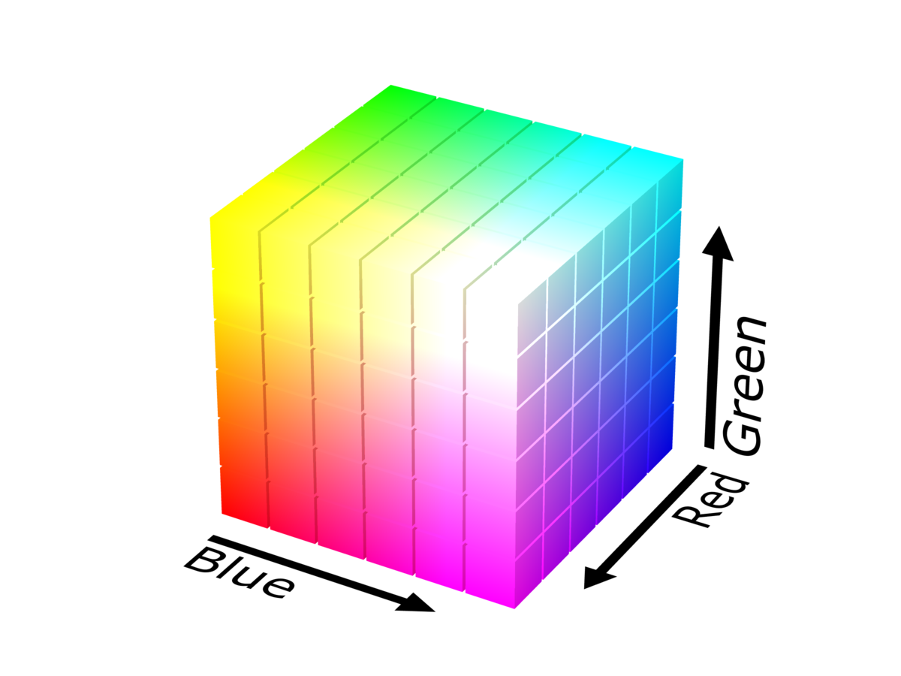
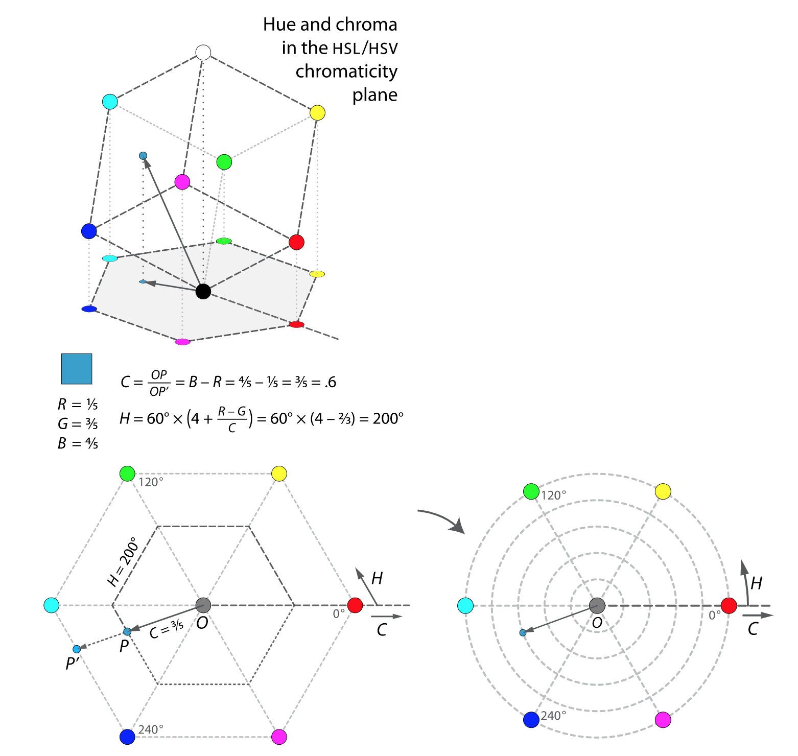

## 图形系统中的颜色表示

### 引言

说到颜色，前端的小伙伴们一定都不陌生，比如字体颜色、背景色等等，颜色是构建视觉效果的重要部分，所以也必然是可视化的关键部分，当学习到可视化中有关于颜色表示的这一部分时，我也想起了我曾经玩过的一个游戏，叫做Blendoku，这个名字和数独的Sudoku有些类似，考验的是玩家对颜色的敏锐度，下面是其中一个关卡的截图，可以明显看出，这个截图中有一个颜色渐变的趋势。



色彩对人的视觉感知以及情绪心理都存在不少的影响，所以了解颜色表示对可视化非常重要。那么图形系统中都有哪些颜色表示方式呢？


### RGB/RGBA

我想很多人应该和我一样，对于RGB和RGBA的色值形式是最熟悉的，对我来说，其他的颜色表示方式用的很少，了解的也很少，HSL还略有所耳闻，但是对于CIE Lab、Cubehelix这些，在学习可视化前，我甚至都没怎么听说过，当我们拿到一份设计稿试图去还原页面时，首选的色值基本都是RGB/RGBA的表示形式。它使用起来非常简单，也很好理解，RGB三个字母分别代表了Red、Green、Blue，也就是红、绿、蓝三个颜色通道的色阶，色阶代表了某个通道的强弱。

RGB有两种写法，一种是十六进制的形式，另一种是rgb/rgba函数的形式。在十六进制形式中，使用两位数来表示某一通道的色阶，最小能表示的值是00，最大能表示的值为FF，转换为十进制就是0到255，因此每个通道分别有256阶。

我们可以用一个三维立方体，把RGB能表示的所有颜色描述出来。就如下图所示：



根据此图显而易见，RGB色值并不能表示人眼可见的所有颜色；但就平常的使用而言，也足够丰富了，大多数设备，比如一般的显示器、彩色打印机、扫描仪等等，都支持RGB的颜色表示。

RGBA则是在RGB的基础上增加了一个对应透明度的alpha通道。

对于一般的网页开发而言，RGB/RGBA的使用并没什么太大的问题，但是如果用于数据可视化方面的开发，就存在比较明显的短板。

比如需要根据数据生成一组对比明显的颜色，来进行图表的展示，但实际上**从RGB的色值上，我们并不能得到关于两个颜色的实际差异**，也就是说，两个色值之间的差值，只能反映出它们在RGB立方体中的相对距离。

比如下面这个例子：

我们在画布上生成3组颜色不同的圆，每组5个圆；颜色使用随机生成。

```javascript
import { Vec3 } from 'https://unpkg.com/ogl';
// ...
const canvas = document.querySelector('canvas');
const ctx = canvas.getContext('2d');
ctx.translate(canvas.width / 2, canvas.height / 2);
ctx.scale(1, -1); // 绕X轴翻转

for (let i = 0; i <  3; i ++) {
  const colorVector = randomRGB();
  for (let j = 0; j < 5; j ++) {
    const c = colorVector.clone().scale(0.5 + 0.25 * j);
    ctx.fillStyle = `rgb(${Math.floor(c[0] * 256)}, ${Math.floor(c[1] * 256)}, ${Math.floor(c[2] * 256)})`;
    ctx.beginPath();
    ctx.arc((j - 2) * 60, (i - 1) * 60, 20, 0, Math.PI * 2);
    ctx.fill();
  }
}

function randomRGB() {
  return new Vec3(
      0.5 * Math.random(),
      0.5 * Math.random(),
      0.5 * Math.random(),
  )
}
```

* 首先我们生成随机的三维向量`colorVector`，用于后续构建RGB颜色，`0.5 * Math.random()`使得每个分量的范围都是`[0, 0.5)`
* 然后我们在每一组圆上，依次用0.5、0.75、1.0、1.25和1.5的比率乘以随机生成的三维向量，再通过乘以256，就得到了一个随机的RGB色值

这样，一组圆就能呈现不同的亮度；总体上，越左边越暗，越右边越亮。但我们能发现，这样子生成的随机RGB颜色存在两个缺点：

1. 行与行之间的颜色差别可能很大，也可能很小
2. 我们无法控制随机生成的颜色本身的亮度，一组圆的颜色可能都很亮或者都很暗，区分度差

总的来说，就是随机生成的RGB颜色彼此之间的**区分度不能保证**；因此，在需要动态构建颜色时，很少直接用RGB色值，而是使用其他的颜色表示形式；其中比较常用的就是HSL和HSV颜色表示形式。


### HSL/HSV

HSL和HSV用色相（Hue）、饱和度（Saturation）和亮度（Lightness）或明度（Value）来表示颜色。

其中，Hue是角度，取值范围是0到360度，饱和度和亮度/明度的取值都是从0到100%。

虽然HSL和HSV有一些区别，但实现的效果比较接近。

简单来说，我们可以把HSL和HSV理解为，是将RGB颜色的立方体从直角坐标系投影到极坐标的圆柱上，所以它的色值和RGB色值是一一对应的。可以参考下图：



它们之间互相转换的算法比较复杂。CSS和Canvas2D可以直接支持HSL颜色，只有WebGL中需要我们自己去转换，一般而言直接使用一些现有的转换代码就足够了，如果有对这个实现算法感兴趣的小伙伴，可以自己去深入研究一下。

现在我们用HSL颜色改写前面三排圆的例子，同样也是随机生成颜色：

```javascript
import {Vec3} from 'https://unpkg.com/ogl';
// ...
const canvas = document.querySelector('canvas');
const ctx = canvas.getContext('2d');
ctx.translate(canvas.width / 2, canvas.height / 2);
ctx.scale(1, -1); // 绕X轴翻转

const [h, s, l] = randomColor();
for (let i = 0; i <  3; i ++) {
  const p = (i * 0.25 + h) % 1;
  for (let j = 0; j < 5; j ++) {
    const d = j - 2;
    ctx.fillStyle = `hsl(${Math.floor(p * 360)}, ${Math.floor((0.15 * d + s) * 100)}%, ${Math.floor((0.12 * d + l) * 100)}%)`;
    ctx.beginPath();
    ctx.arc((j - 2) * 60, (i - 1) * 60, 20, 0, Math.PI * 2);
    ctx.fill();
  }
}

function randomColor() {
  return new Vec3(
      0.5 * Math.random(), // 色相：0~0.5之间的值
      0.7, // 初始饱和度 0.7
      0.45, // 初始亮度 0.45
  )
}
```

* 首先依旧是生成随机的三维向量，调用`randomColor()`方法，用于后面计算HSL颜色，第一个分量的取值范围是`[0, 0.5)`，与色相Hue的计算有关，第二个分量0.7，与饱和度的生成有关，第三个分量0.45，与亮度的生成有关
* 然后在每一组圆上，依次设置每个圆的饱和度为0.4、0.55、0.7、0.85和1.0，设置每个圆的亮度为0.21、0.33、0.45、0.57和0.69

以上代码中，我们主要生成了一个随机的值，用于表示色相，通过`i * 0.25`加上随机值，来将每一行色相的角度拉开，从而保证三组圆之间的色相差异；并且每一组圆之间通过不同的饱和度和亮度做出区分。

从效果上看，比生成的RGB随机颜色要好不少。但是多试几次，还是能发现，有些颜色差距还是没那么明显。这是因为受到人眼视觉感知的影响。

我们可以通过一个简单的实验来直观感受这种影响：

```javascript
for (let i = 0; i < 20; i ++) {
  ctx.fillStyle = `hsl(${Math.floor(i * 15)}, 50%, 50%)`;
  ctx.beginPath();
  ctx.arc((i - 10) * 20, 200, 10, 0, Math.PI * 2);
  ctx.fill();
}
for (let i = 0; i < 20; i ++) {
  ctx.fillStyle = `hsl(${Math.floor((i % 2 ? 60 : 210) + 3 * i)}, 50%, 50%`;
  ctx.beginPath();
  ctx.arc((i - 10) * 20, 140, 10, 0, Math.PI * 2);
  ctx.fill();
}
```

以上代码绘制了两排圆，第一排每个圆之间的色相间隔都是15，饱和度和亮度都是50%；第二排圆的颜色，色相在60和210附近两两交互，饱和度和亮度也都是50%。

观察第一排圆可以明显发现，虽然相邻的圆之间色相相差都是15，但颜色过渡并不均匀，尤其几个绿色的圆视觉上颜色比较接近；而第二排圆，虽然饱和度和亮度都是一样的，但蓝色和紫色的圆明显不如绿色和黄色的圆亮眼。这是由于人眼对不同频率的光的敏感度不同所产生的结果。也就是说，虽然**区分度够了，但是对于人眼感知HSL还是欠缺完美**。

因此我们还需要一套更接近人类知觉的颜色标准，它需要尽量满足2个原则：

第一，人眼看到的色差 = 颜色向量间的欧式距离，这样子计算出的颜色差值更能符合人眼视觉感知到的色差；

第二，相同亮度的两个颜色，能让人从视觉上也感觉亮度相同。

于是就诞生了CIE Lab。


### CIE Lab和CIE Lch

CIE Lab颜色空间，简称Lab，是一种符合人类感觉的色彩空间，其中L表示亮度，a和b表示颜色对立度。

RGB色值也可以与Lab转换，但转换规则比较复杂。

比较欠缺的一点就是，目前还没有图形系统支持CIE Lab，但是css-color-level4规范已经给出了Lab颜色值的定义。

```mathematica
lab() = lab( [<percentage> | <number> | none]
      [ <percentage> | <number> | none]
      [ <percentage> | <number> | none]
      [ / [<alpha-value> | none] ]? )
```

尽管如此，一些走在前沿的探索者们已经开发出了可以直接处理Lab颜色空间的JavaScript库，比如d3-color。

以下的例子展示了d3.lab是如何处理Lab颜色的：

```javascript
const canvas = document.querySelector('canvas');
const ctx = canvas.getContext('2d');
ctx.translate(canvas.width / 2, canvas.height / 2);
ctx.scale(1, -1); // 绕X轴翻转

for (let i = 0; i < 20; i ++) {
  const c = d3.lab(30, i * 15 - 150, i * 15 - 150).rgb();
  ctx.fillStyle = `rgb(${c.r}, ${c.g}, ${c.b})`;
  ctx.beginPath();
  ctx.arc((i - 10) * 20, 60, 10, 0, Math.PI * 2);
  ctx.fill();
}

for (let i = 0; i < 20; i ++) {
  const c = d3.lab(i * 5, 80, 80).rgb();
  ctx.fillStyle = `rgb(${c.r}, ${c.g}, ${c.b})`;
  ctx.beginPath();
  ctx.arc((i - 10) * 20, -60, 10, 0, Math.PI * 2);
  ctx.fill();
}
```

上述代码中使用d3.lab来定义Lab色值。

第一排圆，相邻的色值，欧式空间距离相同；第二排圆，颜色的亮度按5阶的方式递增。

在这里d3.lab处理Lab颜色的方式，就是把Lab色值转换为rgb色值后，再提供给Canvas2D使用。

看得出来，与HSL对比，使用Lab生成的颜色，更接近人眼的感知。

而CIE Lch和CIE Lab的关系，也是类似于将坐标从立方体的直角坐标系变换为圆柱体的极坐标系。

目前CIE Lch和CIE Lab的颜色表示方式还比较新，应用的也不太多，但由于符合人眼感知，可以对其保持关注。


### Cubehelix色盘

最后一块是Cubehelix色盘，它的原理是，在RGB的立方体中，构建一段螺旋线，让色相随着亮度增加螺旋变换。就如下图所示：


可以看出，非常适合用于实现颜色随数据动态改变的效果。比如下面这个例子：

```javascript
import {cubehelix} from 'cubehelix';
// ...
const canvas = document.querySelector('canvas');
const ctx = canvas.getContext('2d');
ctx.translate(canvas.width / 2, canvas.height / 2);
ctx.scale(1, -1); // 绕X轴翻转

const color = cubehelix(); // 色盘颜色映射函数
const T = 2000;

function update(t) {
  const p = 0.5 + 0.5 * Math.sin(t / T);
  console.log(p);
  ctx.clearRect(-256, -256, 512, 512);
  const {r, g, b} = color(p);
  ctx.fillStyle = `rgb(${255 * r}, ${255 * g}, ${255 * b})`;
  ctx.beginPath();
  ctx.rect(-236, -20, 480 * p, 40);
  ctx.fill();
  requestAnimationFrame(update);
}

update(0);
```

实现的效果如下：


可以看到颜色会随着时间的推延发生周期性的变化。

* color是一个色盘映射函数，接收一个参数，参数值的范围为0到1。
* 这里用正弦函数来模拟数据的周期性变化


### 总结

在前端开发中，颜色的使用随处可见，一般在开发过程中，有两种定义色值的方式。

第一种，是由UI设计师来指定全部配色，这也是普通前端开发中大多数的方式；

第二种，是根据数据来动态地生成颜色值，这在数据比较复杂的项目中比较常用。

对于第二种情况，颜色能在数据可视化中提供比较重要的信息，是值得我们重视的，而对于普通的前端开发，更好地掌握颜色的使用，也能为用户提供更加友好的交互。