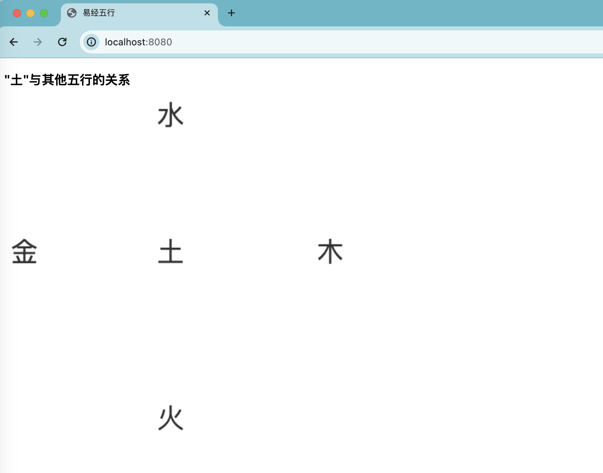
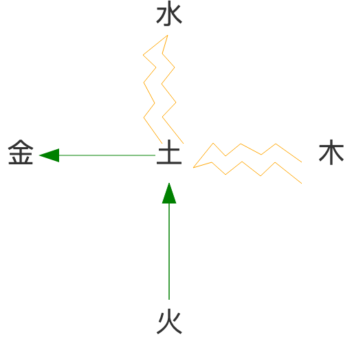

## puppeteer的简单使用

### 引言

对于编写应用程序，尤其是要部署上线投入生产使用的应用，QA是其中重要的一环，在过去的工作经历中，我参与的项目开发，大多是由测试同学主要来把控质量的，我很少编写前端方面的测试代码，对于测试工具的使用，也基本停留在一个小玩具的样子，所以接触的也少，回忆上一次写单元测试，还是在一个vue3的课程中使用jest实现TDD，记得之前有的时候面试，会被问到有没有在项目中用单测，但是因为以前工作中大多数时候需求排期都只考虑开发的时间，就很少考虑到这方面，然后就，面试中这方面也说不出什么东西，最近因为一个偶然的机会，我接触了puppeteer用来做前端自动化测试，用着还感觉蛮有点小意思。


### puppeteer能做什么

puppeteer是一个Node.js库，通过[puppeteer](https://pptr.dev/)的文档，我们可以快速的了解我们能使用puppeteer来做些什么：

> Most things that you can do manually in the browser can be done using Puppeteer! Here are a few examples to get you started:
>
> - Generate screenshots and PDFs of pages.
> - Crawl a SPA (Single-Page Application) and generate pre-rendered content (i.e. "SSR" (Server-Side Rendering)).
> - Automate form submission, UI testing, keyboard input, etc.
> - Create an automated testing environment using the latest JavaScript and browser features.
> - Capture a [timeline trace](https://developers.google.com/web/tools/chrome-devtools/evaluate-performance/reference) of your site to help diagnose performance issues.
> - [Test Chrome Extensions](https://pptr.dev/guides/chrome-extensions).

第一句作为总领，点出了puppeteer可以模拟用户与浏览器的交互。包括页面截图、生成SPA的预渲染内容、触发用户交互事件等等，可以用于进行UI和功能测试，另外可以看出除了普通的前端测试外，还可以作为爬虫工具使用。本文针对简单的用户交互事件的模拟和页面截图，实现一个puppeteer的使用示例。


### 准备工作

* 首先在使用之前，需要先安装依赖

  ```bash
  npm i puppeteer
  # or using yarn
  yarn add puppeteer
  # or using pnpm
  pnpm i puppeteer
  ```

  我这里使用yarn global进行了全局的安装。

* 然后我们来准备待测试的页面

  我这里准备了一个简单的页面，直接预览如下所示：

  

  页面分为两部分，最上面是标题，下面展示的是一个canvas。我们即将测试的内容除了基本的请求页面和获取页面元素外，主要有两项功能，分别为：

  * 点击canvas后展示一个弹窗，使用文字描述“土”与其他五行的关系，测试点击事件的模拟和弹窗的展示
  * 点击canvas后在canvas上绘制，使用图像描述“土”与其他五行的关系，测试puppeteer的截图功能并引入`blink-diff`模块，用于图像的对比

接下来我们就可以开始编写测试代码。


### 使用示例

因为是模拟交互，所以会有许多异步的操作，我们可以通过`await`获取结果，所以这个例子中的代码会使用异步函数`async`来包裹。

另外由于要模拟操作，所以选择器也是核心功能，类似于`document.querySelector`或`document.querySelectorAll`的作用，puppeteer使用css选择器语法的超集进行查询，也就是说我们可以使用`.class`、`#id`等css选择器来进行元素查询。

#### 基本功能

以下是基本的代码：

```javascript
/*
 * check.js
*/
const puppeteer = require('puppeteer');

(async () => {
    // Launch the browser and open a new blank page
    const browser = await puppeteer.launch({ args: ['--no-sandbox', '--disable-setuid-sandbox'] });
    const page = await browser.newPage();
  
    // Set screen size
    await page.setViewport({width: 1920, height: 1080});
  
    // Navigate the page to a URL
    await page.goto('http://0.0.0.0:8080');

    // 关闭puppeteer
    browser.close();

    // ...
})()
```

在模拟交互前，我们需要先启动浏览器并打开页面，以上代码就可以完成这些操作：

* puppeteer.launch：启动浏览器

  在启动浏览器时，我们可以设置一些启动参数，这里的`'--no-sandbox'`代表取消沙盒模式，放开权限，`--disable-setuid-sandbox`也是类似的作用，此两者的区别可以参考这个[discuss](https://groups.google.com/a/chromium.org/g/chromium-discuss/c/kfhzPq_Al94?pli=1)

* browser.newPage：可以理解为打开一个浏览器tab

* page.setViewport：设置视窗尺寸

* page.goto：跳转页面到指定地址，这里跳转到了我们本地启动的8080服务页面

* browser.close：关闭浏览器。我们可以在获取到数据后就进行关闭操作，再在后续中使用抓取到的数据

可以看到在每步操作之前，我们都使用了await来等待操作完成，因为每一步都需要等待上一步操作完毕才能开始。

接下来我们就可以开始获取页面上的元素，比如示例页面上的h3标签。

```javascript
const elm = await page.waitForSelector('h3');
// OR
const elm = await page.$('h3');

console.log(elm);
// CdpElementHandle {
//   handle: CdpJSHandle {},
//   [Symbol(_isElementHandle)]: true
// }
console.log(elm.innerText); // undefined
```

可以通过`.waitForSelector`或简写的`.$`方法获取元素，可以看到打印出来的并不是DOM对象，而是一个经过封装的CdpElementHandle类型的对象，因此我们无法通过`elm.innerText`的方式来获取h3标签内的文本内容，似乎这个选择器方法只能用于判断页面上是否存在某个或某类匹配的元素。

如果想获取元素对应的DOM属性，可以使用[Page.$eval()](https://pptr.dev/api/puppeteer.page._eval)来实现，用法如下所示：

```javascript
const elmText = await page.$eval('h3', h3 => h3.innerText);
console.log(elmText); // "土"与其他五行的关系
```

#### 判断DOM属性

在本文的测试页面中，实现了点击canvas显示弹窗的功能，弹窗的显示是通过js代码添加样式类实现的，并且会在2s后关闭弹窗的显示，所以我们需要测试样式类的添加和移除。

同样的，我们需要先获取到canvas元素。

```javascript
const canvas = await page.$('canvas');
```

接着模拟点击，并获取弹窗对应div的classList。

```javascript
await canvas.click();
const popupClassList = await page.$eval('.popup-dialog', popup => popup.classList);
console.log(popupClassList); // { '0': 'popup-dialog', '1': 'visible' }
```

可以看到弹窗的classList中按照预期出现了代表显示的样式类visible。

接着我们继续测试2s后弹窗关闭。

```javascript
await new Promise(r => setTimeout(r, 2000));
const postPopupClassList = await page.$eval('.popup-dialog', popup => popup.classList);
console.log(postPopupClassList); // { '0': 'popup-dialog' }
```

可以看到在2s后，样式类`visible`按照预期被移除了。这里我们使用一个promise来计时。

#### 截图功能

最后我们来使用puppeteer的截图功能。在使用之前，先把测试页面的点击canvas显示弹窗改为绘制图像，然后我们来测试。

在截图之前，我们需要先指定一个目录用于存放截图，这里我直接创建一个imgs文件夹，然后编写以下代码：

```javascript
const imgDir = './imgs/';
canvas.screenshot({ path: `${imgDir}canvas.png` });
```

执行`node check.js`后，我们就可以看到imgs目录下生成了一张图片，和我们在浏览器中看到的是一样的。



如果这是一个UI效果图，我们可以把他重命名为`target.png`，然后使用代码实现后，配合使用`blink-diff`模块，对比UI设计图与实际代码实现所存在的差异大小；`blink-diff`模块也可以通过NPM来安装。blink-diff是一个轻量级的图片对比工具，以下是一个简单的使用展示：

```javascript
const puppeteer = require("puppeteer"),
    BlinkDiff = require('blink-diff');

// ...

// 关闭puppeteer
browser.close();

const diff = new BlinkDiff({
		imageAPath: imgDir + 'target.png', // 设计图
		imageBPath: imgDir + 'canvas.png',// ⻚⾯截图
		threshold: 0.02, // 1% threshold
		imageOutputPath: imgDir + 'Diff.png'// Diff路径
});
```

因为已经得到截图，所以此时已经不需要浏览器了，`new BlinkDiff`可以在puppeteer关闭后执行。

imageAPath和imageBPath分别是设计图和页面截图的存放路径，imageOutputPath输出两张图片的差异对比图，threshold是一个百分比阈值，当差异比例低于该值时忽略差异，在这里这就是说，当差异比例低于2%，就认为两张图是相同的。

接下来就通过调用`diff.run()`方法来执行对比：

```javascript
diff.run(function (error, result) {
    if (error) {
        throw error;
    } else {
        let rel = Math.round((result.differences /
            result.dimension) * 100);
        console.log(result.code);
        console.log(diff.hasPassed(result.code));
        console.log(diff.hasPassed(result.code) ? 'Passed' : 'Failed');
        console.log('总像素:' + result.dimension);
        console.log('发现:' + result.differences + ' 差异，差异占⽐'
            + rel + "%");
    }
});
```

当正常执行后，会返回一个result对象包含对比结果的信息。

`result.differences`表示存在不同的像素数量，`result.dimension`表示像素的总数量，因此这里rel计算得到的就是像素的差异比例。

`result.code`就是一个结果状态码，调用`diff.hasPassed`方法会根据diff的配置对状态码进行解析，从而得出通过或失败的判断。

到这里为止就是一个截图功能和图像对比的简单示例，看上去使用起来挺不错的样子，但实际还是存在一些问题，比如我最近遇到的，使用渐变函数设置样式，得到的截图会存在问题，并没有得到应用渐变后的样式截图，不知道是兼容上的问题还是我的使用方式问题，所以暂时我使用了getComputedStyle作为替代方案。


### 总结

好啦，以上就是puppeteer的简单使用，有感兴趣的小伙伴可以继续阅读[官方文档](https://pptr.dev/)深入研究。

