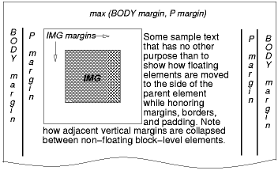
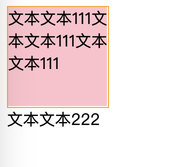
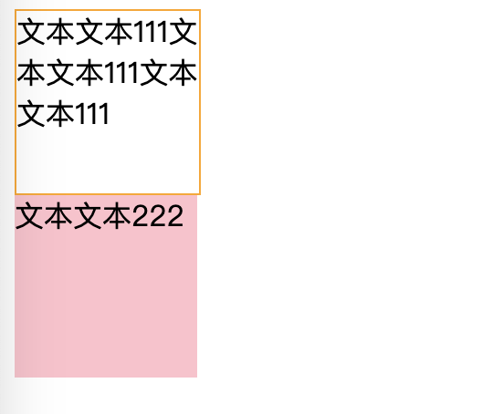
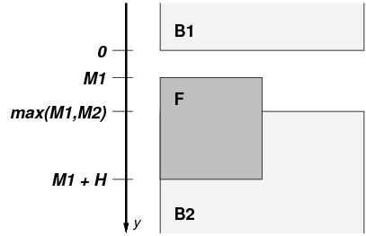

## CSS之浮动Float

### 前言

提到浮动，前端的小伙伴肯定都不陌生，但是随着弹性布局等等一些更好用的标准出来后，用在布局方面少了很多，当初我刚开始接触前端的时候，很习惯用浮动来给元素改变定位，当时还并不是很流行flexbox布局，很多布局会通过浮动来实现，但是使用浮动来布局会产生一些副作用，比如虽然使用浮动可以使元素向左或向右靠齐，但会造成高度坍塌，当时的我并不太了解其中的缘由，只是机械地从网上搜索到一些解决高度坍塌的代码，到现在也不能算是了解的很透彻，只能算是比刚开始做前端的时候多了解了一点。


### 脱离文档流

在说到浮动的时候，很多地方都会说，它们脱离了文档流，那么正常情况下文档流是怎么样的呢？

写过HTML的小伙伴应该都了解，HTML中的元素应用的是默认的流式布局；假设页面上有一个`div`，然后还有一个`span`，如果我们不编写额外的样式改变它们的布局方式，它们会按照默认的规则布局，`div`是块状元素，默认占满行，即使给div设置了宽度，也是占着一行，如果有多个div会纵向一个个排布，而`span`是行内元素，通常行内元素会放置在块容器内部，如果有多个span会默认横向从左向右一个挨一个排布。

应用了浮动的元素就不受流式布局的控制了。比如应用了`float: left;`的`div`，它不再会占满一整行，应用了`float: right;`的`span`，可以从右向左排布。

那么浮动有什么特点，清除浮动又是什么意思呢？


### 浮动

前端有几个较为有名的布局方式，比如圣杯布局、双飞翼布局等等，使用`float`是实现这些布局的方式之一，当然现在我们可以使用更便捷的方式来实现，比如flex弹性布局、grid网格布局等等，在这方面浮动的应用应该少了很多，但其实浮动它原本设计之初应该就不是为了这些布局（个人观点，暂未考证），这从它的名称上就可以窥见。

我们可以把文档想象成一个水面，而浮动元素就好比是浮在水面上的船。水波环绕船体，就像浮动元素被其他内容环绕一样。比如下面这张图：


设计`float`属性主要就是实现这种效果，这从规范文档中的描述就能看出：

> The most interesting characteristic of a float (or "floated" or "floating" box) is that content may flow along its side (or be prohibited from doing so by the ['clear'](https://www.w3.org/TR/CSS22/visuren.html#propdef-clear) property). Content flows down the right side of a left-floated box and down the left side of a right-floated box.
>
> **浮动框（或 "浮动 "或 "浮动 "框）最有趣的特点是，内容可以沿其侧面流动（或通过 "清除 "属性禁止流动）。内容可以沿着左浮动框的右侧流动，也可以沿着右浮动框的左侧流动。**

这里流动的内容就可以比作流动的水，所以我们经常能看到使用`float`实现文字环绕效果的例子。比如规范文档中给出的例子：



只能说早些时候的CSS还不够完善，不能满足一些特殊的布局需求，而`float`恰好误打误撞可以满足，这算是一种css hack吧。

当使用`float:left;`或者`float: right;`声明某个节点后，这个节点就变成了水面上的船，一个自身重量为0的船，完全浮在水面上，当船上没有任何东西时，它不会影响到水面，而当我们往其中增加内容之后，船就会向水面下沉一点，从而影响到水面。产生类似于规范文档中的以下描述：

> Since a float is not in the flow, non-positioned block boxes created before and after the float box flow vertically as if the float did not exist. However, the current and subsequent line boxes created next to the float are shortened as necessary to make room for the margin box of the float.
>
> **由于浮动框不在流中，在浮点框之前和之后创建的非定位块框会垂直流动，就像浮动框不存在一样。不过，在浮动框旁边创建的当前和后续行方框会根据需要缩短，以便为浮动框的margin box留出空间。**

float会影响所在行的行方框，也就是`line boxes`。就类似于影响到水面的面积。

#### 清除浮动

在使用浮动用于布局之后，我们常常需要清除浮动，那么清除浮动是什么意思呢？这里可以继续用前面浮在水面上的船来举例子，虽然可能不算很贴切。

船在水面上是浮动着的，随着水流的作用会飘移，那么就有可能飘移到其他的水域，清除浮动就类似于阻止这艘船飘移，比如安装一道闸门，防止船飘进来或飘出去。通过设置特定的css属性来清除浮动，就类似于这里的安装闸门。


##### 创建BFC容器

之前在《对BFC的理解》中我们有提到过，可以通过创建BFC容器的方式来清除浮动，比如设置`display: flow-root;`，这就类似于在一个水域的下游处安装闸门，防止这个水域内的船飘往下游。

假设有以下一段HTML：

```html
<div style="width: 100px; height: 100px; border: 1px solid orange; float: left;">
    <span>文本文本111文本文本111文本文本111</span>
</div>
<div style="width: 100px; height: 100px; background: pink; ">
    <span>文本文本222</span>
</div>
```

在未清除浮动前是这样的：



可以看到，`文本111`占用了`文本222`所在div的容器，就像是船飘到了下游的水域，占了`文本222`的位置。

将第一个div用BFC容器包裹后（类似于闸门的作用）：

```html
<div style="display: flow-root;">
    <div style="width: 100px; height: 100px; border: 1px solid orange; float: left;">
        <span>文本文本111文本文本111文本文本111</span>
    </div>
</div>
<div style="width: 100px; height: 100px; background: pink;">
    <span>文本文本222</span>
</div>
```

页面就变成了下面这个样子：



##### 使用clear属性

可以看到在规范文档中，还直接提供了一个[`clear`属性](https://www.w3.org/TR/CSS22/visuren.html#flow-control)用于清除浮动。

> This property indicates which sides of an element's box(es) may *not* be adjacent to an earlier floating box. The 'clear' property does not consider floats inside the element itself or in other [block formatting contexts.](https://www.w3.org/TR/CSS22/visuren.html#block-formatting)
>
> **该属性表示元素方框的哪些边不得与先前的浮动方框相邻。"清除"属性不考虑元素本身内部或其他块格式上下文中的浮动。**

创建BFC的方式可以类比为上游水域在下游口安装了闸门，使用`clear`属性就可以类比为下游水域在上游口安装闸门，防止上游的船飘进来。所以前面的例子中，我们也可以使用以下代码来清除浮动：

```html
<div style="width: 100px; height: 100px; border: 1px solid orange; float: left;">
    <span>文本文本111文本文本111文本文本111</span>
</div>
<div style="width: 100px; height: 100px; background: pink; clear: left;">
    <span>文本文本222</span>
</div>
```

可以看到，最终效果和上面创建BFC的效果是一样的。但实际我之前看到的解决浮动的方案中，比较推荐的做法是由浮动的元素这边来处理清除，比如创建BFC容器，或者加在伪元素`before`或者`after`上。比如下面这段代码：

```html
<div id="float-box">
    <div style="width: 100px; height: 100px; border: 1px solid orange; float: left;">
        <span>文本文本111文本文本111文本文本111</span>
    </div>
</div>
<style>
    #float-box::after {
        content: '';
        display: block;
        clear: left;
    }
</style>
<div style="width: 100px; height: 100px; background: pink;">
    <span>文本文本222</span>
</div>
```

上面的代码中使用`::after`元素创建了一个看不见的块来清除浮动。

`clear`属性可以设置多种值。

| Name:           | clear                                                        |
| --------------- | ------------------------------------------------------------ |
| Value:          | none \| left \| right \| both \| [inherit](https://www.w3.org/TR/CSS22/cascade.html#value-def-inherit) |
| Initial:        | none                                                         |
| Applies to:     | block-level elements                                         |
| Inherited:      | no                                                           |
| Percentages:    | N/A                                                          |
| Media:          | [visual](https://www.w3.org/TR/CSS22/media.html#visual-media-group) |
| Computed value: | as specified                                                 |

根据文档里的描述，`left`值表示当前块不被相邻的左浮动框影响，`right`值表示当前块不被相邻的右浮动框影响，`both`表示同时不受两类浮动框的影响。

但是规范文档中也提示我们，使用`clear`属性会产生副作用，使用`none`以外的值可能会引入间隙（clearance）。

> Values other than 'none' potentially introduce clearance. Clearance inhibits margin collapsing and acts as spacing above the margin-top of an element. It is used to push the element vertically past the float.
>
> **“none”以外的值可能会引入间隙。 间隙会抑制边距折叠，并充当元素顶部边距上方的间距。 它用于将元素垂直推过浮动。**

在《对BFC的理解》中，我们提到过，在BFC容器中，相邻块级盒子之间的垂直'margin'会折叠。这里的意思应该就是指，设置了`clear`属性为非`none`之后，会影响BFC容器里的垂直`margin`折叠。

文档中给出了间隙的值是怎么计算得出的：

> Then the amount of clearance is set to the greater of:
>
> 1. The amount necessary to place **the border edge of the block** even with the bottom outer edge of the lowest float that is to be cleared.
> 2. The amount necessary to place **the top border edge of the block** at its hypothetical position.
>
> **然后将间隙量设置为以下两者中的较大值：**
>
> **1.将块的边界边缘与要清除的最低浮动的底部外边缘对齐所需的量。**
> **2.将块的顶部边框边缘放置在其假设位置所需的量。**

光从描述上看，有点抽象，尤其是第二种计算，这里所谓的假设位置是哪里呢？第一种似乎好理解一些，就是让两个边缘对齐的一个间隔的量。所以文档中也举了例子来配合解说。

1. **示例1**



从名称就可以看出，F是个浮动块高度为H，此时B1有个bottom margin值为M1，B2有个top margin值为M2，在B2未设置clear属性之前，B1和B2之间的间距为M1和M2中的较大值，也就是产生了垂直`margin`的折叠。

假设B1的底部边框在y=0这个位置，就如上图所示，此时浮动框F的顶部位置就在y=M1的位置，而B2的顶部边框就在y=max(M1,M2)的位置，浮动框F的底部位置在y=M1+H的位置。

在这个例子中，B2不在F下面，这个例子所描述的就是需要添加间隙的场景。也就是说：

>  max(M1,M2) < M1 + H

根据文档中描述的计算方式，这里需要计算两次间隙量，C1和C2，然后取两者中的较大值：C = `max(C1, C2)`。

第一种方法是使 B2 的顶部与 F 的底部齐平，即 y(top of B2) = M1 + H。这意味着margin不再折叠（B1和B2的间距肯定大于M1和M2），它们之间有了间隙：

此时它们的等式关系为：

```
F的底部 = B2的顶部边框
M1 + H = M1 + C1 + M2
    C1 = M1 + H - M1 - M2
       = H - M2
```

第二中计算是保持 B2 的顶部位置，即 y(top of B2) = max(M1,M2)。也就是B2边框在其假设位置，按照预期保持垂直`margin`折叠的效果。此时的等式关系就是编程下面这样了：

```
max(M1, M2) = M1 + C2 + M2
         C2 = max(M1, M2) - M1 - M2
```

因为假设了`max(M1,M2) < M1 + H`，因此可以得出以下不等式：

```
C2 = max(M1, M2) - M1 - M2 < M1 + H - M1 - M2 = H - M2
C2 < H - M2
```

又因为`C1 = H - M2`，所以在这个场景中`C2 < C1`。因此间隙量C=max(C1, C2)=C1。

2. **示例2，负值间隙**

```html
<p style="margin-bottom: 4em">
            First paragraph.</p>

<p style="float: left; height: 2em; margin: 0">
    Floating paragraph.</p>

<p style="clear: left; margin-top: 3em">
    Last paragraph.</p>
```

在最后一个`p`元素未设置`clear`属性之前，第一个和最后一个`p`元素之间的`margin`会折叠，最后一个`p`元素的顶部边框边缘（top border edge）会与浮动`p`元素的顶部齐平。

当我们设置`clear`属性用于清除浮动时，需要让最后一个`p`元素的top border edge位于浮动框的下面，也就是说需要往下挪动`2em`。此时必须引入间隙，相应地，`margin`不再折叠，此时我们来计算间隙量：

```
c + m-t = 2em
c = 2em - m-t = 2em - 3em = -1em
```

第一种方式计算C1 = H - M2 = 2em - 3em = -1em

第二种计算方式，也就是保持 最后一个`P`元素 的顶部位置，C2 = max(M1, M2) - M1 - M2 = 4em - 4em - 3em = -3em

所以最后C=max(C1,C2)=-1em。

从上面两个例子可以看出，间隙量的两种计算方式的区别就在于，是否改变浮动框后续元素的顶部位置。


### 总结

随着弹性布局、网格布局等一系列新的布局方式引入后，浮动的使用少了很多，但它仍然能实现特殊的网页效果，因此我们还是需要对它进行必要的了解。
