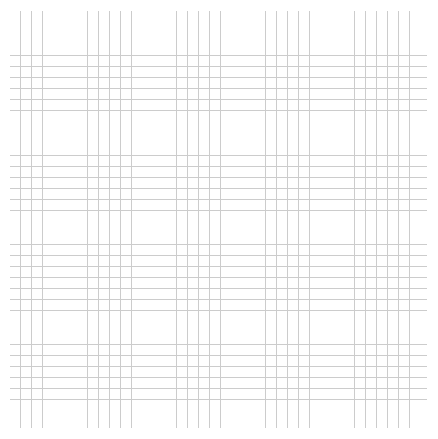
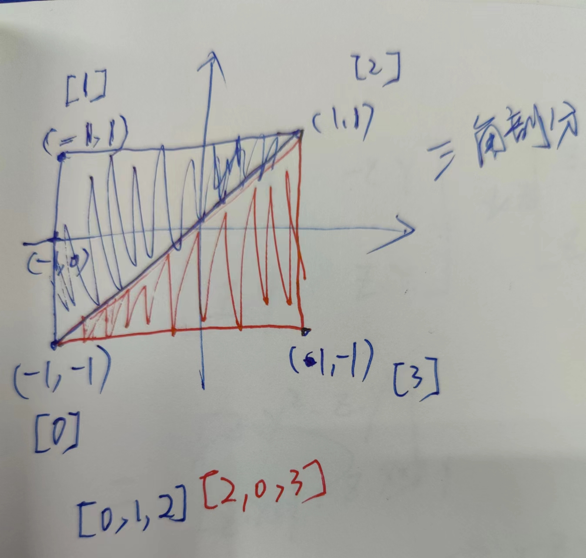
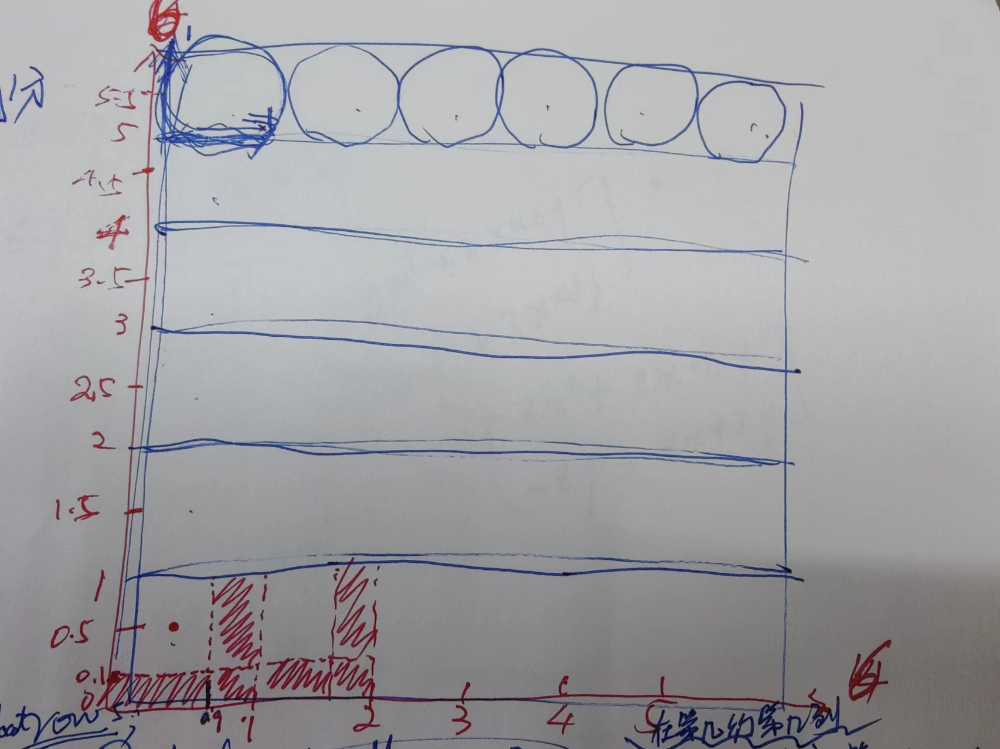

## 使用WebGL实现网格背景

### 前言

作为前端开发人员，我们最关注的就是应用的交互体验，而元素背景是最基础的交互体验之一。一般而言，能够使用代码实现的界面，我们都会尽可能减少图片的使用，这主要是有几方面的原因，第一，是图片会消耗更多的带宽，对于移动端或者网络信号较差时的体验不够友好，第二是不够便捷，在使用图片的情况下即使有细微的调整也需要重新做图上传，第三是不够灵活，这一点主要体现在根据不同的条件需要呈现不同的效果。

本文就使用网格背景作为例子，来通过代码实现，这是在可视化课程中新学的内容，这里我做一个总结和复习。网格背景是一种常见的设计元素，它可以为网页增添一种现代感和动态感。要实现网格背景，我们可以使用CSS代码来实现，这类实现方式我在很多文章中都有看到过，但除了使用CSS，我们还可以通过WebGL实现，通过WebGL来实现，还能额外带来一些好处，比如有更好的性能，也能与画布上的其他元素更好地融合。


### 网格背景

在使用具体的代码实现之前，我们先简单来分析一下网格背景。



从上面的图片中我们能发现，网格背景其实可以看作是一个小的网格图案重复了n遍而形成的一个背景，也就是说这是一个重复图案的背景。


### 使用CSS实现

在使用WebGL来实现网格背景之前，我们还是先来看一下CSS代码是如何实现的。

在使用CSS代码实现网格背景时，需要用到CSS中的渐变函数，因为渐变函数最终形成的效果类似于图像，所以可以当作图像来使用，也就是说可以应用于background-image属性。渐变函数有三种：线性渐变、径向渐变和圆锥渐变，在这个例子中，由于网格是直线的，所以我们使用线性渐变函数就可以了。

线性渐变的语法比较简单，以下是[MDN给出的表达式](https://developer.mozilla.org/en-US/docs/Web/CSS/gradient/linear-gradient#formal_syntax)：

```mathematica
<linear-gradient()> = 
  linear-gradient( [ <linear-gradient-syntax> ] )  

<linear-gradient-syntax> = 
  [ <angle> | to <side-or-corner> ]? , <color-stop-list>  

<side-or-corner> = 
  [ left | right ]  ||
  [ top | bottom ]  

<color-stop-list> = 
  <linear-color-stop> , [ <linear-color-hint>? , <linear-color-stop> ]#  

<linear-color-stop> = 
  <color> <length-percentage>?  

<linear-color-hint> = 
  <length-percentage>  

<length-percentage> = 
  <length>      |
  <percentage>  

```

我们主要向线性渐变函数传递三类参数：第一是渐变的方向，第二是初始色值，第三是最终色值。如果要控制得更细致，我们还可以通过上述公式中的length或者percentage来控制某个色值的范围，或者设置多个阶梯色值。

现在我们就可以通过以下CSS代码，来实现网格背景的设置。

```css
.grid-bg {
  width: 300px;
  height: 300px;
  background-image: linear-gradient(to right, transparent 95%, #ccc 0),
    linear-gradient(to bottom, transparent 95%, #ccc 0);
  background-size: 8px 8px, 8px 8px;
}
```

以上代码中首先使用background-size属性指定了一个网格图案的大小，然后我们知道background-repeat属性的默认值是repeat，所以会重复这个图案来铺满整个元素的背景，最后我们来看background-image这个属性，我们使用了线性渐变函数来给这个属性赋值，可以看到这里用了两个渐变函数。

第一个渐变函数，设置的渐变方向是`to right`，也就是自左向右进行渐变，初始色值是transparent也就是透明色，这里使用了百分数95%来控制透明色的范围，也就是说从0%的位置开始到95%的位置，都是透明色，然后最终色值是#ccc也就是灰色，我们想要95%到100%的范围都是#ccc的灰色，可以直接简写为0。

第二个渐变函数也是类似的。

在这两个渐变函数的作用下，最终形成的图案就是一个小网格，右边5%的宽度和下边5%的宽度由灰色填充；然后在background-repeat默认值repeat的作用下，就会铺满对应元素。


### 使用WebGL实现

那么既然CSS已经可以实现网格来替代图片了，为什么又要使用WebGL来实现呢？所以那肯定是WebGL的实现有其他的优势，首先是直接调用GPU的话，无论是有多少重复图案都能一次完成，理论上没有性能瓶颈，其次是能满足更多类型的需求，比如能使网格随着Canvas中的其他元素一起缩放。

那么在WebGL中要如何去实现网格背景呢？我们可以通过图案的使用来实现。

#### 基础页面

首先最基础的，我们先在页面上放置一个Canvas。

```html
<canvas width="512" height="512"></canvas>
```

#### 操作WebGL

接着就可以开始操作WebGL去完成图案的绘制。

在本次实现中，使用了一个基础库[`gl-renderer`](https://github.com/akira-cn/gl-renderer)来简化WebGL的操作，让我们可以将重心放在数据提供和编写shader上。

以下是操作WebGL的代码：

```javascript
// 第一步：创建Renderer对象
const canvas = document.querySelector('canvas');
const renderer = new GlRenderer(canvas);
// 第二步：创建并启用WebGL程序
const program = renderer.compileSync(fragment, vertex);
renderer.useProgram(program);
// 第三步：设置uniform变量
renderer.uniforms.rows = 32; // 64; // 每一行显示多少个网格（在片元着色器中使用）
// 第四步：将顶点数据送入缓冲区
renderer.setMeshData([{
  positions: [ // 顶点（覆盖整个画布）
      [-1, -1], // 左下
      [-1, 1], // 左上
      [1, 1], // 右上
      [1, -1] // 右下
  ],
  attributes: {
    uv: [ // 纹理坐标（坐标系：左下角[0,0] 右上角[1,1]）
        [0, 0], // 左下
        [0, 1], // 左上
        [1, 1], // 右上
        [1, 0] // 右下
    ]
  },
  cells: [ // 顶点索引（三角剖分）：将矩形剖分成两个三角形
      [0, 1, 2],
      [2, 0, 3]
  ]
}]);
// 第五步：执行渲染
renderer.render();
```

以上代码不难理解，就是向WebGL传递数据，并执行渲染。主要有以下几个操作：

* 首先在初始化阶段，根据GLSL代码和Canvas的WebGL上下文创建WebGL程序；

* 接着就是传递数据，包括uniform常量、顶点数据和纹理坐标。其中纹理坐标的使用与图案有关。

* 然后是设置三角剖分的顶点索引。三角剖分简单来说就是将一个多边形使用多个三角形组合拼接来表示，可以参考下图来理解。

  

* 最后一步就是渲染。

#### GLSL代码

现在我们来看关键的GLSL代码。

```glsl
// 顶点着色器
attribute vec2 a_vertexPosition;
attribute vec2 uv;
varying vec2 vUv;

void main() {
  gl_PointSize = 1.0;
  vUv = uv;
  gl_Position = vec4(a_vertexPosition, 1, 1);
}
```

以上是顶点着色器，这段代码比较基础，找到要处理的像素点，其余的就是将纹理坐标传递给片元着色器。

在网格背景的实现中，片元着色器是比较关键的一环，现在我们就来看片元着色器的实现代码：

```glsl
#ifdef GL_ES
precision mediump float;
#endif

varying vec2 vUv; // 由顶点着色器传来的uv属性
uniform float rows;

void main() {
  // st：保存像素点对应纹理坐标的小数部分
  vec2 st = fract(vUv * rows); // fract函数是一个用于获取向量中小数部分的函数
  float d1 = step(st.x, 0.9); // step：阶梯函数。当step(a,b)中的b < a时，返回0；当b >= a时，返回1。
  float d2 = step(0.1, st.y);

  // 根据d1*d2的值，决定使用哪个颜色来绘制当前像素。
  // st.x <= 0.9 且 st.y >= 0.1时，d1*d2=1, 否则为0
  gl_FragColor.rgb = mix(vec3(0.8), vec3(1.0), d1 * d2);
  gl_FragColor.a = 1.0;
}
```

在编写shader时，要理解其中的GLSL代码不是太容易，因为对于课程中给出的解释也并不太能理解，所以我也是花了一点时间去思考。

首先就是这个fract函数的调用，课程中给出的说法是：它可以帮助我们获得重复的 rows 行 rows 列的值 st

> 当一个数从 0~1 周期性变化的时候， 我们只要将它乘以整数 N，然后再用 fract 取小数，就能得到 N 个周期的数值。

但我感觉这种说法并不太直观，至少我看下来觉得还是一头雾水，当然也可能是我的理解能力有限，着色器程序理论上是批量执行，那么这段代码针对某个待处理的像素点是什么含义呢？因为暂时我想先自己探索一番，所以我也没有参考其他资料。

经过多日思考，以下是我目前的几点理解：

1. 首先是传递的纹理坐标，我们可以理解是一个单元的坐标，坐标的范围是一个正方形。

2. 然后`vUv * rows`可以看作是相当于把纹理坐标在画布上的纵向放大rows倍，又因为纹理坐标范围的原因，同时相当于在横向上也放大了rows倍。

3. 接着就得到了当前待处理的像素点映射到纹理坐标上的位置，后续会根据这个像素点的纹理坐标去计算设置。

4. st保存了像素点对应纹理坐标的小数部分。

5. step是阶梯函数，接收两个入参a和b，根据a和b的大小关系返回0或1；当b < a时，返回0；当b >= a时，返回1。

   两个step函数的执行后，我们就可以得到：

   > st.x <= 0.9 且 st.y >= 0.1时，d1*d2=1, 否则为0

6. 最后我们调用mix得到最终的色值。

   mix(a,  b,  c)是一个线性插值函数。a和b是两个色值，当c为0时，返回a；当c为1时，mix函数返回b。

   在这里`vec3(0.8)`是一个灰色色值，`vec3(1.0)`是白色；显而易见当d1或d2为0时，也就是st.x > 0.9 或 st.y < 0.1时，像素点渲染为灰色，否则渲染为白色。

具体渲染结果可参考下图（随手画的比较潦草），最终网格的数量由rows决定：



总之我理解的就是，在片元着色器中，我们主要去**计算某个像素点的色值**，在这个例子中，就是映射到纹理坐标并根据纹理坐标计算得到一个色值，最终像素点会被渲染为这个色值。

这段代码中，纹理坐标的小数部分是周期性重复的，所以就可以得到重复的图案，最终形成网格背景。


### 总结

最后总结一下吧，要理解WebGL代码，有时候还是需要转换一下思路，其实我也并不太确定自己的理解是不是对的，但我觉得有时候学习新的东西，就是给自己一个打开思路的机会，最重要的还是自己去思考理解，让自己得到新的启发。


[完整代码参考](https://github.com/yeying0827/visualization-demos/blob/main/src/pages/Pattern/WebGL.vue)
[最终效果](https://yeying0827.github.io/visualization-demos/#/pattern/webgl)

