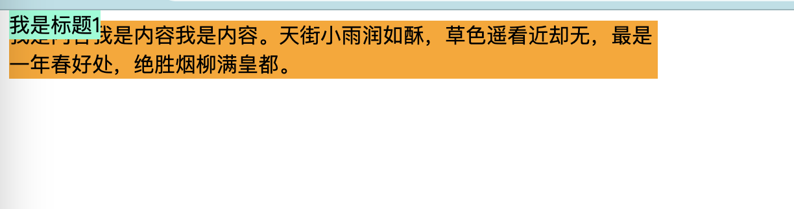
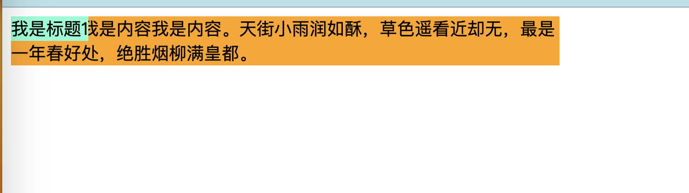
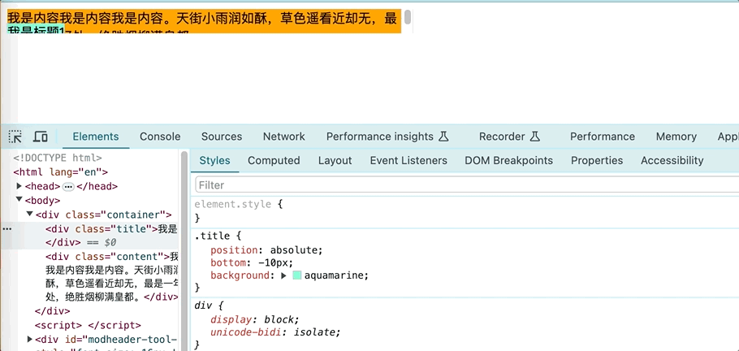
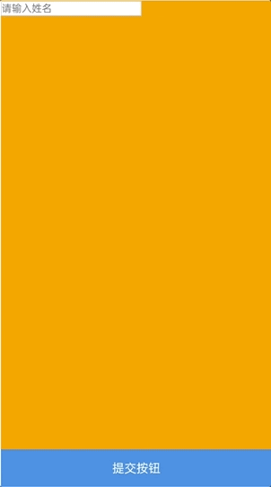
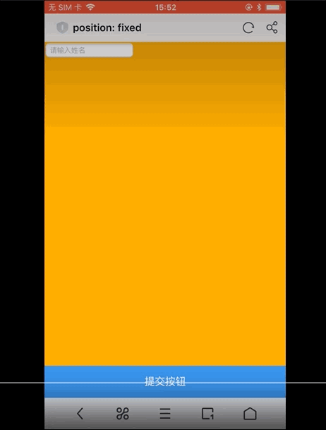

## CSS之定位Position

### 前言

之前在《CSS之浮动》中，我当时是想一起说说定位的，因为我在很多地方看到有把float和position放在一起讲的，说它们的一些属性值可以使元素脱离文档流，但是没想到在准备内容的时候，发现浮动的内容有点多，就先把浮动的内容单独整了一篇。本文就继续来说说定位吧。


### 基本信息

| Name:                                                        | position                                                     |
| ------------------------------------------------------------ | ------------------------------------------------------------ |
| [Value:](https://www.w3.org/TR/css-values/#value-defs)       | static [\|](https://drafts.csswg.org/css-values-4/#comb-one) relative \| absolute \| sticky \| fixed |
| [Initial:](https://www.w3.org/TR/css-cascade/#initial-values) | static                                                       |
| [Applies to:](https://www.w3.org/TR/css-cascade/#applies-to) | all elements except table-column-group and table-column      |
| [Inherited:](https://www.w3.org/TR/css-cascade/#inherited-property) | no                                                           |
| [Percentages:](https://www.w3.org/TR/css-values/#percentages) | N/A                                                          |
| [Computed value:](https://www.w3.org/TR/css-cascade/#computed) | specified keyword                                            |
| [Canonical order:](https://www.w3.org/TR/cssom/#serializing-css-values) | per grammar                                                  |
| [Animation type:](https://www.w3.org/TR/web-animations/#animation-type) | discrete                                                     |

尽管在[规范文档](https://drafts.csswg.org/css-position/#position-property)中我们能看到Position可设置的值有5个，但一般我们不太会去手动设置static，static代表按照普通文档流布局，默认情况下position的值为static。所以我们现在主要关注后面几个值，relative、absolute、sticky和fixed，他们都是按照某个参照物来定位，区别就在于参照物的不同。因此这四个值都会使选中元素的定位算法不同于正常文档流的布局计算；其中sticky是CSS3新增的内容。


### relative

从文档中的描述可以看出，relative这个属性值，表示选中的元素将根据原本自身在普通流中的位置来计算定位，是一个相对于自身的偏移。虽然这个元素的位置发生了偏移，但这只是视觉效果并不会改变其他盒子的尺寸或位置，也就是说假设给一个DIV设置了relative，它后面的盒子在计算位置的时候并不会考虑这个DIV产生的偏移。也就是不管这个DIV是不是设置了relative，都不会影响它后面盒子的位置计算。比如我们来看这个例子：

```css
.nav {
    position: relative;
    /*top: -50px;*/
    width: 500px;
    height: 300px;
    background: orange;
}
.section {
    width: 500px;
    height: 300px;
    background: aquamarine;
}
```

```html
<div class="nav"></div>
<div class="section"></div>
```

```javascript
const rect = document.querySelector('.section').getBoundingClientRect();
console.log(rect.top);
```

在脚本中log出来的值，不管是否给`.nav`设置了`top: -50px;`，还是不设置`postion`这个属性时，结果都是一样的。因此可以看出，虽然设置了`position: relative;`之后当前元素的定位可以改变，但这个元素原本的几何属性还是会影响文档流其他元素的布局计算。


### absolute

absolute属性值会使元素被移出正常的文档流，因此这个元素对同级和祖先元素的尺寸和位置不会产生影响，这就和relative不一样了。并且当盒子设置了absolute，它的定位和尺寸将根据它的包含块来计算。因此盒子的位置和尺寸可以通过`top`、`right`、`bottom`和`left`属性来指定，这些值是相对于包含块的：

>  the box is positioned and sized solely in reference to its [absolute positioning containing block](https://drafts.csswg.org/css-position/#absolute-positioning-containing-block)

#### 包含块

那么哪个是绝对定位元素的包含块呢？假设有以下代码：

```html
<div class="container">
    <div class="title">我是标题1</div>
    <div class="content">我是内容我是内容我是内容。天街小雨润如酥，草色遥看近却无，最是一年春好处，绝胜烟柳满皇都。</div>
</div>
```

单看HTML的话，我们会觉得`.title`这个元素的包含块是`.container`这个盒子建立的，但是如果设置了以下CSS，我们会看到页面效果和预期的并不一致。

```css
.container {
    background: orange;
    width: 500px;
}
.title {
    position: absolute;
    top: 0;
    background: aquamarine;
}
```



如果说`.title`的包含块是`.container`，那么此时`.title`这个盒子的顶部应该和`.container`齐平，但我们看到的页面效果并不是这样的，所以也就是说`.title`的包含块并不是`.container`，那么**`absolute positioning containing block`**是指什么呢？这在CSS3的[文档](https://drafts.csswg.org/css-position/#absolute-positioning-containing-block)中直接给出了定义：

> Values other than [static](https://drafts.csswg.org/css-position/#valdef-position-static) make the box a positioned box, and cause it to establish an absolute positioning containing block for its descendants. 

这句话的意思是，在position的可选属性值中除了`static`之外的其他值，都会使盒子成为一个被定位的盒子，并且为其后代元素建立绝对定位包含块（absolute positioning containing block）。

因此`.title`元素的包含块是由祖先元素中离`.title`最近的一个positioned box所建立的，如果找不到这样的元素，就会去找初始包含块，也就是我们在页面上看到的`html`根节点，所以我们就在页面中看到了以上效果。

因此如果我们想要改变`.title`元素的包含块，就需要给它的祖先元素设置`postion`属性，比如：

```css
.container {
    position: relative;
    background: orange;
    width: 500px;
}
```

这样我们就能看到如下效果：



#### 居中布局

说到这我想到了一个词——”子绝父相“，写过居中布局的小伙伴可能会对这个词有印象，在这种布局方案中，子元素的position会被设置为`absolute`，父元素的`position`会被设置为`relative`。在父元素宽度已知（或隐式声明）或父子元素宽度都已知的情况下，我们可以通过定位相关的属性，使子元素在父元素内部水平居中。可以来看下面这个例子，首先是父子宽度都已知：

```html
<div class="h-c1">
    <div class="h-c1-child">
        <span>谈笑有鸿儒，往来无白丁。谈笑有鸿儒，往来无白丁。</span>
    </div>
</div>
```

我们可以通过以下CSS样式使子元素居中：

```css
.h-c1 {
    position: relative;
    width: 500px; /*或者宽度隐式声明*/
    height: 100px;
    background: #00bd7e;
}

.h-c1-child {
    position: absolute;
    width: 300px;
    left: 50%; /* 相对于父元素的宽度 */
    margin-left: -150px; /* 子元素宽度的一半的负数 */
    background-color: #fbf;
}
```

`absolute`元素的位置将根据它的包含块来计算，关于这个计算可以参考[嵌入性属性`inset properties`的说明](https://drafts.csswg.org/css-position/#inset-properties)：

> The interpretation of these [inset properties](https://drafts.csswg.org/css-position/#inset-properties) varies by [positioning scheme](https://drafts.csswg.org/css-position/#positioning-scheme):
>
> - for [absolute positioning](https://drafts.csswg.org/css-position/#absolute-position), they represent insets from the containing block.

> The inset is a percentage relative to the [containing block](https://drafts.csswg.org/css-display-4/#containing-block)’s size in the corresponding axis (e.g. width for [left](https://drafts.csswg.org/css-position/#propdef-left) or [right](https://drafts.csswg.org/css-position/#propdef-right), height for [top](https://drafts.csswg.org/css-position/#propdef-top) and [bottom](https://drafts.csswg.org/css-position/#propdef-bottom)).

所以`left: 50%;`最终计算出的值是`50% * 500px = 250px`，也就是说如果没有其他设置的情况下，盒子的左边缘距离包含块的左边缘为250px。为了使盒子居中，我们继续设置`margin-left`属性值为子元素宽度的一半的负数，使盒子有一个负数的左外边距，这样就能使盒子向左挪动宽度的一半的距离，这样就达到了居中的效果。但这样的写法并不够灵活，每次设置居中时还要去计算盒子宽度的一半，虽然计算量不大，但每次都要计算还是显得繁琐，所以就有了另一种写法：

```css
.h-c1-child {
    position: absolute;
    left: 50%; /* 相对于父元素的宽度 */
    transform: translateX(-50%); /* 相对于自己的宽度 */
    background-color: #fbf;
}
```

在这段样式中通过使用`transform`的`translateX`函数计算并设置偏移，就能达到一样的效果，在`translateX`函数中`-50%`是相对于盒子自身的宽度，此处盒子宽度未设置，会默认为父元素宽度的一半，这与宽度的计算规则有关。

#### 宽度

重新看回`absolute`，除了用于定位的计算，`left/right`和`top/bottom`的值还能决定盒子的尺寸，关于这点我们可以参考文档上关于[宽度`width`的说明](https://drafts.csswg.org/css-position/#abs-non-replaced-width)。

主要关注其中这个等式：

> ‘[left](https://drafts.csswg.org/css-position/#propdef-left)’ + ‘[margin-left](https://drafts.csswg.org/css-box-4/#propdef-margin-left)’ + ‘[border-left-width](https://drafts.csswg.org/css-backgrounds-3/#propdef-border-left-width)’ + ‘[padding-left](https://drafts.csswg.org/css-box-4/#propdef-padding-left)’ + ‘[width](https://drafts.csswg.org/css-sizing-3/#propdef-width)’ + ‘[padding-right](https://drafts.csswg.org/css-box-4/#propdef-padding-right)’ + ‘[border-right-width](https://drafts.csswg.org/css-backgrounds-3/#propdef-border-right-width)’ + ‘[margin-right](https://drafts.csswg.org/css-box-4/#propdef-margin-right)’ + ‘[right](https://drafts.csswg.org/css-position/#propdef-right)’ = width of containing block

这个公式是包含块的宽度等式，文档中分类为三种情况讲解了各属性值的计算：

* 第一种情况是，`left`、`width`和`right`均为`auto`；

  > If all three of 'left', 'width', and 'right' are 'auto'

* 第二种情况是，`left`、`width`和`right`均不是`auto`；

  > If none of the three is 'auto'

* 其他情况属于第三种。

`left/right`决定盒子宽度的情况就属于第三种情况，也就是left和right已知：

> 5. 'width' is 'auto', 'left' and 'right' are not 'auto', then solve for 'width'

因此在宽度为`auto`时根据已知的`left`和`right`，我们就能根据上述等式求得盒子的宽度。

#### 溢出

对于绝对定位的元素，如果它的包含块是由可滚动盒子建立的，也就是说盒子内容有溢出，我们还需要注意的一点，就是这个绝对定位的元素会包含在滚动的溢出区域内。

> is included in the [scrollable overflow area](https://drafts.csswg.org/css-overflow-3/#scrollable-overflow-region) of the box that generates is [containing block](https://drafts.csswg.org/css-display-4/#containing-block).

有时这可能不是我们想要达到的页面效果。比如以下例子：

```css
.container {
    position: relative;
    background: orange;
    width: 500px;
    height: 30px;
    overflow: auto;
}
.title {
    position: absolute;
    bottom: -10px;
    background: aquamarine;
}
```



这是我们在使用absolute时需要考虑的一种情况。


### fixed

接着来看fixed，fixed可以说和`absolute`是一样的，除了说它的位置和尺寸是取决于不同的包含块，也就是文档上所说的`fixed positioning containing block`，所以它被认为是绝对定位的子集。

fixed盒子的位置相对于参考矩形（reference rectangle）是固定的：如果盒子附加到视口（viewport），那么当文档滚动时，盒子不会移动；如果盒子附加到页面区域（page area），当对文档进行分页时，盒子会在每页上复制。

[固定定位包含块](https://drafts.csswg.org/css-position/#def-cb)的建立与绝对定位包含块的建立有所不同：

> Properties that can cause a box to establish a [fixed positioning containing block](https://drafts.csswg.org/css-position/#fixed-positioning-containing-block) include [transform](https://drafts.csswg.org/css-transforms-1/#propdef-transform), [will-change](https://drafts.csswg.org/css-will-change-1/#propdef-will-change), [contain](https://drafts.csswg.org/css-contain-2/#propdef-contain)…

根据文档描述，我们可以通过`transform`、`will-change`和`contain`属性的设置来触发固定定位包含块的建立。

如果在祖先元素中没有建立这类包含块，分为两类情况处理：

* 在连续媒体（continuous media）中是布局视口
* 在分页媒体（paged media）中是每一页的页面区域（固定定位元素相对于页面盒子而言是固定的）

#### 兼容性

仅仅看文档中的描述其实并没有什么问题，但在实际运用中`fixed`似乎在移动端的iOS上存在一些兼容性的问题，因为不同机型表现不同，然后这些兼容性问题在网上也有不少解决方案，所以我这里就不多说了。我们就看一个例子。

假设有以下代码：

```css
.container {
    height: calc(100vh + 300px);
    background: orange;
}
.nav-bar {
    position: fixed;
    bottom: 0;
    left: 0;
    right: 0;
    height: 50px;
    background: #3a8ee6;
    color: #fff;
    line-height: 50px;
    text-align: center;
}
input {
    border: 1px solid #ddd;
}
```

```html
<div class="container">
    <input type="text" placeholder="请输入姓名">
</div>
<div class="nav-bar">提交按钮</div>
```

以下是fixed在安卓和iOS中的不同效果，安卓是我目前在用的一加9pro（用的是自带浏览器），苹果是一部老手机iPhon8（用的是UC浏览器）。





我处理fixed这类问题的经验并不太多，查了一下资料似乎现在有一个API叫做[Visual Viewport](https://developer.mozilla.org/en-US/docs/Web/API/Visual_Viewport_API)可以处理这一类可视视口的问题，有兴趣的小伙伴可以去研究一下。

然后如果我们按照文档描述的方式去触发fixed positioning containing box，会发现它的表现变得有点像绝对定位的样子。

```css
body {
    margin: 0;
    padding: 0;
    transform: translate(0);
}
```


### sticky

最后我们来看sticky，sticky使用较少，因为sticky相对于前面三个是较新的一个值。

sticky类似于相对定位（relative positioning），这里是规范中给出的定义：

> Identical to [relative](https://drafts.csswg.org/css-position/#valdef-position-relative), except that its offsets are automatically adjusted in reference to the nearest ancestor [scroll container’s](https://drafts.csswg.org/css-overflow-3/#scroll-container) [scrollport](https://drafts.csswg.org/css-overflow-3/#scrollport) (as modified by the [inset properties](https://drafts.csswg.org/css-position/#inset-properties)) in whichever axes the inset properties are not both [auto](https://drafts.csswg.org/css-position/#valdef-top-auto), to try to keep the box in view within its [containing block](https://drafts.csswg.org/css-display-4/#containing-block) as the user scrolls. This [positioning scheme](https://drafts.csswg.org/css-position/#positioning-scheme) is called sticky positioning.

关于`scrollport`这个词，这是文档中给出的定义：

> The visual “viewport” of a scroll container (through which the scrollable overflow area can be viewed) coincides with its padding box, and is called the scrollport.

翻译过来的意思是：

> 滚动容器的可视 "视口"（通过它可以查看可滚动溢出区域）与其填充盒子一致，称为滚动口。

我感觉简单理解就是滚动容器的可视部分，如果在这部分上操作触发鼠标滚动事件，可以让我们看到溢出部分的内容。

sticky会在用户滚动页面时产生作用，它的偏移量会自动调整，这是因为在滚动过程中参照点不是固定的，这是与relative、absolute和fixed最大的不同。它的偏移量是相对于最近的滚动容器的滚动口。

在[MDN](https://developer.mozilla.org/en-US/docs/Web/CSS/position#values)中可以看到，sticky元素的嵌入式属性不能全是`auto`，否则它的效果就相当于relative：

> **Note:** At least one [inset](https://developer.mozilla.org/en-US/docs/Web/CSS/inset) property ([`top`](https://developer.mozilla.org/en-US/docs/Web/CSS/top), [`inset-block-start`](https://developer.mozilla.org/en-US/docs/Web/CSS/inset-block-start), [`right`](https://developer.mozilla.org/en-US/docs/Web/CSS/right), [`inset-inline-end`](https://developer.mozilla.org/en-US/docs/Web/CSS/inset-inline-end), etc.) needs to be set to a non-`auto` value for the axis on which the element needs to be made sticky. **If both `inset` properties for an axis are set to `auto`, on that axis the `sticky` value will behave as `relative`.**

我们注意到，在MDN上还有一段描述：

> The element is positioned according to the normal flow of the document, and then **offset relative to its nearest scrolling ancestor and containing block (nearest block-level ancestor)**, including table-related elements, based on the values of top, right, bottom, and left. 

是关于sticky元素的偏移，在这段内容中描述sticky元素的偏移量是相对于最近的滚动祖先和最近的块级祖先，那么问题来了，如果这两个祖先不是同一个元素，什么时候相对于滚动祖先，什么时候相对于块级祖先呢？我们先来看下面这个例子：

```html
<div class="container">
    <div class="header"></div>
    <div class="list">
        <div class="item">
            <div class="title">列表项111</div>
        </div>
        <div class="item">
            <div class="title">列表项222</div>
        </div>
        <div class="item">
            <div class="title">列表项333</div>
        </div>
        <div class="item">
            <div class="title">列表项444</div>
        </div>
        <div class="item">
            <div class="title">列表项555</div>
        </div>
        <div class="item">
            <div class="title">列表项666</div>
        </div>
        <div class="item">
            <div class="title">列表项777</div>
        </div>
        <div class="item">
            <div class="title">列表项888</div>
        </div>
    </div>
</div>
```

```css
.container {
    background: orange;
    height: 100vh;
    overflow: scroll;
}
.item {
    height: 300px;
    background: #00bd7e;
    border: 1px solid #333;
}
.title {
    position: sticky;
    top: 10px;
    height: 30px;
    line-height: 30px;
    background: #8cc5ff;
    color: #fff;
}
```

运行以上代码我们很快能发现，在页面初始阶段，只有第一个`.title`元素有明显的偏移，其他的`.title`元素似乎并没有产生效果，而当我们开始滚动页面后，就会发现，当`.title`元素的块级祖先有一部分进入滚动祖先的滚动溢出区域后，`.title`元素的偏移量就变成相对于滚动祖先了。

可以看到，MDN中的描述就是这样的：

> - A **stickily positioned element** is an element whose [computed](https://developer.mozilla.org/en-US/docs/Web/CSS/computed_value) `position` value is `sticky`. It's treated as relatively positioned until its [containing block](https://developer.mozilla.org/en-US/docs/Web/CSS/Containing_block) crosses a specified threshold (such as setting [`top`](https://developer.mozilla.org/en-US/docs/Web/CSS/top) to value other than auto) within its flow root (or the container it scrolls within), at which point it is treated as "stuck" until meeting the opposite edge of its [containing block](https://developer.mozilla.org/en-US/docs/Web/CSS/Containing_block).

在sticky元素的包含块在滚动容器内越过一个阈值后，比如上述例子中的top，sticky元素就会进入一个像是“卡住了”的状态，此时sticky距离滚动祖先的顶部距离就是top指定的值，直到sticky元素遇到这个包含块的对边才会结束这种状态。

因此sticky这个属性值可以用于实现类似于吸顶的效果。

因为sticky我个人几乎也没在实际项目中使用过，所以就先说到这吧。


### 总结

最后来总结一下，在我的项目经历中其实定位属性用的并不算多，absolute用的相对多一点吧，但由于以前我对CSS不太重视的原因，导致为什么居中布局是“子绝父相”以及为什么使用left和right能决定宽度，为什么能这样做在有一段时间内其实我并不清楚，我想应该有一些前端小伙伴和我是一样的情况，那么我觉得其实还是有必要去了解的，因为前端要解决的问题就是视觉和交互，而在实现视觉效果中CSS是很重要的一环，我们不应该因为UI库和框架的使用而忽略了CSS，因为只会使用UI库的话就会被限制在UI库的效果范围内，这就和提倡看技术原版书的原因一样，在搬运或者翻译的过程中，总会有信息的丢失，因此建议小伙伴们还是可以自己再去多多阅读文档。

sticky这个属性值还比较新，可以在条件允许的情况下（比如不用考虑兼容时）做一些探索使用，但由于偏移值是自动调整的，可能会存在性能方面的问题。

另外对于fixed的使用，主要的点还是在于移动端的兼容性问题。

