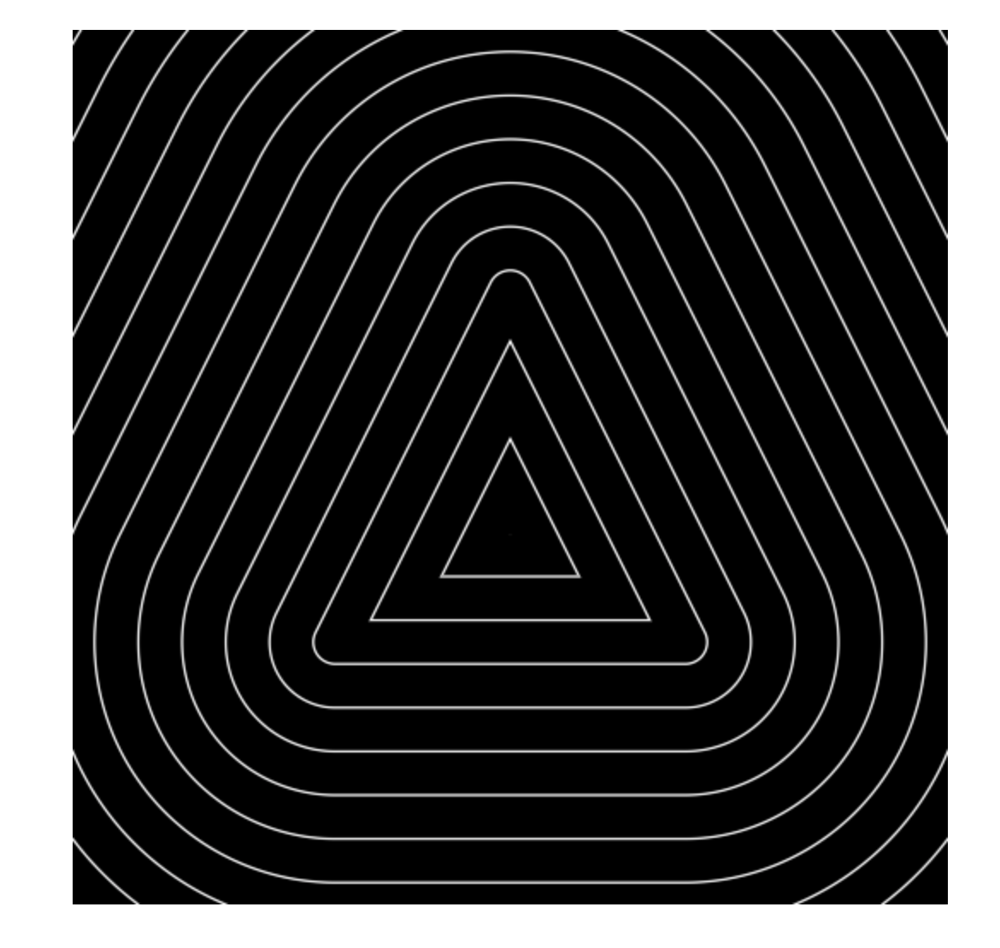

## WebGL：使用着色器进行几何造型

### 前言

本文将介绍如何使用着色器来进行几何造型，说到几何图形大家一定都不陌生，比如说三角形、圆形，接触过WebGL基础使用的小伙伴一定都知道怎么去在画布上绘制一个三角形，只要传入三个顶点坐标，并选择绘图模式，我们就能在WebGL的画布上画出一个三角形。

但是除了这种形式之外，我们还可以直接使用片元着色器进行几何造型，那么具体要怎么做呢，下面就以三角形作为例子来进行演示。


### 绘制三角形

要实现三角形的绘制，我们需要先判断当前片元是否在三角形内部，也就是说在给片元上色之前，我们需要先计算出片元的色值。

假设我们已知三角形的三个顶点：

```glsl
vec2(0.3),
vec2(0.5, 0.7),
vec2(0.7, 0.3)
```

那么我们就可以根据当前片元的**纹理坐标**和三角形三个顶点的坐标，计算片元与三角形的距离。下面我们会通过使用向量的叉乘和点乘来进行计算，对向量操作不太熟悉的小伙伴可以去找些资料复习一下，或者参考我前面的文章。

首先在片元着色器中定义一个函数，叫做`line_distance`，用于计算点到一条直线的距离，这里我们使用了向量的叉乘来计算，代码应该比较容易理解，就简单说一下，这里的参数st表示我们要判断的点，a和b分别表示直线上的两个点，因为这三个点都是平面上的点，叉积本身也是向量，所以直接取叉积Z轴的分量就是二维向量叉乘的结果。这个函数我们在后续会用于判断点是否在三角形内部。

```glsl
// 点到直线的距离
float line_distance(in vec2 st, in vec2 a, in vec2 b) {
  vec3 ab = vec3(b - a, 0);
  vec3 p = vec3(st - a, 0);
  return cross(p, normalize(ab)).z;
}
```

接着继续定义一个函数，叫做`seg_distance`，用于计算点到一条线段的距离，点与线段的距离我们分为两类情况考虑，一类是点在线段的上方或下方，这个时候点到线段的距离，就等于点到这条线段所在直线的距离，第二类是点在线段的左右两侧，此时点到线段的距离就是点到线段两个端点的距离中的较小值。

```glsl
// 点到线段的距离
float seg_distance(in vec2 st, in vec2 a, in vec2 b) {
  vec3 ab = vec3(b - a, 0);
  vec3 p = vec3(st - a, 0);
  float l = length(ab);
  float d = abs(
    cross(p, normalize(ab))
  ).z;
  float proj = dot(p, ab) / l;
  if (proj >= 0.0 && proj <=l) return d;
  return min(distance(st, a), distance(st, b));
}
```

最后定义一个函数，叫做`triangle_distance`，用于计算点到三角形的距离，这属于一个自定义的距离概念，从代码上看准确来说应该是点到三条边的距离中的最小值。在这段代码中，我们定义内部的距离取负数，外部的距离为正。

```glsl
// 点与三角形的距离
float triangle_distance(in vec2 st, in vec2 a, in vec2 b, in vec2 c) {
  float d1 = line_distance(st, a, b);
  float d2 = line_distance(st, b, c);
  float d3 = line_distance(st, c, a);

  if (d1 >= 0.0 && d2 >= 0.0 && d3 >= 0.0
    || d1 <= 0.0 && d2 <= 0.0 && d3 <= 0.0) {
    return -min(abs(d1), min(abs(d2), abs(d3))); // 内部距离为负
  }

  return min(seg_distance(st, a, b), min(seg_distance(st, b, c), seg_distance(st, c, a))); // 外部距离为正
}
```

首先我们判断三组向量叉乘的结果，符号是否是一样的，如果是一样，说明当前点在三角形内部，那么点必然是在线段的上方，所以直接用三个叉积中的最小值。

如果点在三角形外部，就取点到三个线段距离中的最小值。

到这里我们就能得到片元与三角形的距离了。

```glsl
float d = triangle_distance(
  vUv,
  vec2(0.3),
  vec2(0.5, 0.7),
  vec2(0.7, 0.3)
);
```

接着我们就利用这个距离来进行最简单的填充，将三角形的内部直接填充为白色。

```glsl
gl_FragColor.rgb = (1.0 - smoothstep(0.0, 0.01, d)) * vec3(1.0);
```

当然除了填充之外，我们可以进行三角形的描边。

```glsl
gl_FragColor.rgb = (smoothstep(-0.005, 0.0, d) - smoothstep(0.0, 0.005, d)) * vec3(1.0);
```

`smoothstep(a, b, c)`函数可能有些小伙伴不了解，这里简单说一下，这个函数接收3个参数。

* 在a小于b的情况下
  * 如果c小于a，会返回0
  * 如果c大于b，就返回1
* 而在a大于b的情况下
  * 如果c大于a，返回的是0
  * 如果c小于b，就返回1
* 如果c在a和b之间，就返回一个过渡值

所以其实上面的计算也可以反过来写。


### 应用场景

那么看到这里，有些小伙伴可能就有疑问了，这感觉好像和直接用顶点画没什么区别，那么我们为什么要用着色器造型呢？答案其实很简单，就是它能帮助我们实现更多的图案效果。比如使用以下代码，可以实现三角环。

```glsl
d = fract(20.0 * d);
gl_FragColor.rgb = (smoothstep(0.45, 0.5, d) - smoothstep(0.5, 0.55, d)) * vec3(1.0);
```

在这段代码中，将距离的值放大20倍，再取小数部分，就能实现重复的环。这种绘制方式叫做**符号距离场渲染（SDF)**，这是图形渲染中的一个专有名词，本质上就是利用空间中的距离分布来着色，是着色器造型生成图案的基础方法。这种效果如果要用顶点来画就没这么简单了。



除了SDF，我们注意到代码中使用的是纹理坐标，所以着色器造型还可以配合纹理实现更多的效果，比如图片裁剪。下面我们来看一个简单的例子。

```glsl
void main() {
  vec4 color = texture2D(tMap, vUv);
  float d = distance(vUv, vec2(0.5, 0.5));
  gl_FragColor.rgb = (1.0 - smoothstep(0.4, 0.4005, d)) * color.rgb;
  gl_FragColor.a = (1.0 - smoothstep(0.4, 0.4005, d));
}
```

这里我们定义的距离是片元到一个点的距离，根据这个距离我们能按照上面的方式绘制出一个圆心在`0.5, 0.5`的圆，同时我们现在还能将纹理按这个圆形裁剪出来，就还是蛮好用的效果。


### 总结

在刚开始着色器几何造型的学习时，我也有点奇怪WebGL已经有顶点可以画图形了，为什么还要有这个着色器造型，看到符号距离场SDF的时候，才感觉出来是有区别哦，好像还挺有用的。

绘制的步骤简单来说就两步，第一步，确定计算距离的方式，第二步，根据距离给片元上色。

绘制三角形和圆形都还算简单的，我相信很多小伙伴看下来应该都能理解了，可以自己动手尝试一下，有兴趣的小伙伴还可以去尝试更多的图形，比如正多边形、椭圆等等这些图形，甚至是更复杂的图形。


[完整代码参考](https://github.com/yeying0827/visualization-demos/blob/main/src/pages/DemoShape.vue)