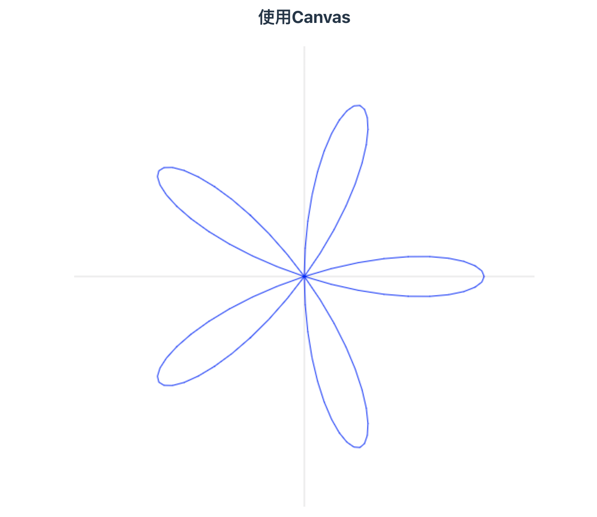
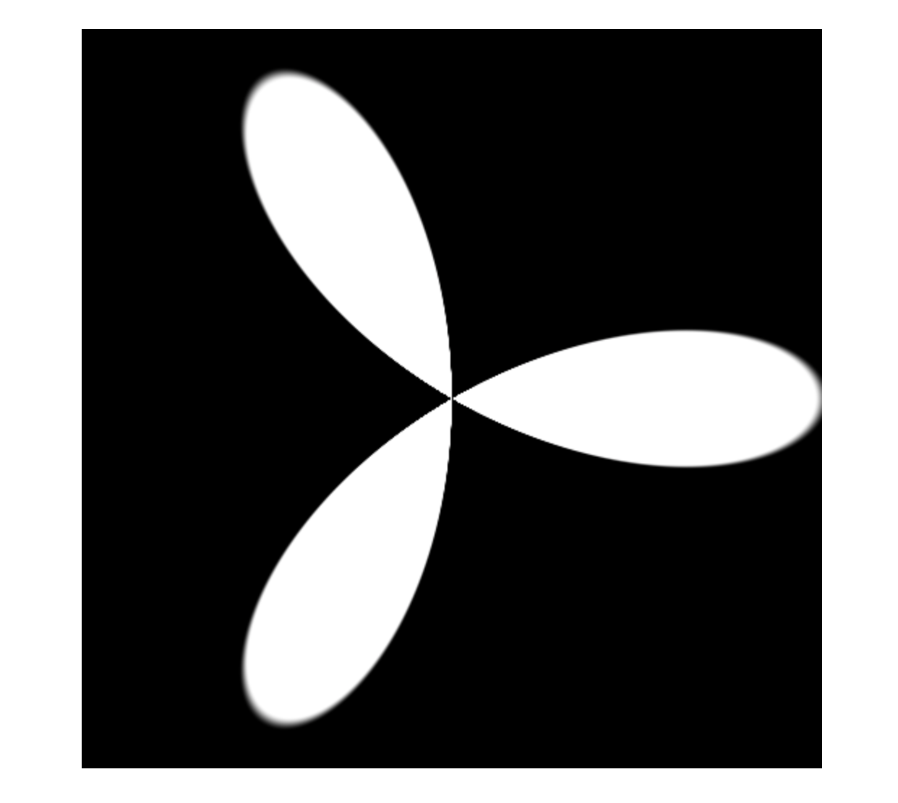
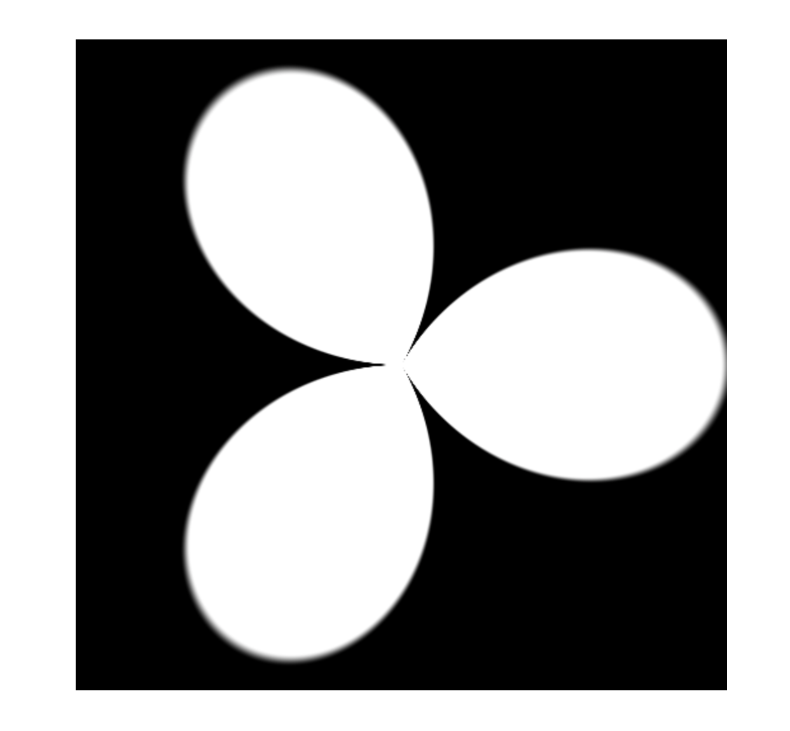
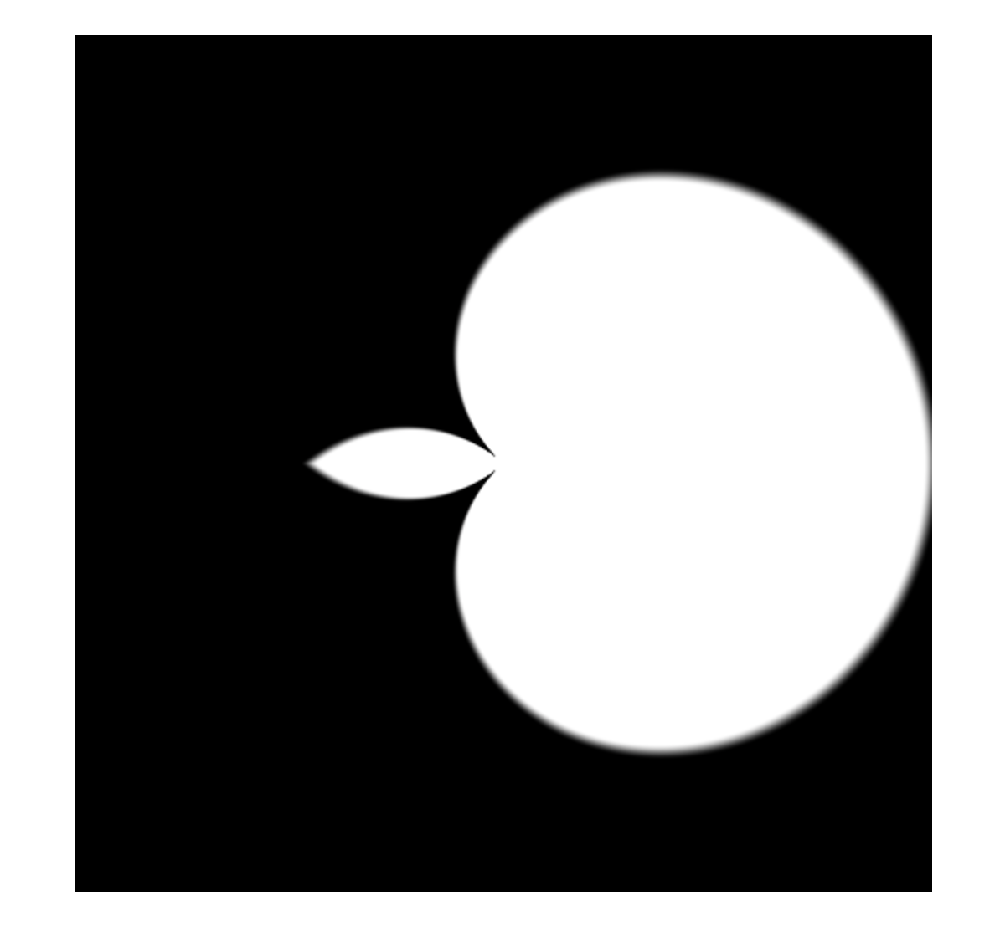
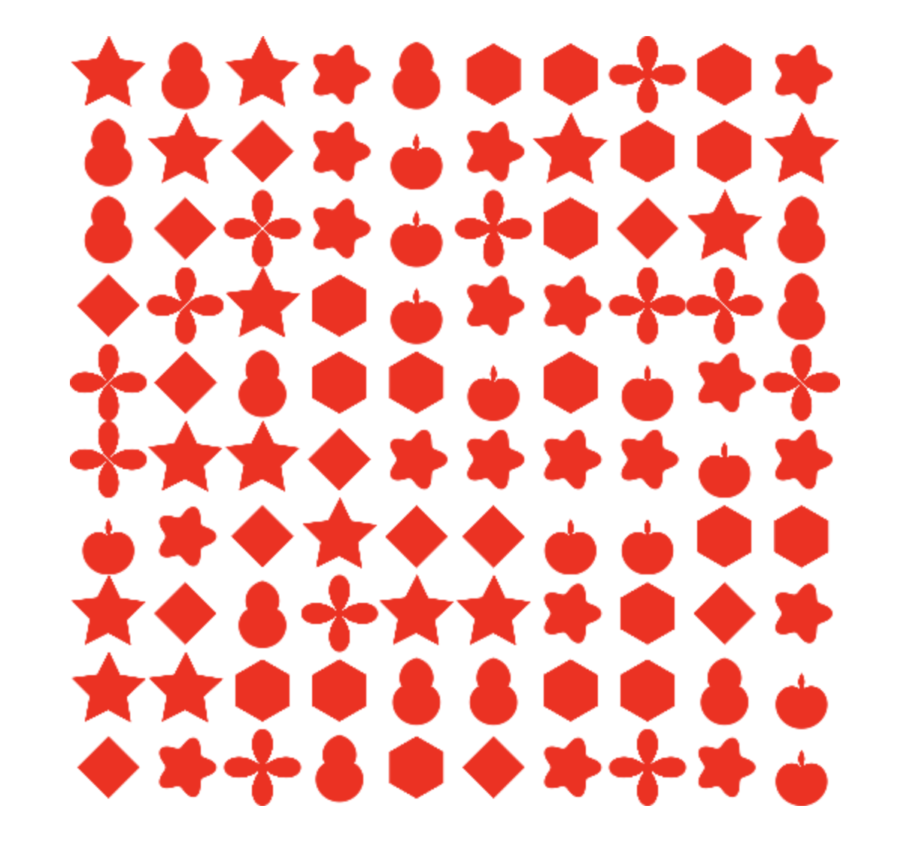

## 使用极坐标参数方程和SDF绘制有趣的图案

### 前言

本文将介绍如何使用极坐标参数方程和上一篇文章提到的距离场SDF来绘制有趣的图案。

说到曲线和几何图形的绘制，我们知道图形系统默认支持的是通过直角坐标绘制，但是有些曲线呢，不太容易使用直角坐标系来表示，却可以很方便地使用极坐标来表示，这个时候我们可以选择通过极坐标和直角坐标的相互转换，来实现图形的绘制。

下面我就用玫瑰线、花瓣线等曲线作为例子来进行演示。

在开始演示之前，我先简单介绍下极坐标和参数方程。

* **极坐标**是使用*相对极点的距离*，以及*与X轴正向的夹角*，使用这一对值来表示平面上点的坐标。

* **参数方程**表示的是点的坐标分别和相关参数的关系，所以通常会对应一个方程组，比如说二维平面上的点，会使用两个参数方程来表示。

我这里只是简单介绍一下，可能说的并不是很准确。我们也可以用圆作为例子，圆的标准方程大家都知道，假设圆心在原点，在直角坐标系下，圆的公式就是x的平方加上y的平方等于半径的平方，圆的参数方程是x等于半径乘以与X轴夹角的余弦值，y等于半径乘以与X轴夹角的正弦值。
$$
\begin{cases}
x = r * cosθ \\
y = r * sinθ
\end{cases}
$$


但在极坐标系下，圆的参数方程就变成了r等于一个常量，θ等于与X轴的夹角。这基本上可以算是最简单的极坐标参数方程组了。
$$
\begin{cases}
r = r \\
θ = t
\end{cases}
$$


那么基本的知识了解后，我们就可以开始使用极坐标参数方程来绘制图形和曲线了。


### 具体实现

现在就来演示通过曲线的极坐标参数方程来绘制曲线。

#### Canvas

首先先来看Canvas2D的例子，在Canvas中我们可以通过`lineTo`方法绘制足够多的线段将它们连在一起，来模拟曲线，所以我们可以通过参数方程获取足够多的点，将它们连接起来，这样就能最终完成曲线的绘制。

因此我们先来定义一个高阶函数parametric用于创建方程组，接收三个参数xFunc、yFunc和rFunc。xFunc和yFunc表示点的一对坐标值各自分别对应的参数方程，rFunc表示坐标映射函数。

```javascript
export default function parametric(xFunc, yFunc, rFunc) {
    return function(start, end, seg = 100, ...args) {
        const points = [];
        for (let i = 0; i <= seg; i ++) {
            const p = i / seg;
            // const t = start * (1 - p) + end * p;
            const t = start + (end - start) * i / seg;
            // console.log(t);
            const x = xFunc(t, ...args);
            const y = yFunc(t, ...args);
            if (rFunc) points.push(rFunc(x, y));
            else points.push([x, y]);
        }
        return {
            draw: draw.bind(null, points),
            points
        }
    }
}
```

这个高阶函数的返回值也是一个函数，在这个匿名函数应该不难理解，我简单说一下，它接收多个参数，必选的三个是坐标相关参数 t 的上下限start和end，以及要收集的点的数量seg，最终返回一个对象，这个对象带有一个draw方法，通过调用这个draw方法就可以完成曲线的绘制。

下面我们就通过parametric函数构造不同的曲线方程组。来看一个玫瑰线：

```javascript
// 玫瑰线
const rose = parametric(
    (t, a, k) => a * Math.cos(k * t), // r
    t => t, // θ
    fromPolar,
);
```

这里fromPolar是一种坐标映射函数，作用是将极坐标转换为直角坐标，这样我们才能在Canvas2d中使用坐标值。现在我们就可以通过调用rose函数，来获取曲线上的点并绘制曲线了。

```javascript
rose(0, Math.PI, 100, 200, 5).draw(ctx, {strokeStyle: 'blue'}); // 玫瑰线
```



通过传入不同的a，我们可以改变曲线的大小，而不同的k，可以改变叶子的数目；这样就能构造出不同的图案。

所以我们也可以应用不同的曲线方程，绘制出各种曲线。

#### WebGL

那么除了Canvas2d，我们当然也可以在WebGL中应用曲线的参数方程实现图形的绘制。接下来我就演示几个在shader中应用参数方程的例子，并结合上篇文章中提到的距离场，完成图形的绘制。

首先还是玫瑰线：

```glsl
void main() {
  vec2 st = vUv - vec2(0.5);
  st = polar(st);
  float d = 0.5 * cos(st.y * 3.0) - st.x;

  gl_FragColor.rgb = smoothstep(-0.01, 0.01, d) * vec3(1.0);
  gl_FragColor.a = 1.0;
}
```

在这段Shader代码中，这里的0.5就是刚刚在Canvas例子中的a，而3.0就是Canvas例子中的k，所以这里叶子的数目就是3。那为什么这里的d要这样定义呢？这是因为玫瑰线上的所有点都满足 `0 = a * cos(k * θ) - r` 这个等式，也就是说玫瑰线上的点对应的d都是0，并且玫瑰线形成的图形内部的点对应的d都大于0，而外部的点对应的d都小于0，因此这样我们就可以得到一个内部填充为白色的玫瑰线图形。



我们对玫瑰线的参数和公式做些微调，就能得到不同的图形，比如添加一个取绝对值的操作，并且给角度乘以一个常量0.5。

```glsl
void main() {
  float u_k = 3.0; 

  vec2 st = vUv - vec2(0.5);
  st = polar(st);
  float d = 0.5 * abs(cos(st.y * u_k * 0.5)) - st.x;
  gl_FragColor.rgb = smoothstep(-0.01, 0.01, d) * vec3(1.0);
  gl_FragColor.a = 1.0;
}
```

可以看出这个图形有些类似花瓣的形状。



当我们设置不同的u_k值时，也能得到不同的图案，比如当u_k设置为1.3时，图形看上去就像一个横放的苹果。

```glsl
void main() {
  float u_k = 1.3; // 横放的苹果

  vec2 st = vUv - vec2(0.5);
  st = polar(st);
  float d = 0.5 * abs(cos(st.y * u_k * 0.5)) - st.x;
  gl_FragColor.rgb = smoothstep(-0.01, 0.01, d) * vec3(1.0);
  gl_FragColor.a = 1.0;
}
```



继续微调参数方程，我们还能画出类似横放的葫芦图案：

```glsl
void main() {
  float u_k = 1.7; // 横放的葫芦
  float u_scale = 0.5; 
  float u_offset = 0.2; 
  
  vec2 st = vUv - vec2(0.5);
  st = polar(st);
  float d = u_scale * 0.5 * abs(cos(st.y * u_k * 0.5)) - st.x + u_offset;
  gl_FragColor.rgb = smoothstep(-0.01, 0.01, d) * vec3(1.0);
  gl_FragColor.a = 1.0;
}
```


相信小伙伴们通过结合三角函数、abs、smoothstep等等这些函数，还能绘制出更多有趣的图案，大家可以动手自己尝试一下。

#### 结合随机数

接下来，我们结合一个随机数函数，来实现一个类似剪纸的图案。

在这个例子中，我们会使用一个**生成随机数的函数**叫做random，从代码中我们可以看出random实际上生成的是一个伪随机数，因为纹理坐标是确定的，所以根据纹理坐标生成的随机数也是确定的。

```glsl
float random(vec2 st) {
  return fract(
    sin(
      dot(st.xy, vec2(12.9898, 78.233))
    ) *
    43758.5453123
  );
}
```

这个函数是我学的课程上给的一个函数，应该是一个经验公式。那么接下来我们就开始来实现这个剪纸图案。

首先，我们利用实现网格的方式，将画布变为10 x 10的网格，此时得到的st变量就是片元对应的纹理坐标乘以10，接着我们分别获取到st的整数部分和小数部分。

整数部分ipos将用于生成随机数，而小数部分就用于绘制各类图案。

```glsl
vec2 st = vUv * 10.0;
vec2 ipos = floor(st); // integer
vec2 fpos = fract(st); // fraction

float r = random(ipos);
```

接着我们就可以按照随机数在不同区间绘制不同的图案，我这里就用上期学的着色器几何造型里的不同距离公式和上面的几个参数方程来实现不同图案的绘制。

```glsl
void main() {
  vec2 st = vUv * 10.0;
  vec2 ipos = floor(st); // integer
  vec2 fpos = fract(st); // fraction

  float r = random(ipos);

  float d = 0.0;
  if(r < 0.14) { // 四边形
    fpos = fpos - vec2(0.5);
     float d = polygon_distance2(
        fpos,
        4,
        vec2(0.0, 0.4)
     );
     gl_FragColor.rgb = smoothstep(0.01, 0.0, d) * vec3(1.0, 0.0, 0.0);
     gl_FragColor.a = smoothstep(0.01, 0.0, d);
  } else if (r < 0.28) { // 四片花瓣
    float u_k = 4.0;

    fpos = fpos - vec2(0.5);
    fpos = polar(fpos);
    d = 0.5 * abs(cos(fpos.y * u_k * 0.5)) - fpos.x;
    gl_FragColor.rgb = smoothstep(-0.01, 0.01, d) * vec3(1.0, 0.0, 0.0);
    gl_FragColor.a = smoothstep(-0.01, 0.01, d);
  } else if (r < 0.42) { // 苹果
    float u_k = 1.3;

    fpos = fpos - vec2(0.5, 0.7);
    fpos = polar(fpos);
    fpos.y += 3.14 / 2.0;
    // atan 的返回值是：从第一到第二象限为 0~PI，从第三到第四象限为 -PI~0
    // 旋转极坐标后要保证函数定义域的一致性
    if (fpos.y > 3.14) fpos.y -= 3.14 * 2.0;
    float d = 0.5 * abs(cos(fpos.y * u_k * 0.5)) - fpos.x;
    gl_FragColor.rgb = smoothstep(-0.01, 0.01, d) * vec3(1.0, 0.0, 0.0);
    gl_FragColor.a = smoothstep(-0.01, 0.01, d);
  } else if (r < 0.56) { // 六边形
     fpos = fpos - vec2(0.5);
     float d = polygon_distance2(
        fpos,
        6,
        vec2(0.0, 0.4)
     );
     gl_FragColor.rgb = smoothstep(0.01, 0.0, d) * vec3(1.0, 0.0, 0.0);
     gl_FragColor.a = smoothstep(0.01, 0.0, d);
  } else if (r < 0.70) { // 五角星
    fpos = fpos - vec2(0.5);
    float d = star_distance(
      fpos,
      5,
      vec2(0.15, 0.2)
    );
    gl_FragColor.rgb = smoothstep(0.01, 0.0, d) * vec3(1.0, 0.0, 0.0);
    gl_FragColor.a = smoothstep(0.01, 0.0, d);
  } else if (r < 0.84) { // 葫芦
    float u_k = 1.7;
    float u_scale = 0.5;
    float u_offset = 0.2;

    fpos = fpos - vec2(0.5);
    fpos = polar(fpos);
    fpos.y += 3.14 / 2.0;
    if (fpos.y > 3.14) fpos.y -= 3.14 * 2.0;
    float d = u_scale * 0.5 * abs(cos(fpos.y * u_k * 0.5)) - fpos.x + u_offset;
    gl_FragColor.rgb = smoothstep(-0.01, 0.01, d) * vec3(1.0, 0.0, 0.0);
    gl_FragColor.a = smoothstep(-0.01, 0.01, d);
  } else { // 花苞
    float u_k = 5.0;
    float u_scale = 0.13;
    float u_offset = 0.2;

    fpos = fpos - vec2(0.5);
    fpos = polar(fpos);
    float d = smoothstep(-0.3, 1.0, u_scale * 0.5 * cos(fpos.y * u_k) + u_offset) - fpos.x;
    gl_FragColor.rgb = smoothstep(-0.01, 0.01, d) * vec3(1.0, 0.0, 0.0);
    gl_FragColor.a = smoothstep(-0.01, 0.01, d);
  }
}
```

这样我们就实现了一个类似于剪纸的图案，实现的方式比较简单粗暴，就是用了一堆if-else，看上去不太优雅。



相信大家一定都知道怎么去实现更多图形图案了，接下去就是多动手多尝试。

[代码参考：Canvas](https://github.com/yeying0827/visualization-demos/blob/main/src/pages/DemoPolar2D.vue)

[代码参考：WebGL](https://github.com/yeying0827/visualization-demos/blob/main/src/pages/DemoPolar.vue)

