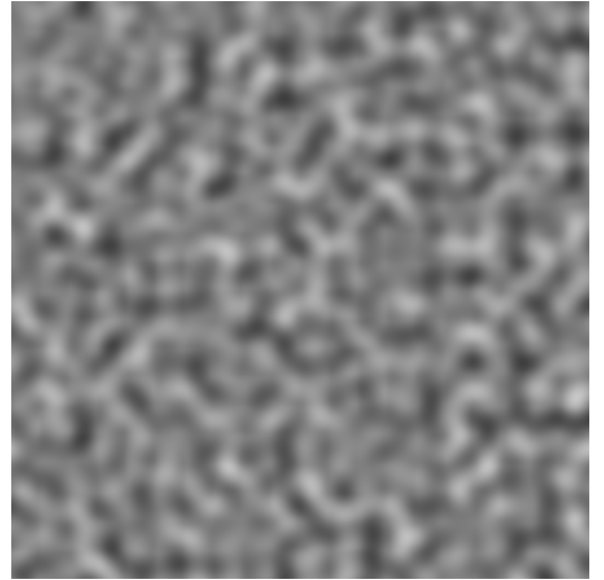

## 如何使用噪声生成纹理

本文分享的是如何使用噪声生成纹理。

首先，什么是噪声呢？在上篇文章中我介绍过一个生成随机数的函数，利用随机技巧我们生成了一个类似剪纸的图案，那在自然界中，这种离散的随机也是比较常见的，比如蝉鸣突然响起又突然停下，比如雨滴随机落在一个位置，但是随机和连续并存是更常见的情况，比如山脉的走向是随机的，但山峰之间的高度又是连续的，比如天上的云朵、水面的波纹等等。

那么这种把随机和连续结合起来，就**形成了噪声**。

通过利用噪声，我们就可以去模拟真实自然的图案。

接下来就介绍几种生成噪声的常用算法。

### 插值噪声

首先是比较容易理解的插值噪声，Value noise。

#### 一维噪声

我们先来看一个小例子。

```glsl
// 随机函数
float random (float x) {
  return fract(sin(x * 1243758.5453123));
}

void main() {
  vec2 st = vUv - vec2(0.5);
  st *= 10.0;
  float i = floor(st.x);
  float f = fract(st.x);

  // d直接等于随机函数返回值，这样d不连续
  float d = random(i); // 取出10个不同的'd'值(0~1)

  // st.y: -5 ~ +5
  // 1. d < st.y - 0.1 或 d > st.y + 0.1，值为0，为黑色（st.y > d+0.1 或 st.y < d-0.1）
  // 2. st.y - 0.1 < d < st.y + 0.1 时, 值为0->1->0，为黑到白再到黑的过渡色
  gl_FragColor.rgb = (smoothstep(st.y - 0.10, st.y, d) - smoothstep(st.y, st.y + 0.10, d)) * vec3(1.0);
  gl_FragColor.a = 1.0;
}
```

通过这段代码我们在画布上绘制了10条线段，那么这10条线段是怎么生成的呢？


我们来看代码，首先通过减去`vec2(0.5)`，相当于把纹理坐标轴的原点挪到了`(0.5, 0,5)`的位置，然后乘以10，就是把 st 坐标值放大10倍，得到一个10 x 10的网格，这里也有一个生成伪随机数的函数，可以看出是根据片元所在的网格、在X轴方向的索引，生成了一个随机数，所以也就是说**整个画布的片元去运算**，会得到10个不同的 d 值。

然后我们看这个生成伪随机数的函数，它的返回值的范围，其实是在0到1之间，也就是说后面的d，它是一个0到1之间的值。

最后我们看这个色值的计算，当 st.y > d+0.1 或者 st.y < d-0.1时，这个值是0，也就为黑色，而st.y的范围本来就在-5到5之间，所以我们可以看到这个随机计算出来的10条线段是靠近X轴的。

在上面的代码中，我们生成的是10条离散的线段，如果我们想将计算出来的离散的值连起来，我们可以使用mix函数。

```glsl
// mix(a,  b,  c)：线性插值函数。a和b是两个输入的颜色或值，c是一个介于0和1之间的浮点数，表示插值的权重
// 当c接近0时，返回a；当c接近1时，mix函数返回b；当c在0和1之间时，返回a和b的插值结果。
float d = mix(random(i), random(i + 1.0), f);
```

这样我们就会得到一段连续的折线。f 是取st的小数部分，是片元在它自身所在的网格内的X坐标，它的范围是在0到1之间。

我们看到折线虽然是连续的，但它看上去并不够自然，因此我们可以改用smoothstep或者三次多项式`f*f*(3.0-2.0*f)`，这样就能得到一条连续且平滑的曲线。

```glsl
float d = mix(random(i), random(i + 1.0), smoothstep(0.0, 1.0, f));
// float d = mix(random(i), random(i + 1.0), f * f * (3.0 - 2.0 * f));
```

**随机加连续**，所以这就是噪声函数了。

#### 二维噪声

可以看到，这个噪声的生成方式，是在首尾两个点之间进行插值。用了一个坐标去生成一个随机值，这是一维噪声。如果要生成二维的图案，我们需要使用二维噪声，需要对平面画布上 方形区域 的四个顶点，分别从x、y方向进行两次插值。


比如下面这个例子：

```glsl
float random(vec2 st) {
  return fract(
    sin(
      dot(st.xy, vec2(12.9898, 78.233))
    )
    *
    43758.5453123
  );
}

// 二维噪声，对st与方形区域的四个顶点插值
highp float noise(vec2 st) {
  vec2 i = floor(st);
  vec2 f = fract(st);
  vec2 u = f * f * (3.0 - 2.0 * f); // 0~1
  return mix(
    mix(random(i + vec2(0.0, 0.0)), random(i + vec2(1.0, 0.0)), u.x),
    mix(random(i + vec2(0.0, 1.0)), random(i + vec2(1.0, 1.0)), u.x),
    u.y
  );
}

void main() {
  vec2 st = vUv * 20.0;
  gl_FragColor.rgb = vec3(noise(st));
  gl_FragColor.a = 1.0;
}
```

这个例子中我们是通过 st 这个向量与一个常量的向量得到一个随机值，也就是说随机值由x坐标和y坐标同时决定，而不是像一维噪声的例子中，仅由一个坐标决定。

noise这个函数可以看出，当u的值分别接近四个顶点时，用来计算随机值的向量都不同，这样我们就得到一个插值，得到二维噪声。这是一个比较模糊的噪声图案。


### 梯度噪声

很显然，这里生成的噪声有很明显的缺点，最直观的表现就是，图像有明显的“块状“特点，不够平滑。这是因为它的值的梯度不均匀。如果我们追求更平滑的噪声效果，可以改为使用梯度噪声，Gradient Noise。

梯度噪声是对随机的二维向量来插值，而不是一维的随机数。我们来看下面的例子。

```glsl
vec2 random2(vec2 st) {
  st = vec2(
    dot(st, vec2(127.1, 311.7)),
    dot(st, vec2(269.5, 183.3))
  );
  return -1.0 + 2.0 * fract(sin(st) * 43758.5453123); // x和y：-1~1
}

// Gradient Noise by Inigo Quilez - iq/2013
// https://www.shadertoy.com/view/XdXGW8
float noise(vec2 st) {
  vec2 i = floor(st);
  vec2 f = fract(st);
  vec2 u = f * f * (3.0 - 2.0 * f); // 0~1

  return mix(
    mix(
      dot(random2(i + vec2(0.0, 0.0)), f - vec2(0.0, 0.0)),
      dot(random2(i + vec2(1.0, 0.0)), f - vec2(1.0, 0.0)),
      u.x
    ),
    mix(
      dot(random2(i + vec2(0.0, 1.0)), f - vec2(0.0, 1.0)),
      dot(random2(i + vec2(1.0, 1.0)), f - vec2(1.0, 1.0)),
      u.x
    ),
    u.y
  );
}

void main() {
  vec2 st = vUv * 20.0;
  gl_FragColor.rgb = vec3(0.5 * noise(st) + 0.5);
  gl_FragColor.a = 1.0;
}
```

在这个代码中，random函数生成的不再是一维的随机数float，而是二维的随机向量vec2，在噪声函数Noise中通过点积dot将二维坐标转为一个数字，得到一个噪声值。

可以看到最终的效果中，黑白的过渡明显平滑多了，不再呈现块状。因此许多有趣的模拟自然界特效的视觉实现都采用了梯度噪声。



下面我们来看一个云雾效果的视觉。

它将噪声叠加6次，在每次叠加的时候范围扩大一倍，但是权重减半。配合色相变化，就能到类似飞机航拍的效果。

```glsl
#define OCTAVES 6
float mist(vec2 st) {
  // Initial values
  float value = 0.0;
  float amplitude = 0.5;

  // 叠加6次
  for(int i = 0; i < OCTAVES; i ++) {
    // 每次范围扩大一倍，权重减半
    value += amplitude * noise(st);
    st *= 2.0;
    amplitude *= 0.5;
  }
  return value;
}

// 配合色相的变化

void main() {
  vec2 st = vUv;
  st.x += 0.1 * uTime;
  gl_FragColor.rgb = hsb2rgb(vec3(mist(st), 1.0, 1.0));
  gl_FragColor.a = 1.0;
}
```

我们可以分别使用插值噪声和梯度噪声看效果，虽然色值不一样，但是可以明显看出，在使用插值噪声的函数时，云雾效果中会出现明显的”块状“的特点。


### Simplex Noise

接下来介绍一个Simplex Noise算法，相比前面两种噪声函数，这个算法比较新，它有非常明显的优势，它有更低的计算复杂度，可以用更少的计算量达到更高的维度，并且它所制造出的噪声非常自然。

不同于前面的函数是对四边形进行插值，Simplex Noise算法是对三角网格进行插值，所以大大降低了计算量，提升了运行性能。它所包含的数学技巧比较高深，可以参考[Book of Shaders](https://thebookofshaders.com/11/?lan=ch)的文章来学习。下面我们来看一个例子体会一下。

```glsl
vec3 mod289(vec3 x) { return x - floor(x * (1.0 / 289.0)) * 289.0; }
vec2 mod289(vec2 x) { return x - floor(x * (1.0 / 289.0)) * 289.0; }
vec3 permute(vec3 x) { return mod289((x * 34.0 + 1.0) * x); }

//
// Description : GLSL 2D simplex noise function
//      Author : Ian McEwan, Ashima Arts
//  Maintainer : ijm
//     Lastmod : 20110822 (ijm)
//     License :
//  Copyright (C) 2011 Ashima Arts. All rights reserved.
//  Distributed under the MIT License. See LICENSE file.
//  https://github.com/ashima/webgl-noise
//
float noise(vec2 v) {
  // Precompute values for skewed triangular grid
  const vec4 C = vec4(0.211324865405187,
                      // (3.0 - sqrt(3.0))/6.0
                      0.366025403784439,
                      // 0.5 * (sqrt(3.0) - 1.0)
                      -0.577350269189626,
                      // -1.0 + 2.0 * C.x
                      0.024390243902439);
                      // 1.0 / 41.0
   // First corner (x0)
   vec2 i = floor(v + dot(v, C.yy));
   vec2 x0 = v - i + dot(i, C.xx);

   // Other two corners(x1, x2)
   vec2 i1 = vec2(0, 0);
   i1 = (x0.x > x0.y)? vec2(1.0, 0.0) : vec2(0.0, 1.0);
   vec2 x1 = x0.xy + C.xx - i1;
   vec2 x2 = x0.xy + C.zz;

   // Do some permutations to avoid
   // truncation effects in permutation
   i = mod289(i);
   vec3 p = permute(
    permute(i.y + vec3(0.0, i1.y, 1.0))
    + i.x + vec3(0.0, i1.x, 1.0)
   );

   vec3 m = max(0.5 - vec3(dot(x0, x0), dot(x1, x1), dot(x2, x2)), 0.0);

   m = m * m;
   m = m * m;

   // Gradients:
   //  41 pts uniformly over a line, mapped onto a diamond
   //  (在一条线上均匀分布 41 个点，映射到一个菱形上。)
   //  The ring size 17*17 = 289 is close to a multiple
   //      of 41(41 * 7 = 287)
   //  (环的大小17 * 17等于289，接近41的倍数（41 * 7等于287）。)
   vec3 x = 2.0 * fract(p * C.www) - 1.0;
   vec3 h = abs(x) - 0.5;
   vec3 ox = floor(x + 0.5);
   vec3 a0 = x - ox;

   // Normalise gradients implicitly by scaling m
   // Approximation of: m *= inversesqrt(a0 * a0 + h * h)
   m *= 1.79284291400159 - 0.85373472095314 * (a0 * a0 + h * h);

   // Compute final noise value at P
   vec3 g = vec3(0.0);
   g.x = a0.x * x0.x + h.x * x0.y;
   g.yz = a0.yz * vec2(x1.x, x2.x) + h.yz * vec2(x1.y, x2.y);
   return 130.0 * dot(m, g);
}

void main() {
  vec2 st = vUv * 20.0;
  gl_FragColor.rgb = vec3(0.5 * noise(st) + 0.5);
  gl_FragColor.a = 1.0;
}
```

与梯度噪声生成的图案相比，它显得更清晰一点。


### 网格噪声

最后我们来看一个网格噪声，这是将噪声与网格结合使用来生成纹理。也是来看一个例子。

```glsl
vec2 random2(vec2 st) {
  st = vec2(
    dot(st, vec2(127.1, 311.7)),
    dot(st, vec2(269.5, 183.3))
  );
  return fract(sin(st) * 43758.5453123); // x和y：0~1
}

void main() {
  vec2 st = vUv * 10.0;

  float d = 1.0;
  vec2 i_st = floor(st);
  vec2 f_st = fract(st);

  vec2 p = random2(i_st); // 特征点
  d = distance(f_st, p);

  gl_FragColor.rgb = vec3(d);
  gl_FragColor.a = 1.0;
}
```

首先我们使用网格技术在画布上生成10 x 10的网格。然后构建距离场，使用随机技术我们在每个网格内部会得到一个特征点，在这个距离场中我们定义的距离就是**片元到它所在网格的特征点**的距离。


这样我们就使用随机技术得到了一个纹理图案，但是这里每个网格很明显是互相独立的，是界限分明的。如果我们想要他们的边界过渡更圆滑，那么我们可以通过以下这种方式来处理。


就是除了当前片元所在网格的特征点之外，还要计算片元与相邻8个网格特征点的距离，然后取其中的最小值。这样看上去就是平滑的过渡。

我们还可以加上uTime，让网格动起来，同时把特征点也给显示出来。这样得到的视觉效果就会非常类似动态的生物细胞。

```glsl
void main() {
  vec2 st = vUv * 10.0;

  float d = 1.0;
  vec2 i_st = floor(st);
  vec2 f_st = fract(st);

  for (int i = -1; i <= 1; i ++) {
    for (int j = -1; j <= 1; j ++) {
      vec2 neighbor = vec2(float(i), float(j)); // 坐标x和y：-1~1
      vec2 p = random2(i_st + neighbor); // 9个随机特征点在自身网格内的坐标（坐标x和y：0~1）
      p = 0.5 + 0.5 * sin(uTime + 6.2831 * p); // 随时间动态变化（0~1）
      // 当前点和9个特征点 最近的距离
      d = min(d, distance(f_st, neighbor + p)); // neighbor+p（坐标X和Y：-1~2）
    }
  }

  gl_FragColor.rgb = vec3(d) + step(d, 0.03); // 显示特征点
  gl_FragColor.a = 1.0;
}
```


### 总结

通过前面的例子，可以看出噪声还是非常有意思的技术，实际上它是一种**程序化的纹理生成技术**，基本思路就是对离散的随机数进行平滑处理。可以模拟很多有趣的效果。关于噪声这一块的内容呢，是比较偏向技巧性的，需要更多去动手实践，我们也可以通过去看更多的创作案例，来得到更多的启发，比如[Shadertoy.com](https://www.shadertoy.com/)上就有很多的着色器创作分享。


[效果参考](https://yeying0827.github.io/visualization-demos/#/demo-noise)

[完整代码](https://github.com/yeying0827/visualization-demos/blob/main/src/pages/DemoNoise.vue)
