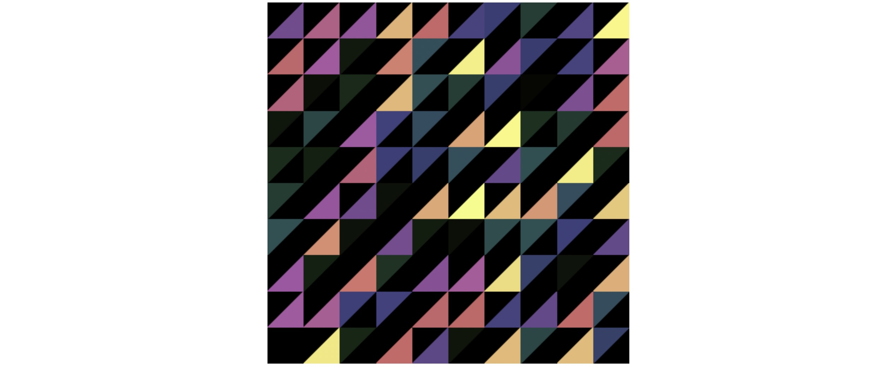
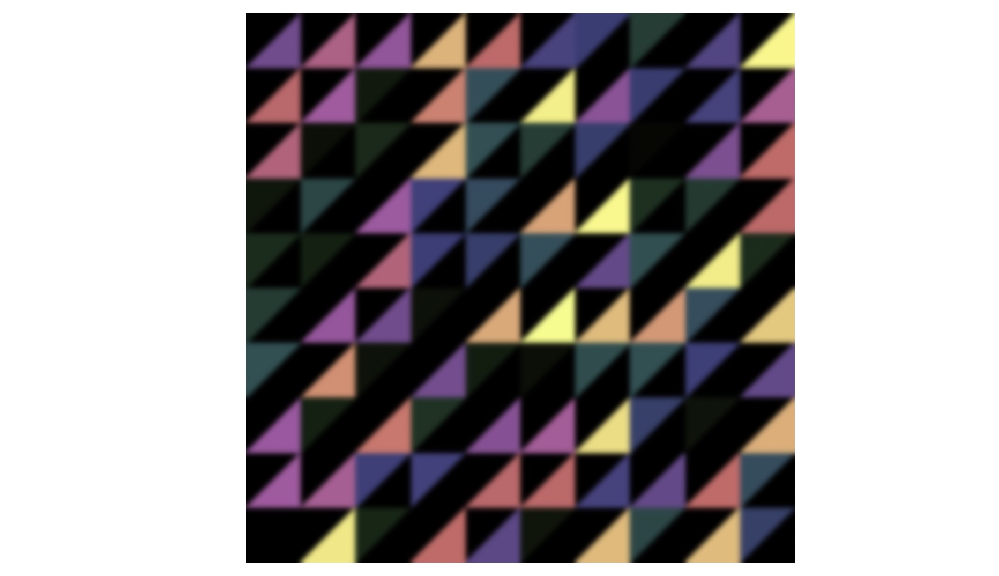

## 使用后期处理通道增强图像效果

### 前言

大家好，本文分享的是如何使用后期处理通道增强图像效果，通过前面几篇文章，我们了解了一些动态生成纹理的方法，比如符号距离场SDF、基于参数方程生成图案、基于噪声生成纹理，等等。这些生成纹理的技术有相似的地方，就是根据片元的纹理坐标，对片元着色，直接生成纹理。

因为GPU是并行渲染的，每个像素的着色器程序是并行执行的，这样的渲染很高效。但是在实际需求中，有时我们计算片元色值时，需要依赖周围像素点或者某个其他位置像素点的颜色信息，这样的话想要一次性完成绘制就无法做到了。我们需要先通过第一次的绘制，来得到动态生成的纹理，接着我们才能根据纹理坐标获取到这个纹理上任一位置的颜色信息，再做后续处理。也就是我们至少要执行两次处理，才能实现我们最终想要的效果。

那么具体要怎么做呢，下面我就用一个高斯模糊的例子来进行演示。


### 高斯模糊的例子

假设我们通过以下Shader代码绘制了随机的三角形图案。

```javascript
const fragment = `
  #ifdef GL_ES
  precision highp float;
  #endif

  varying vec2 vUv;

  ${distance.base}

  ${noise.random2d}

  ${color.hsb}

  void main() {
    vec2 st = vUv;
    st *= 10.0;
    vec2 i_st = floor(st);
    vec2 f_st = 2.0 * fract(st) - vec2(1);
    float r = random(i_st);
    float sign = 2.0 * step(0.5, r) - 1.0;

    float d = triangle_distance(
      f_st,
      vec2(-1),
      vec2(1),
      sign * vec2(1, -1)
    );
    gl_FragColor.rgb = (smoothstep(-0.85, -0.6, d) - smoothstep(0.0, 0.05, d)) * hsb2rgb(vec3(r + 1.2, 0.5, r));
    gl_FragColor.a = 1.0;
  }
`;
```



以上就是动态生成的纹理，在生成的过程中我们无法直接给纹理添加高斯模糊的滤镜。

为了使用这个第一次渲染的结果，我们需要准备一个新的片元着色器。

```glsl
## blurFragment
#ifdef GL_ES
precision highp float;
#endif

varying vec2 vUv;
uniform sampler2D tMap;

void main() {
  vec4 color = texture2D(tMap, vUv);

  gl_FragColor.rgb = color.rgb;
  gl_FragColor.a = color.a;
}
```

这里的变量tMap就是第一次渲染生成的纹理。那么我们要怎么获取这个纹理呢？这就要用到WebGL中的**帧缓冲对象**，Frame Buffer Object。

当我们没有绑定帧缓冲对象时，Shader生成的图形会使用默认的缓冲区，直接输出绘制到画布上，当然这样我们是拿不到渲染结果的，这里为了对渲染结果二次加工，我们需要在执行渲染前绑定帧缓冲对象，这样在渲染时就会实现类似OffscreenCanvas的离屏绘制，将渲染结果输出到帧缓冲对象中。

```javascript
const fbo = renderer.createFBO(); // 创建帧缓冲对象
renderer.bindFBO(fbo); // 绑定，指定输出到的帧缓冲对象
renderer.render(); // 输出到帧缓冲对象
renderer.bindFBO(null); // 解除绑定

const blurProgram = renderer.compileSync(blurFragment, vertex);
renderer.useProgram(blurProgram);
renderer.setMeshData(program.meshData);
renderer.uniforms.tMap = fbo.texture; // 将前一个着色器程序生成的纹理作为新着色器的 tMap 变量
renderer.render();
```

在完成输出后，就解除绑定，并使用新的片元着色器创建一个新的着色器程序，并开启使用。

此时我们可以通过`fbo.texture`获取到前一个着色器程序生成的纹理，并传递给新的着色器使用。

可以看到，现在画布上的图案和之前的并没有什么区别，这是因为我们的第二次渲染，是通过纹理坐标映射直接采样、获取到颜色信息并着色。

现在我们就来添加高斯模糊的处理代码。

对高斯模糊不了解的小伙伴可以参考[这篇博客](https://www.ruanyifeng.com/blog/2012/11/gaussian_blur.html)，它的原理简单来说就是：

**按照高斯分布的权重，对当前像素点及其周围像素点的颜色按照高斯分布的权重 加权平均。**这样能让图片各像素色值与周围色值的差异减小，从而达到平滑，或者说是模糊的效果。

```glsl
varying vec2 vUv; // 当前片元映射的纹理坐标
uniform sampler2D tMap;
uniform int axis; // 标记对哪个坐标轴进行高斯模糊的处理

void main() {
  vec4 color = texture2D(tMap, vUv);

  // 高斯矩阵的权重值
  float weight[5];
  weight[0] = 0.227027;
  weight[1] = 0.1945946;
  weight[2] = 0.1216216;
  weight[3] = 0.054054;
  weight[4] = 0.016216;

  // 每一个相邻像素的坐标间隔，这里的512可以用实际的Canvas像素宽代替
  float tex_offset = 1.0 / 512.0;
  vec3 result = color.rgb;
  result *= weight[0];
  for (int i = 1; i < 5; ++ i) {
    float f = float(i);
    if (axis == 0) { // X轴的高斯模糊
      result += texture2D(tMap, vUv + vec2(tex_offset * f, 0.0)).rgb * weight[i];
      result += texture2D(tMap, vUv - vec2(tex_offset * f, 0.0)).rgb * weight[i];
    } else { // Y轴的高斯模糊
      result += texture2D(tMap, vUv + vec2(0.0, tex_offset * f)).rgb * weight[i];
      result += texture2D(tMap, vUv - vec2(0.0, tex_offset * f)).rgb * weight[i];
    }
  }

  gl_FragColor.rgb = result.rgb;
  gl_FragColor.a = color.a;
}
```

因为我们设置画布宽高是512，所以这个`tex_offset`表示1个像素在WebGL画布上的单位长度，通过加减`tex_offset * f`，就能根据坐标得到附近像素点的颜色信息，完成高斯模糊的处理。

因为高斯模糊有两个方向，所以至少要执行两次渲染，当然如果想要达到更好的效果，可以执行多次渲染。接下来我们就来修改JavaScript部分的代码。

```javascript
// 创建两个FBO对象交替使用
const fbo1 = renderer.createFBO();
const fbo2 = renderer.createFBO();
// 第一次，渲染原始图形
renderer.bindFBO(fbo1);
renderer.render();
const blurProgram1 = renderer.compileSync(blurFragment1, vertex);
// 第二次，对X轴高斯模糊
renderer.useProgram(blurProgram1);
renderer.setMeshData(program.meshData);
renderer.bindFBO(fbo2);  // 绑定帧缓冲对象
renderer.uniforms.tMap = fbo1.texture;
renderer.uniforms.axis = 0;
renderer.render(); // 将第二次的绘制结果输出到帧缓冲对象
// 第三次，对Y轴高斯模糊
renderer.useProgram(blurProgram1);
renderer.bindFBO(fbo1);
renderer.uniforms.tMap = fbo2.texture;
renderer.uniforms.axis = 1;
renderer.render(); // 将第三次的绘制结果输出到帧缓冲对象
// 第四次，对X轴高斯模糊
renderer.useProgram(blurProgram1);
renderer.bindFBO(fbo2);
renderer.uniforms.tMap = fbo1.texture;
renderer.uniforms.axis = 0;
renderer.render(); // 将第四次的绘制结果输出到帧缓冲对象
// 第五次，对Y轴高斯模糊
renderer.useProgram(blurProgram1);
renderer.bindFBO(null); // 解除FBO绑定
renderer.uniforms.tMap = fbo2.texture;
renderer.uniforms.axis = 1;
renderer.render(); // 将第五次的绘制结果输出到画布上
```

在以上代码中，我们执行了五次渲染，第一次渲染是生成初始纹理并输出到FBO对象，后面四次是对纹理进行高斯模糊处理，在执行之后一次渲染之前，我们对FBO对象解除绑定，这样最终的渲染结果就会绘制到屏幕上。

这样我们就通过后期处理通道实现了动态纹理的平滑模糊的滤镜效果。



当然除了实现高斯模糊之外，我们还可以通过后期处理通道实现其他类型的二次加工。


### 核心原理

通过上面这个简单的例子，相信大家都知道如何去使用后期处理通道来增强图像的视觉效果了，简单来说就三个步骤：

第一步，是把第一次渲染后的图案输出到帧缓冲对象FBO中；

第二步，就是把FBO对象的内容作为纹理，再进行下一次渲染；这一步的渲染过程可以根据需要重复若干次。

第三步，就是把最终结果输出到屏幕上。

这样我们就对动态生成的纹理实现了二次加工。


### 总结

我相信大家看下来应该都知道怎么做了，可以自己动手尝试一下，有兴趣的小伙伴还可以去尝试实现更多的视觉效果，比如辉光效果、烟雾效果等等。

[烟雾效果参考文章](https://code.tutsplus.com/how-to-write-a-smoke-shader--cms-25587t)

[高斯模糊例子](https://yeying0827.github.io/visualization-demos/#/demo-pps)

[完整代码](https://github.com/yeying0827/visualization-demos/blob/main/src/pages/DemoPPS.vue)
