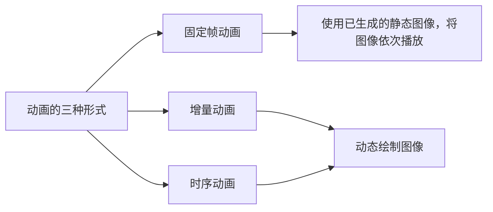
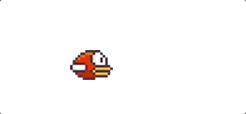
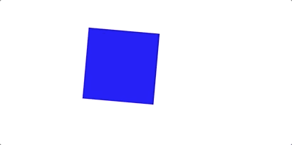
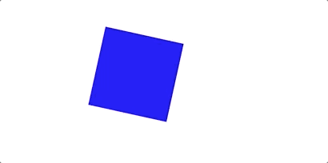
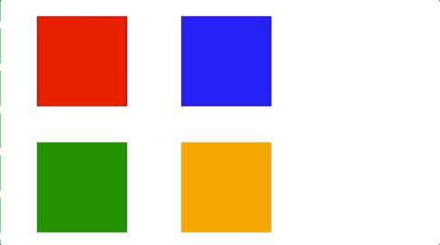
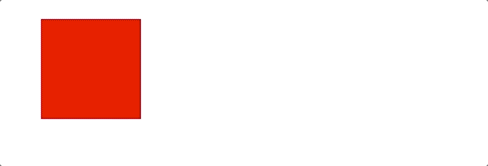
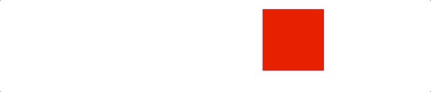

## 如何生成简单动画让图形动起来

大家好，本文分享的是如何生成简单动画让图形动起来。

在可视化展现中，动画它是强化数据表达，吸引用户的重要技术手段。

在具体实现动画之前，我们先来了解一下动画的三种形式，分别是固定帧动画、增量动画和时序动画。




固定帧动画的实现，是使用已生成的静态图像，然后将这些图像依次播放，而后面两种，增量动画和时序动画，都是需要动态绘制图像。可想而知，后面这两种动画形式会更灵活一些。

接下来，我们就来了解如何在HTML/CSS和Shader中实现动画效果。 


### HTML/CSS

首先，我们来了解如何在HTML/CSS中实现动画。

#### 固定帧动画

先来看固定帧动画的一个例子，这个代码实现的是一个飞动的小鸟。

**e.g.动态的小鸟**

```html
<!-- 固定帧动画 -->
<div v-show="checkedTab === 0" style="position: relative;">
  <div class="fixed-frame"></div>
</div>
```

```css
/*固定帧动画*/
.fixed-frame {
  position: absolute;
  left: 100px;
  top: 100px;
  width: 86px;
  height: 60px;
  zoom: 0.5;
  background-repeat: no-repeat;
  background-image: url("@/assets/bird.png");
  background-position: -178px -2px;
  animation: flappy .5s step-end infinite;
}
@keyframes flappy {
  0%  {background-position: -178px -2px;}
  33% {background-position: -90px -2px;}
  66% {background-position: -2px -2px;}
}
```



很显然，在实现这个固定帧动画之前，我们需要预先准备好静态图片，这个例子中我们使用的是雪碧图，也叫CSS精灵，是将小图合并在一起形成的图片，在这里我们设置background-image来指定背景图，然后通过animation动态修改background-position来逐帧切换，最终形成一个动态的效果。当然如果我们使用的是多张图片，直接切换background-image也是可以的。

其中*step-end* 会使 keyframes 动画到了定义的关键帧处直接突变，没有变化的过程。

通过这个例子我们能发现，固定帧动画实现起来非常简单，比较适合的场景是提供现成图片的动画帧图像，如果要去动态绘制图像，就不太合适。如果要生成动态绘制的图像，也就是非固定帧动画，通常会使用另外两种方式。

#### 增量动画

先来看增量动画，其实从名称上看，我们就能有一个大致的概念，增量嘛，就是增加数量，所以增量动画就是在动画的每一帧给属性一个增量。

下面是一个简单的旋转方块的动画例子，是一个旋转的蓝色方块。

```html
<!-- 增量动画 -->
<div style="position: relative;">
  <div class="increase-frame" ref="increaseRef"></div>
</div>
```

```css
/*增量动画*/
.increase-frame {
  position: absolute;
  left: 100px;
  top: 100px;
  width: 100px;
  height: 100px;
  background-color: blue;
  transform-origin: 50% 50%;
}
```

```javascript
let rotation = 0;
requestAnimationFrame(function update() {
  increaseRef.value.style.transform = `rotate(${rotation ++}deg)`;
  requestAnimationFrame(update);
});
```



以上动画实现的关键逻辑就在于修改rotation的值，在每次绘制的时候将它加1。

这种绘制方式实现起来也比较简单，但是它不太容易去控制动画的细节，比如动画周期、变化率、轨迹等等；而且它定义的是状态变化，也就是根据上一刻的状态来计算得到下一刻的状态，这种方式在Shader中实现起来并不太方便，需要像上篇所提到的那样，去使用后期通道来进行处理，很显然，这样做会比较繁琐。

所以如果是比较复杂的动画，我们一般通过定义时间和动画函数来实现，也就是通过时序动画的方式来实现动画效果。

#### 时序动画

关于如何去实现时序动画，我们也直接来看个例子。

**e.g.旋转的蓝色方块**

```javascript
const startAngle = 0;
const T = 2000; // 周期。旋转这一周的时间
let startTime = null;
function update() {
  startTime = startTime === null ? Date.now() : startTime;
  const p = (Date.now() - startTime) / T;
  const angle = startAngle + p * 360;
  timeOrderRef.value.style.transform = `rotate(${angle}deg)`;
  requestAnimationFrame(update);
}
update();
```

这段代码中，我们定义了三个变量，startAngle是起始旋转角度，T是旋转周期，代表完成一次动画、一次旋转需要的时间，startTime表示每一次动画的开始时间。

在update函数中，我们通过`Date.now() - startTime`去得到当前经过的时间，然后除以周期T，就能得到旋转进度 p ，最后根据起始旋转角度和进度 p，计算得到旋转角度angle，并且赋值给transform属性，这样就实现了旋转动画。



根据这个例子，我们可以将时序动画的实现总结为三个步骤：

第一步，定义初始时间和周期；

第二步，在update中计算当前经过的时间和进度；

第三步，通过进度来更新动画元素的属性。

时序动画的优点是，可以更直观、精确地控制动画的周期（也是速度）等参数；它的缺点就是写法相对比较复杂，但是因为它的优点、可以更好控制动画的效果，所以在动画实现中最为常用。

#### 标准动画模型

既然时序动画是**最常用的**动画实现形式，那么我们可以把它的三个步骤抽象成标准的动画模型，来方便后续的动画实现。

* 首先，定义一个类、Timing用于处理时间

  ```javascript
  /**
   * 用于处理动画的时间
   */
  export class Timing {
      constructor({duration, iterations = 1} = {}) {
          this.startTime = Date.now();
          this.duration = duration; // 周期
          this.iterations = iterations; // 重复次数
      }
  
      /**
       * 动画经过的时间
       * @returns {number}
       */
      get time() {
          return Date.now() - this.startTime;
      }
  
      /**
       * 动画进度
       * @returns {number|number}
       */
      get p() {
          // 动画持续了几个周期
          const progress = Math.min(this.time / this.duration, this.iterations);
          // 动画已结束：进度1
          // 动画未结束：0~1
          return this.isFinished ? 1 : progress % 1;
      }
  
      /**
       * 动画是否已结束
       * @returns {boolean}
       */
      get isFinished() {
          // 动画持续了几个周期是否已达到指定次数
          return this.time / this.duration >= this.iterations;
      }
  }
  ```

  这几个方法都很容易理解，就不一一解释了。

* 然后，实现一个Animator类，用于控制动画过程。

  ```javascript
  export class Animator {
      constructor({duration, iterations}) {
          this.timingParam = {duration, iterations};
      }
  
      /**
       * 执行动画
       * @param target
       * @param update
       * @returns {Promise<unknown>}
       */
      animate(target, update) {
          let frameIndex = 0; // 帧序号
          const timing = new Timing(this.timingParam);
  
          return new Promise(resolve => {
              function next() {
                  // 通过执行update更新动画
                  if(update({target, frameIndex, timing}) !== false
                      && !timing.isFinished) {
                      requestAnimationFrame(next);
                  } else {
                      resolve(timing);
                  }
                  frameIndex ++;
              }
              next();
          })
      }
  }
  ```

  `animate`方法，会在执行时创建一个timing对象，最后返回一个promise对象。这里通过执行update更新动画，在动画结束时，resolve这个promise。

现在我们就可以使用这个模型，来尝试实现动画效果了。来看下面这个例子。

在这个例子中，我们让每个方块转动的周期是1秒，一共旋转1.5个周期（也就是540度）。

```html
<div class="container">
  <div class="block"></div>
  <div class="block"></div>
  <div class="block"></div>
  <div class="block"></div>
</div>
```

```javascript
const blocks = document.querySelectorAll('.block');
const animator = new Animator({duration: 1000, iterations: 1.5});
(async function() {
  let i = 0;
  while(true) {
    await animator.animate(blocks[i++ % 4], ({target, timing}) => {
      target.style.transform = `rotate(${timing.p * 360}deg)`;
    });
  }
}());
```

```less
.container {
  display: flex;
  flex-wrap: wrap;
  justify-content: space-between;
  width: 300px;
}
.block {
  width: 100px;
  height: 100px;
  margin: 20px;
  flex-shrink: 0;
  transform-origin: 50% 50%;
  &:nth-child(1) {background-color: red;}
  &:nth-child(2) {background-color: blue;}
  &:nth-child(3) {background-color: green;}
  &:nth-child(4) {background-color: orange;}
}
```



可以看到，这个效果我们很方便地通过前面定义的Animator实现了。

#### 插值与缓动函数

在前面的例子中，我们看到的动画效果都是匀速运动的，图像是匀速变化的，显然在实际中这是不够满足需求的，既然时序动画可以让我们更容易地控制动画的细节，所以它也可以让我们实现一些不规则的运动。

假设已知元素的起始状态、结束状态和运动周期，如果想要让它进行**不规则运动**，我们可以使用插值的方式来控制每一帧的展现。

下面我们来看一个动画：这是一个匀速运动的方块，我们用Animator实现，让这个方块从100px处匀速运动到400px。

```javascript
const block = document.querySelector('.block');
const animator = new Animator({duration: 3000});
document.addEventListener('click', () => {
  animator.animate({el: block, start: 100, end: 400}, ({target: {el, start, end}, timing: {p}}) => {
      const left = start * (1 - p) + end * p;
      el.style.left = `${left}px`;
    });
});
```


这里我们用了一个线性插值方法：`left = start * (1 - p) + end * p`。**线性插值可以很方便地实现属性的均匀变化**，所以用它来让方块做匀速运动是非常简单的。

如果要让方块进行非匀速运动，比如匀加速运动，我们仍然可以用线性插值的方式，只不过要对参数 p 做一个函数映射。比如要让方块做初速度为0的匀加速运动，我们可以将 p 映射为p 的平方；如果要让方块做末速度为0的匀减速运动，可以将p映射为p*(2-p)。那为什么是这样映射呢？

这就要提到匀加速和匀减速的物理计算公式了。有些小伙伴很久没接触物理公式，可能会有些遗忘，这里简单回顾一下。

假设，某个物体在做初速度为0的匀加速运动，运动的总时间为T，总位移为S。那么，它的加速度和在 t 时刻的位移的计算公式是这样的：
$$
a = \frac{2S}{T^2} \\
S_t = \frac{1}{2}at^2 = S(\frac{t}{T})^2 = Sp^2
$$
所以在匀加速运动中，我们把 p 映射为 p 的平方。

同样的，如果物体在做匀减速运动，那么，它的加速度和在 t 时刻的位移的计算公式是这样的：
$$
a = -\frac{2S}{T^2} \\
S_t = \frac{2S}{T}t - S(\frac{t}{T})^2 = Sp(2 - p)
$$
所以在匀减速运动中，我们把 p 映射为 p*(2 - p)。

在实际应用中，我们还可以对p 应用更多映射，来实现不同的动画效果，为了方便实现更多的效果，我们可以抽象出**一个函数来专门处理p的映射，这个函数就叫做缓动函数**。

我们可以在Timing类中直接增加一个缓动函数easing，在获取p 的时候，直接用 `this.easing(progress % 1)`取代`progress %1`。

现在我们可以来尝试使用下缓动函数。

```javascript
const animator2 = new Animator({duration: 3000, easing: p => p ** 2});
document.addEventListener('click', () => {
  animator2.animate({el: block, start: 100, end: 400}, ({target: {el, start, end}, timing: {p}}) => {
    const left = start * (1 - p) + end * p;
    el.style.left = `${left}px`;
  });
});
```



缓动函数有很多种，实际中比较常用的是贝塞尔曲线缓动，我们可以使用现成的JavaScript库[bezier-easing](https://github.com/gre/bezier-easing)来生成贝塞尔缓动函数，比如：

```javascript
const animator3 = new Animator({duration: 3000, easing: BesizerEasing(0.5, -1.5, 0.5, 2.5)});
document.addEventListener('click', () => {
  animator3.animate({el: block, start: 100, end: 400}, ({target: {el, start, end}, timing: {p}}) => {
    const left = start * (1 - p) + end * p;
    el.style.left = `${left}px`;
  });
});
```



贝塞尔缓动函数有很多种，大家可以参考[easing.net](https://easings.net/)这个网站，尝试利用里面提供的缓动函数。

看到这里，关于如何去实现动画，相信大家都有一定的思路了。那么现在我们也可以尝试在Shader中去实现动画效果。


### Shader

#### 固定帧动画

首先我们还是先来看固定帧动画的实现。

直接来看具体的例子，还是之前那个飞动的小鸟的例子。

```glsl
// 片元着色器
varying vec2 vUv;
uniform sampler2D tMap;
uniform float fWidth;
uniform vec2 vFrames[3]; // 3个二维向量，二维向量表示每一帧动画的图片起始x和结束x坐标
uniform int frameIndex;

void main() {
  vec2 uv = vUv;
  for (int i = 0; i < 3; i ++) {
    // 纹理坐标ux.x的取值范围
    // 第0帧：[2/272, 88/272] 约等于 [0.007,0.323]
    // 第1帧：[90/272, 176/272] 约等于 [0.330,0.647]
    // 第2帧：[178/272, 264/272] 约等于 [0.654,0.970]
    uv.x = mix(vFrames[i].x, vFrames[i].y, vUv.x) / fWidth; // vUv 到 uv的映射
    if(float(i) == mod(float(frameIndex), 3.0)) break; // frameIndex除3的余数：0-循环一次；1-循环两次；2-循环三次。（渲染第几帧）
  }

  vec4 color = texture2D(tMap, uv); // 按照uv坐标取色值

  gl_FragColor = color;
}
```

我们在片元着色器中获取纹理，通过纹理坐标读取图像上的像素信息。

vFrames是一个重要的参数，包含3个二维向量，每一个二维向量表示一帧图片的起始x和结束x坐标。

for循环是main函数中的关键部分，在循环内部，我们用二维向量中的两个坐标，来计算插值，最后除以图片的总宽度，得到一个 vUv 到 uv 坐标映射。

在对纹理进行采样时，我们就用这个uv的坐标值去进行颜色提取。

然后看JavaScript部分的代码：

```javascript
(async function() {
  renderer.uniforms.tMap = await renderer.loadTexture(birdpng);
  renderer.uniforms.vFrames = [2, 88, 90, 176, 178, 264];
  renderer.uniforms.fWidth = 272;
  renderer.uniforms.frameIndex = 0;
  setInterval(() => {
    renderer.uniforms.frameIndex ++;
  }, 200);
  // 顶点坐标（WebGL画布绘制范围）
  const x = 43 / glRef.value.width; // 每帧的宽度（86/2）
  const y = 30 / glRef.value.height; // 每帧的高度(60/2)
  renderer.setMeshData([{
    positions: [
      [-x, -y],
      [-x, y],
      [x, y],
      [x, -y]
    ],
    attributes: {
      uv: [
        [0, 0],
        [0, 1],
        [1, 1],
        [1, 0]
      ]
    },
    cells: [
      [0, 1, 2],
      [2, 0, 3]
    ]
  }]);
  renderer.render();
}());
```

我们按照每帧图片的宽高比例设置了顶点坐标的范围，vFrames数组存储的是每一帧图像对应的x坐标范围，动画切换的关键代码就是setInterval中的frameIndex ++。

可以看到在Shader中实现固定帧动画也是比较简单的。

#### 非固定帧动画

对于非固定帧动画，因为时序动画是最常用的实现形式，所以我们直接看时序动画。

大家都知道，在WebGL中有两类着色器，那么对动画的实现应该写在哪类着色器中呢？答案是，两个都可以。

##### 顶点着色器

我们先来看顶点着色器的例子。

```glsl
attribute vec2 a_vertexPosition;
attribute vec2 uv;
uniform float rotation;

void main() {
  gl_PointSize = 1.0;
  float c = cos(rotation);
  float s = sin(rotation);
  mat3 transformMatrix = mat3(
    c,  s, 0,
    -s, c, 0,
    0,  0, 1
  );
  vec3 pos = transformMatrix * vec3(a_vertexPosition, 1); // 映射新的坐标
  gl_Position = vec4(pos, 1);
}
```

这段代码中我们要实现的是一个旋转的红色方块。在这里我们用到了旋转矩阵，对于transform不熟悉的小伙伴可以参考我之前的文章[《CSS transform与仿射变换》](./021CSS transform与仿射变换.md)。

在Shader中会绘制出一个红色的正方形，然后三维的齐次矩阵会让这个红色方块旋转起来。我们可以直接通过下面这段JavaScript去动态更新旋转的角度rotation，就能看到动画效果了：

```javascript
// ...
renderer.uniforms.rotation = 0.0;
requestAnimationFrame(function update() {
  renderer.uniforms.rotation += 0.05;
  requestAnimationFrame(update);
});
// ...
```

我们也可以使用前面定义的Animator对象去更精确地控制图形的旋转效果。

```javascript
// ...
renderer.uniforms.rotation = 0.0;
const animator = new Animator({duration: 2000, iterations: Infinity});
animator.animate(renderer, ({target, timing}) => {
  target.uniforms.rotation = timing.p * 2 * Math.PI;
});
// ...
```

可以看到，这里更新uniform属性和前面更新HTML元素的属性，这两种操作从代码上看很相似。

##### 片元着色器

接着我们来看片元着色器的例子。

```glsl
varying vec2 vUv;
uniform vec4 color;
uniform float rotation;

void main() {
  vec2 st = 2.0 * (vUv - vec2(0.5));
  float c = cos(rotation);
  float s = sin(rotation);
  mat3 transformMatrix = mat3(
    c, s, 0,
    -s, c, 0,
    0, 0, 1
  );
  vec3 pos = transformMatrix * vec3(st, 1.0); // 坐标系旋转
  float d1 = 1.0 - smoothstep(0.5, 0.505, abs(pos.x)); // abs(x)<0.5 d1=1
  float d2 = 1.0 - smoothstep(0.5, 0.505, abs(pos.y)); // abs(y)<0.5 d2=1
  gl_FragColor = d1 * d2 * color;
}
```

这段代码中，我们通过距离场着色的方式绘制了正方形，同样传递了rotation来控制方块的旋转角度。

我们能很明显的发现，片元着色器和前面顶点着色器的实现，最终实现的效果上，两个方块的旋转方向不一致。顶点着色器中是逆时针旋转，片元着色器中是顺时针旋转，这是因为在顶点着色器中，我们是直接改变了顶点坐标，通过旋转矩阵的处理映射到了新的顶点，而在片元着色器中的坐标变换，相当于是把坐标系做了旋转，最终绘图的图形是相对于新的坐标系去计算距离场的距离，所以最终就呈现了相反的旋转效果。

##### 选择

那么既然两类着色器都能实现动画效果，在实际使用中我们要怎么选择呢？一般来说，动画如果能使用顶点着色器实现，会尽量在顶点着色器中实现。因为在绘制一帧画面的时候，顶点着色器的运算量会大大少于片元着色器，所以使用顶点着色器消耗的性能更少。

但是假如我们需要绘制更复杂的效果，比如运用大量的重复、随机、噪声，那么使用片元着色器更合适。

所以具体的，还是要根据我们最终想要达到的效果、去选择合适的实现方式。

##### Shader缓动函数

和HTML/CSS中的例子一样，如果我们想要在Shader中实现非匀速运动，也可以直接使用Animator对象，在JavaScript中使用缓动函数，但是在WebGL中除了这种方式之外，我们也可以选择直接把缓动函数写在Shader中，比如下面这个例子：

```glsl
// vertex
attribute vec2 a_vertexPosition;
uniform vec4 uFromTo;
uniform float uTime;

float easing(in float p) {
  // return smoothstep(0.0, 1.0, p);
  // return clamp(p * p, 0.0, 1.0); // 匀加速

  return clamp(p * (2.0 - p), 0.0, 1.0); // 0->1->0 // 先减速后加速

  // if(p < 1.0) return clamp(p * (2.0 - p), 0.0, 1.0);
  // else return 1.0;
}

void main() {
  gl_PointSize = 1.0;
  vec2 from = uFromTo.xy;
  vec2 to = uFromTo.zw;
  float p = easing(uTime / 2.0);
  vec2 translation = mix(from, to, p);
  mat3 transformMatrix = mat3(
    1, 0, 0,
    0, 1, 0,
    translation, 1
  );
  vec3 pos = transformMatrix * vec3(a_vertexPosition, 1);
  gl_Position = vec4(pos, 1);
}
```

可以用`smoothstep(0.0, 1.0, p)`来让方块做平滑变速运动；也可以替换缓动函数，使用比如`clamp(p*p, 0.0, 1.0)`或`clamp(p*(2.0-p), 0.0, 1.0)`来实现匀加速、匀减速的运动效果。


### 总结

以上就是关于动画实现的分享，主要介绍了动画的三种实现形式和具体操作，本文中都是比较简单的一些动画例子，希望能给到大家一些启发，去实现更复杂、更有意思的动画效果。