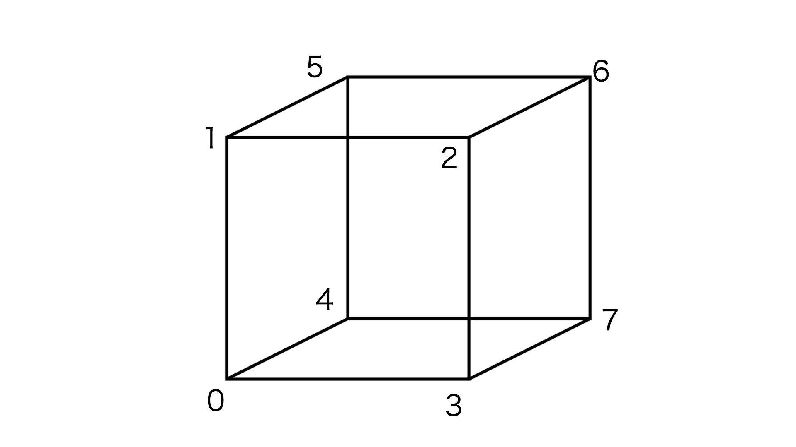
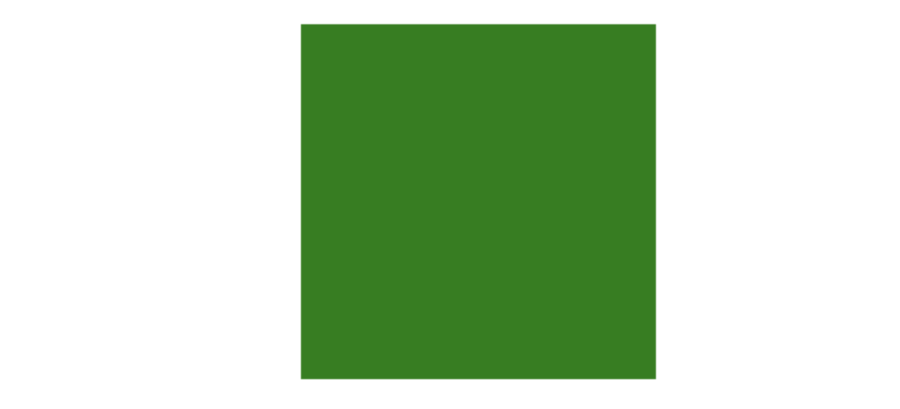

## 可视化学习：如何用WebGL绘制3D物体

在之前的文章中，我们使用WebGL绘制了很多二维的图形和图像，在学习2D绘图的时候，我们提过很多次关于GPU的高效渲染，但是2D图形的绘制只展示了WebGL部分的能力，WebGL更强大的地方在于，它可以绘制各种3D图形，而3D图形能够极大地增强可视化的表现能力。

相信很多小伙伴都对此有所耳闻，也有不少人学习WebGL，就是冲着它的3D绘图能力。

接下来，我就用一个简单的正立方体的例子来演示在WebGL中如何绘制3D物体。

### 从二维到三维

**首先，我们先来绘制一个熟悉的2D图形，正方形。**

```glsl
// vertex
attribute vec2 a_vertexPosition;
attribute vec4 color;

varying vec4 vColor;

void main() {
  gl_PointSize = 1.0;
  vColor = color;
  gl_Position = vec4(a_vertexPosition, 1, 1);
}

// fragment
#ifdef GL_ES
precision highp float;
#endif

varying vec4 vColor;

void main() {
  gl_FragColor = vColor;
}
```

```javascript
// ...
renderer.setMeshData([{
  positions: [
    [-0.5, -0.5],
    [-0.5, 0.5],
    [0.5, 0.5],
    [0.5, -0.5]
  ],
  attributes: {
    color: [
      [1, 0, 0, 1],
      [1, 0, 0, 1],
      [1, 0, 0, 1],
      [1, 0, 0, 1],
    ]
  },
  cells: [[0, 1, 2], [2, 0, 3]]
}]);
// ...
```

上述这些代码比较简单，我就不过多解释了。

在画布上我们看到，绘制了一个红色的正方形，它是一个平面图形。


接下来，我们就在这个图形的基础上，将它拓展为3D的正立方体。

**要想把2维图形拓展为3维几何体，第一步就是要把顶点扩展到3维。**也就是把vec2扩展为vec3。

```glsl
// vertex
attribute vec3 a_vertexPosition;
attribute vec4 color;

varying vec4 vColor;

void main() {
  gl_PointSize = 1.0;
  vColor = color;
  gl_Position = vec4(a_vertexPosition, 1);
}
```

当然仅仅修改Shader是不够的，因为数据是从JavaScript传递过来的，所以我们需要在JavaScript中计算立方体的顶点数据，然后再传递给Shader。

一个立方体有8个顶点，能组成6个面。在WebGL中需要用12个三角形来绘制它。



如果6个面的属性相同的话，我们可以复用8个顶点来绘制；

但如果属性不完全相同，比如每个面要绘制成不同的颜色，或者添加不同的纹理图片，就得把每个面的顶点分开。这样的话，就需要24个顶点来分别处理6个面。

为了方便使用，我们可以定义一个JavaScript函数，用来生成立方体6个面的24个顶点，以及12个三角形的索引，并且定义每个面的颜色。

```javascript
/**
 * 生成立方体6个面的24个顶点，12个三角形的索引，定义每个面的颜色信息
 * @param size
 * @param colors
 * @returns {{cells: *[], color: *[], positions: *[]}}
 */
export function cube(size = 1.0, colors = [[1, 0, 0, 1]]) {
    const h = 0.5 * size;
    const vertices = [
        [-h, -h, -h],
        [-h, h, -h],
        [h, h, -h],
        [h, -h, -h],
        [-h, -h, h],
        [-h, h, h],
        [h, h, h],
        [h, -h, h]
    ];

    const positions = [];
    const color = [];
    const cells = [];

    let colorIdx = 0;
    let cellsIdx = 0;
    const colorLen = colors.length;

    function quad(a, b, c, d) {
        [a, b, c, d].forEach(item => {
            positions.push(vertices[item]);
            color.push(colors[colorIdx % colorLen]);
        });
        cells.push(
            [0, 1, 2].map(i => i + cellsIdx),
            [0, 2, 3].map(i => i + cellsIdx)
        );
        colorIdx ++;
        cellsIdx += 4;
    }

    quad(1, 0, 3, 2); // 内
    quad(4, 5, 6, 7); // 外
    quad(2, 3, 7, 6); // 右
    quad(5, 4, 0, 1); // 左
    quad(3, 0, 4, 7); // 下
    quad(6, 5, 1, 2); // 上

    return {positions, color, cells};
}
```

现在我们就可以通过调用cube这个函数，构建出立方体的顶点信息。

```javascript
const geometry = cube(1.0, [
    [1, 0, 0, 1],   // 红
    [0, 0.5, 0, 1], // 绿
    [0, 0, 1, 1]    // 蓝
]);
```

通过这段代码，我们就能创建出一个棱长为1的立方体，并且六个面的颜色分别是“红、绿、蓝、红、绿、蓝”。

接下来我们就要把这个立方体的顶点信息传递给Shader。

在传递数据之前，我们需要先了解一个知识点，是关于绘制3D图形与2D图形存在的一点不同，那就是绘制3D图形时，必须要开启深度检测和启用深度缓冲区。

在WebGL中，我们可以通过`gl.enable(gl.DEPTH_TEST);`这段代码来开启深度检测；在清空画布的时候，也要用`gl.clear(gl.COLOR_BUFFER_BIT | gl.DEPTH_BUFFER_BIT);`这段代码来同时清空颜色缓冲区和深度缓冲区。

启动和清空深度检测和深度缓冲区这两个步骤，非常重要。但是一般情况下，我们几乎不会用原生的方式来编写代码，所以了解一下即可。为了方便使用，在本文演示的例子中，我们还是直接使用gl-renderer这个库，它封装了深度检测，我们在使用时，在创建renderer的时候配置一个参数`depth: true`就可以了。

现在我们就把这个三维立方体用gl-renderer渲染出来。

```javascript
// ...
renderer = new GlRenderer(glRef.value, {
  depth: true // 开启深度检测
});
const program = renderer.compileSync(fragment, vertex);
renderer.useProgram(program);
renderer.setMeshData([{
  positions: geometry.positions,
  attributes: {
    color: geometry.color
  },
  cells: geometry.cells
}]);
renderer.render();
```

现在我们在画布上看到的是一个红色正方形，这是因为其他面被遮挡住了。


### 投影矩阵：变换WebGL坐标系

但是，等等，为什么我们看到的是红色的一面呢？按照我们所编写的代码，预期看到的应该是绿色的一面，也就是说我们预期Z轴是向外的，因为规范的直角坐标系是右手坐标系。所以按照现在的绘制结果，我们发现WebGL的坐标系其实是左手系的？

但一般来说，不管什么图形库或者图形框架，在绘图的时候，都会默认将坐标系从左手系转换为右手系，因为这更符合我们的使用习惯。所以这里，我们也去把WebGL的坐标系从左手系转换为右手系，简单来说，就是将Z轴坐标方向反转。关于坐标转换，可以通过齐次矩阵来完成。对坐标转换不熟悉的小伙伴，可以参考我之前的一篇关于仿射变换的文章。

将Z轴坐标方向反转，对应的齐次矩阵是这样的：

```mathematica
[
	1, 0, 0, 0,
	0, 1, 0, 0,
	0, 0, -1, 0,
	0, 0, 0, 1
]
```

这种转换坐标的齐次矩阵，也被称为**投影矩阵**，ProjectionMatrix。

现在我们修改一下顶点着色器，把这个投影矩阵添加进去。

```glsl
// vertex
attribute vec3 a_vertexPosition; // 1:把顶点从vec2扩展到vec3
attribute vec4 color; // 四维向量

varying vec4 vColor;
uniform mat4 projectionMatrix; // 2:投影矩阵-变换坐标系

void main() {
  gl_PointSize = 1.0;
  vColor = color;
  gl_Position = projectionMatrix * vec4(a_vertexPosition, 1.0);
}
```

现在我们就能看到画布上显示的是绿色的正方形了。



### 模型矩阵：让立方体旋转起来

现在我们只能看到立方体的一个面，因为Z轴是垂直于屏幕的，这样子从视觉上看好像和2维图形没什么区别，没法让人很直观地联想、感受到这是一个三维的几何体，为了将其他的面露出来，我们可以去旋转立方体。

要想旋转立方体，我们同样可以通过矩阵运算来实现。这个矩阵叫做**模型矩阵**，ModelMatrix，它定义了被绘制的物体变换。

把模型矩阵加入到顶点着色器中，将它与投影矩阵相乘，再乘上齐次坐标，就得到最终的顶点坐标了。

```glsl
attribute vec3 a_vertexPosition; // 1:把顶点从vec2扩展到vec3
attribute vec4 color; // 四维向量

varying vec4 vColor;
uniform mat4 projectionMatrix; // 2:投影矩阵-变换坐标系
uniform mat4 modelMatrix; // 3:模型矩阵-使几何体旋转

void main() {
  gl_PointSize = 1.0;
  vColor = color;
  gl_Position = projectionMatrix * modelMatrix * vec4(a_vertexPosition, 1.0);
}
```

现在我们定义一个JavaScript函数，用立方体沿x、y、z轴的旋转来生成模型矩阵。

以x、y、z三个方向的旋转得到三个齐次矩阵，然后将它们相乘，就能得到最终的模型矩阵。

```javascript
import { multiply } from 'ogl/src/math/functions/Mat4Func.js';
// ...
export function fromRotation(rotationX, rotationY, rotationZ) {
    let c = Math.cos(rotationX);
    let s = Math.sin(rotationX);
    const rx = [
        1,  0, 0, 0, // 绕X轴旋转
        0,  c, s, 0,
        0, -s, c, 0,
        0,  0, 0, 1
    ];

    c = Math.cos(rotationY);
    s = Math.sin(rotationY);
    const ry = [
        c,  0, s, 0,
        0,  1, 0, 0, // 绕Y轴旋转
        -s, 0, c, 0,
        0,  0, 0, 1
    ];

    c = Math.cos(rotationZ);
    s = Math.sin(rotationZ);
    const rz = [
        c,  s, 0, 0,
        -s, c, 0, 0,
        0,  0, 1, 0, // 绕Z轴旋转
        0,  0, 0, 1
    ];

    const ret = [];
    multiply(ret, rx, ry);
    multiply(ret, ret, rz);
    return ret;
}
```

我们把模型矩阵传给顶点着色器，不断更新三个旋转角度，就能实现立方体旋转的效果。

```javascript
// ...
let rotationX = 0;
let rotationY = 0;
let rotationZ = 0;
function update() {
  rotationX += 0.003;
  rotationY += 0.005;
  rotationZ += 0.007;
  renderer.uniforms.modelMatrix = fromRotation(rotationX, rotationY, rotationZ);
  requestAnimationFrame(update);
}
update();
// ...
```

现在我们就能在旋转中看到立方体的其他几个面了，能更直观地感受到这是一个三维物体。


### 总结

至此，我们就实现了正立方体的绘制。在3D物体的绘制中，正立方体属于是比较简单的一类，屏幕前的小伙伴们都可以来动手尝试下，感兴趣的小伙伴，还可以尝试去实现圆柱体、正四面体等等这些几何体的绘制。