## VMware Fusion网络配置

之前虚拟机用的Parallel Desktop，因为我用虚拟机的机会并不多只是一些练手的东西，所以不想用付费的PD了，从网上了解到VMware Fusion可以免费使用，从[这里](https://sysin.org/blog/vmware-fusion-13/)下载安装包，安装过程比较简单，主要过程中遇到网络配置的问题，记录一下，其实我也是看了其他人的博客，算是备份吧。

供参考：我这里的mac版本是Sonoma 14.6.1

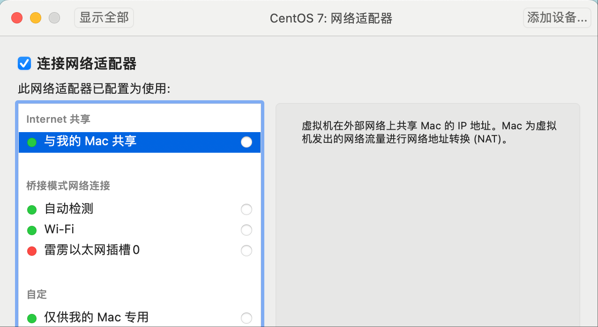

默认的网络设置是”与我的Mac共享“，不管我使用默认、还是切换到桥接模式、或者使用自定，都没法连接网络，于是借助搜索网络有了以下解决方法。

### 1. 新增网络配置

在配置网络之前需要先关闭虚拟机，然后点击设置进行网络配置。

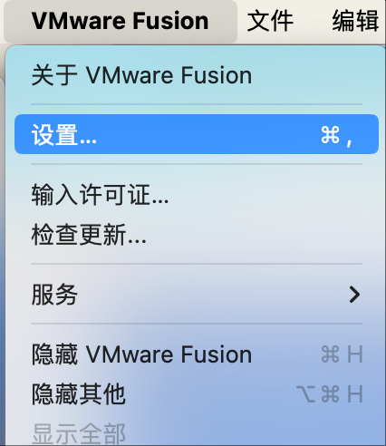

配置网络之前需要先解锁。

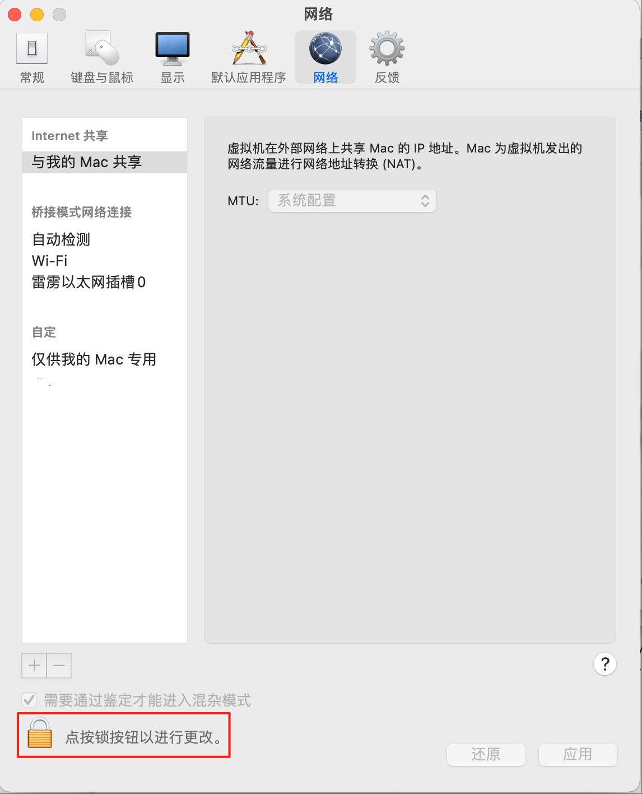

点击加号添加新的网络配置。

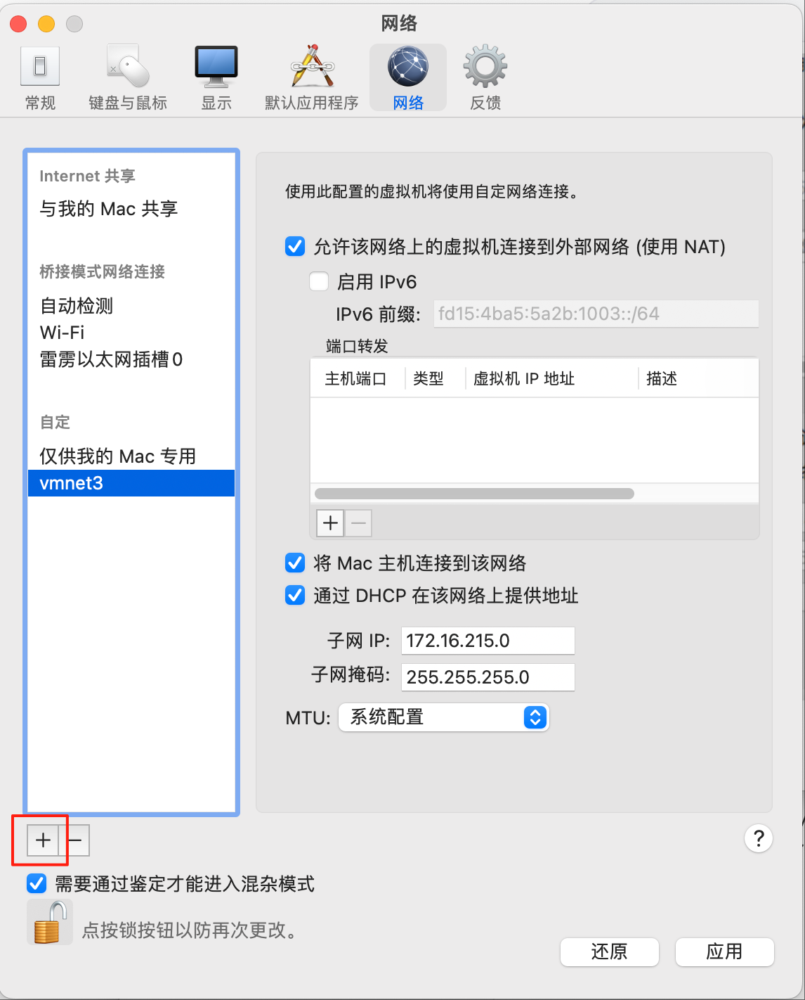

点击右下角的”应用“按钮子网IP会自动生成，这个也可以在mac的终端查看。

```shell
$ vim /Library/Preferences/VMware\ Fusion/networking
```


### 2. 查看网关

在mac使用终端查看虚拟机的网关。

```shell
$ vim /Library/Preferences/VMware\ Fusion/vmnet3/nat.conf 
```

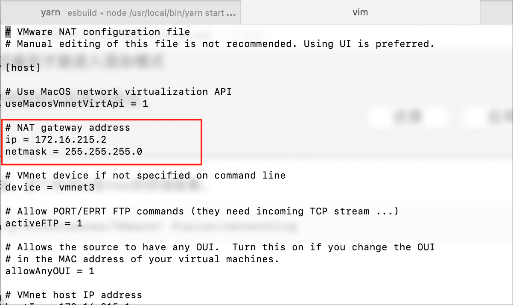

我这里生成的网关地址是172.16.215.2。


### 3. 查看主机网络的DNS

查看mac连接的网络设置。

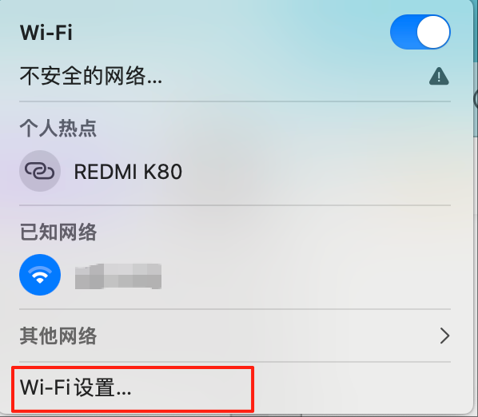

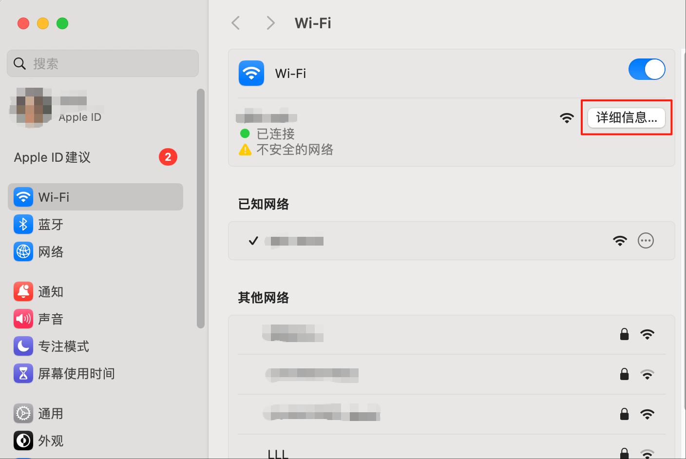

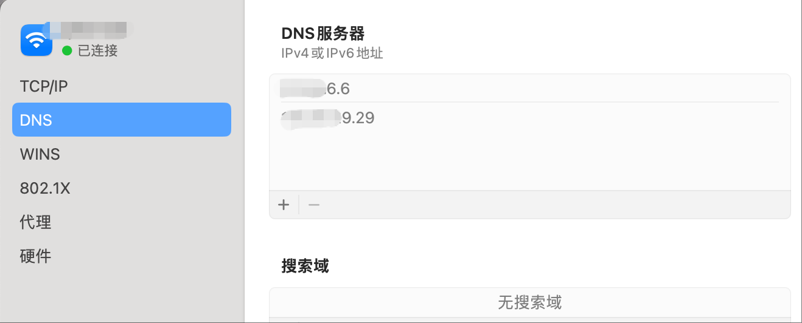


### 4. 修改Linux配置

```shell
vi /etc/sysconfig/network-scripts/ifcfg-ens33
```

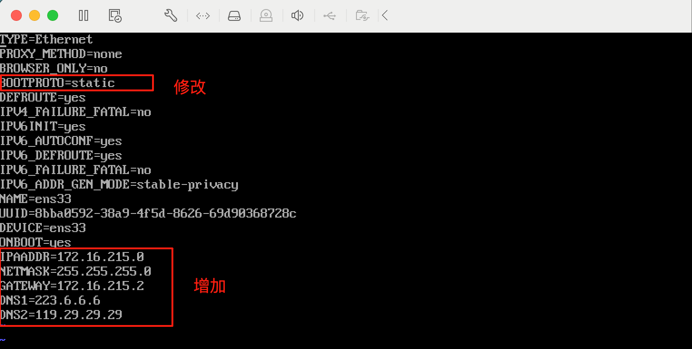

修改第四行的值，并追加后面几行内容分别对应IP地址、子网掩码、网关和DNS。


### 5. 测试网络

我使用了以下命令行重启网络服务

```shell
service network restart
```

但是没有用无法ping通，进行reboot重启后就可以了。

使用`ip addr`命令查看IP地址。

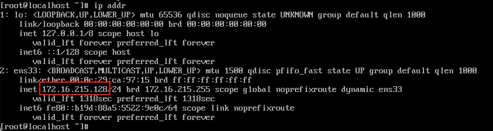

这个时候就可以使用yum安装东西了。

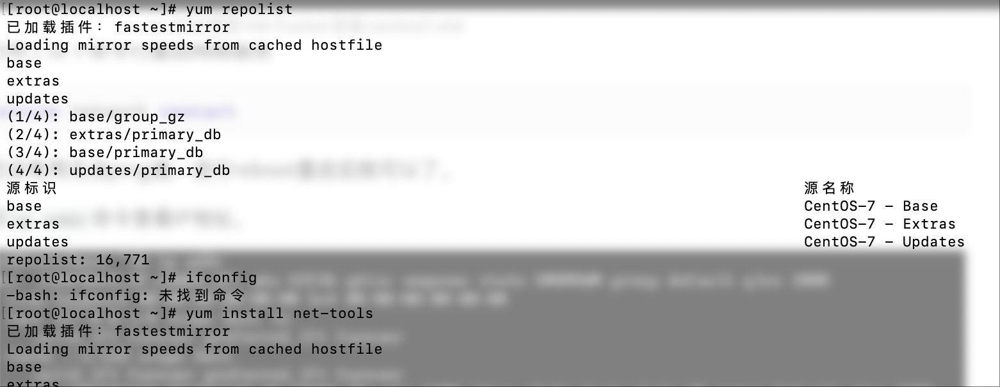

