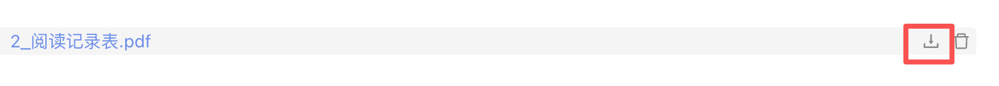

## antd 上传文件组件区分预览和下载入口

之前需求方提出说想要给表单上传的文件增加预览功能，原来点击展示列表中的文件时，docx文件会启动下载，而pdf会启动新的tab页进入预览，所以最好是统一处理。

因为我对Upload组件用的不多，对它不够了解，所以一开始我想着从fileList下手，不用Upload默认的展示列表，经过多番尝试发现有点麻烦，于是打开官网文档研究，才发现原来文档里已经提供了相关的功能，原来点击文件的展示列表默认的动作是文档里的`onPreview`回调，要区分预览和下载的入口，可以增加`showDownloadIcon`的配置，并增加`onDownload`的回调用于处理文件的下载，那么预览和下载的处理就可以区分开来。



但是问题到这里并没有完全解决，当我重新进入表单页面进入编辑时，也就是表单内容回显时，发现没有出现下载按钮，查了很久的文档都没有找到怎么解决，也在网上搜索了一下，不知道是不是我搜索的关键词不对，就是没找到答案，就只能自己翻项目里的依赖包，各种尝试，才发现原来文件列表中的文件需要同时设置`status`为`'done'`，下载的按钮才会显示。

所以表单内容回显的时候，需要单独给上传的文件列表进行处理，因为我这边接口没有存status的值，又因为文件上传成功后，才会被表单整体提交保存，文件的状态可以默认为done，所以在加载表单内容时，直接给文件列表处理成如下结构就可以。

```json
[
	{ url, name, status: 'done' }
]
```

